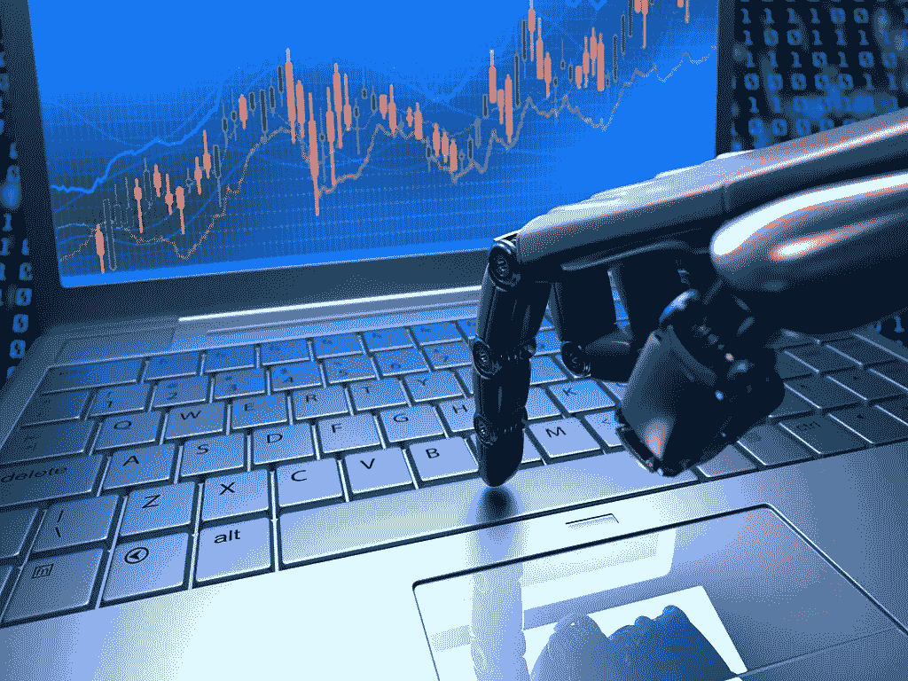
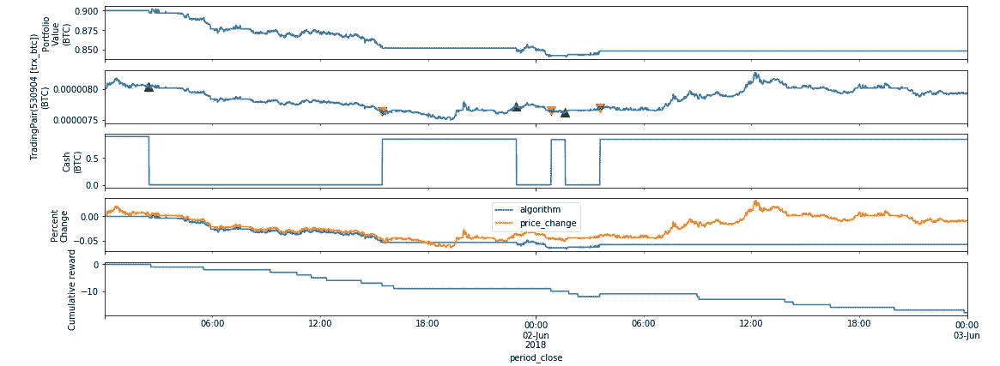
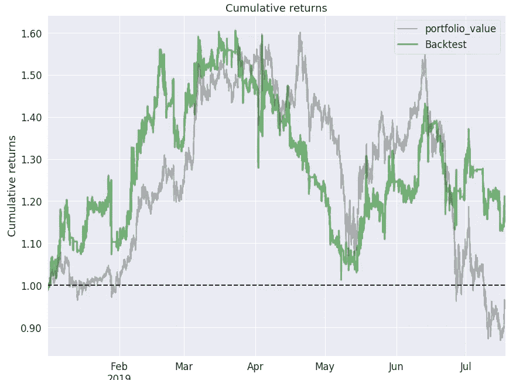

# 我如何最终教会人工智能实时交易加密货币

> 原文：<https://medium.datadriveninvestor.com/how-i-finally-taught-ai-to-live-trade-cryptocurrency-f6a4eae70c0a?source=collection_archive---------0----------------------->

去年，在 Coursera 上完成了出色的吴恩达深度学习专业课程后，我一直在寻找一个问题来实现我的新技能。我选择了股票价格预测(我知道这是一个非常有创意的想法)。基本理念很简单:

1.  交易中很大一部分损失是由人为因素造成的，算法是客观的，不受情绪影响，因此，从长远来看，它必须胜过人类交易者。
2.  自学习交易代理相对于硬编码模型具有优势，因为它可以灵活地适应不断变化的市场条件。

 [## 值得购买的 4 大人工智能股票及其原因|数据驱动型投资者

### 人工智能(AI)在 2019 年继续进入大众意识。通过应用程序…

www.datadriveninvestor.com](https://www.datadriveninvestor.com/2019/03/06/top-4-artificial-intelligence-stocks-to-buy-and-why/) 

有了这样强有力的理论武装，我对成功毫不怀疑。现实很艰难。我的第一个模型非常简单。我使用了一种监督学习方法，根据 20 天的 OHLCV 值来预测第二天的收盘价是高于还是低于今天。多亏了 Keras，这个模型的“大脑”只有 4 行代码。我使用了两个双向 LSTM 层来开发时序数据结构，然后是输出预测价格的密集层。

结果令人沮丧。尽管该模型在训练样本上显示了大约 60%的准确性，但在验证样本上的准确性接近随机猜测。

一个可能的解决方案是将监督学习的方法转变为强化学习的方法。对这种差异的天真解释是，没有老师告诉算法该做什么，学习是通过试错过程进行的。我强烈推荐[大卫·西尔弗的 RL 课程](https://www.youtube.com/watch?v=2pWv7GOvuf0&list=PLqYmG7hTraZDM-OYHWgPebj2MfCFzFObQ)给那些想深入学习的人。

问题是找到一个合适的环境。在 RL 范式下，环境的作用是向代理提供当前的“世界状态”,在我的情况下，这意味着输出 OHLC 和当前的投资组合价值。到目前为止，我已经决定专注于加密货币而不是股票。至于我的最终目标是做一个实时交易代理，加密货币交易所有很多优势:

*   连续数据流，全天候交换工作
*   低进入门槛:我不想拿一大笔钱去冒险
*   没有监管——这迎合了我的自由主义观点

在花了一些时间在不同的环境中进行试验后，我发现了[Enigma Catalyst](https://enigma.co/catalyst/)——用于加密资产回溯测试和实时交易算法的开源库。我不确定这个项目是否是实时的——自 2018 年以来没有更新，但它完全符合我的需求。我知道我可以很容易地用它制作一个 RL 环境。

首先，我决定试试[DQN](https://deepmind.com/research/dqn/):deep mind 推出的著名算法，用来训练 agent 如何下围棋。它的主要思想是利用收到的奖励随机初始化状态-行动价值函数(特定环境状态有多好),然后不断地将其更新到导致最佳行为的方向。

我在寻找 DQN 代理的 Keras 实现，并成功地在[这个](https://github.com/keon/deep-q-learning)仓库中找到了它。经过一些修改后，我的代理的“大脑”看起来像这样:

我的代理必须在每个环境步骤中输出三个可能的操作之一:“购买”、“出售”或“保持”。问题是算法就是不想交易！一段时间后，不管市场状况如何，它总是收敛到“持有”:

*图中的一些交易(第二张图中的绿色和红色三角形)是由于ε-贪婪策略——以固定概率执行随机操作以促进探索。*

我已经测试了一堆不同的奖励函数和模型配置，但结果是一样的。DQN 的限制之一是它只允许离散的行动，然而，我认为连续的行动空间(例如，如果需要，算法可以在此时购买 26.5%的资产组合)将更适合这个问题。所以我开始寻找一个更好的算法来实现我的目标。

幸运的是，我已经找到了[这个](https://github.com/nwihardjo/RL-Trading-Agent)库。描述交易代理吸引我的是持续的行动空间，更重要的是多资产支持。我做的唯一调整经历了重播。这是在最初的 DQN 论文中使用的改善收敛性的技术:所有代理的决策都存储在经验缓冲区中，并且模型是根据随机的经验样本而不是最近的决策来训练的。尽管这种新算法并不完全是 DQN，但我注意到，通过经验回放，当对验证样本进行回溯测试时，它的表现要好得多。

我采用的另一个重要技术是状态设计:除了标准化的 OHLCV 值，我还使用 Ta-lib 计算了 30 个技术分析指标。所有指标都使用默认的(不同的)时间段。这个想法是，技术指标被其他交易者用于决策，因此反映了所有市场参与者的全部知识。

在尝试了不同的时间段后，我停止了 2H 蜡烛。时间周期越短，回溯测试的利润越少，时间周期越长，训练数据越少，越容易过度拟合。从 2018 年 1 月 1 日开始，我在币安的数据上对 4 对数据进行了算法训练:ETH/BTC，LTC/BTC，BNB/BTC 和 XRP/BTC，并从 2019 年 1 月 1 日开始使用半年作为测试集。

这是对算法和买入并持有策略进行回溯测试的结果。大多数情况下，该算法超过了买入并持有的回报率，期末回报率为 20%，而买入并持有的回报率为-5%。

现在我正在努力使它在实时交易中保持稳定。我的目标是在至少一个月的现场交易中测试它的性能。虽然由于滑点和买卖价差，实时交易结果可能与回溯测试不同，但我很乐观，因为在这种低频交易中，这些因素应该不会很重要。另一件有趣的事情是在模型中加入新闻情感分析。这可能会给当前的技术分析算法增加一个“基础”成分。

希望这篇文章对如何做一个真正交易的 AI 交易机器人有一个简单的了解。感谢阅读！以下是一些参考资料:

1.  本文的代码(Google Colab)
2.  [深度 Q-学习示例](https://github.com/keon/deep-q-learning)
3.  [谜催化剂](https://enigma.co/catalyst/)交易库
4.  [DRL 代理](https://github.com/nwihardjo/RL-Trading-Agent)股票