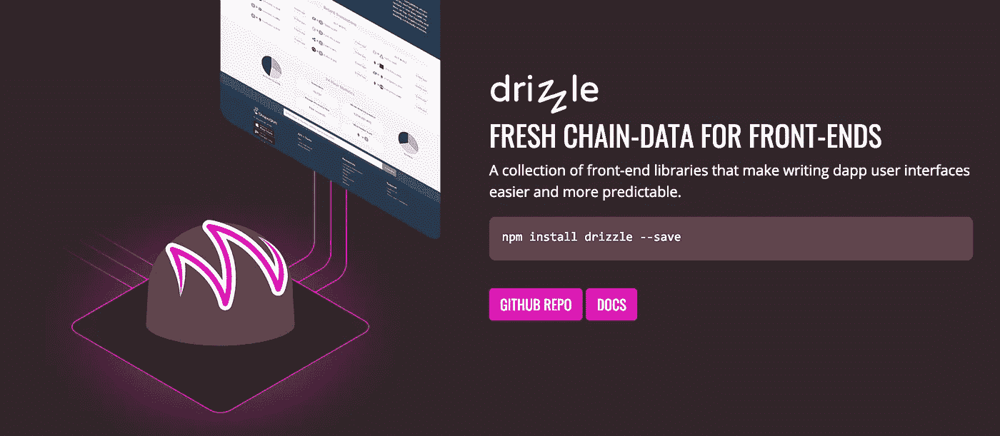
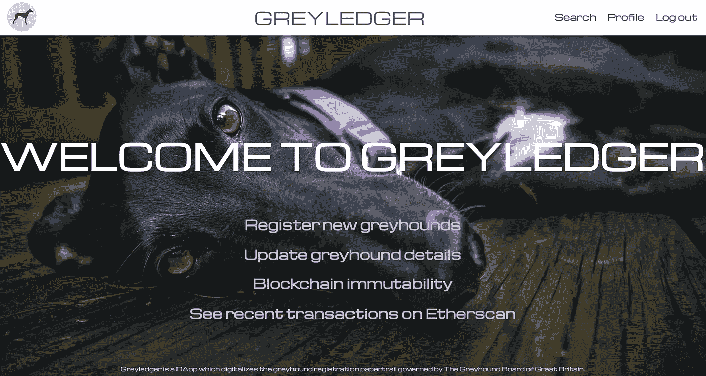
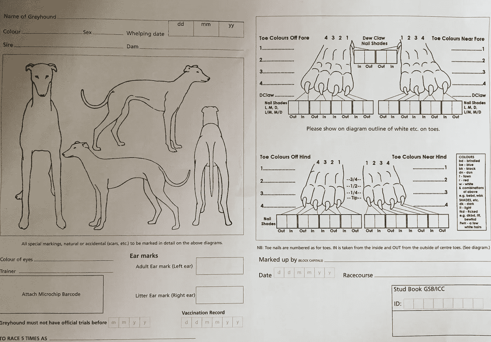
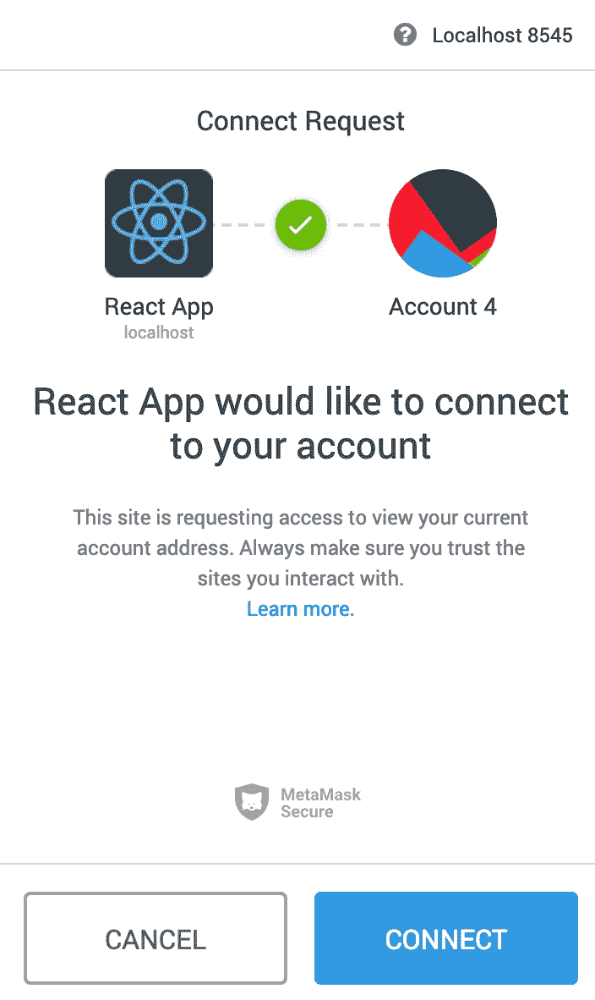

# 我如何初始化毛毛雨来创建一个混合的网络应用程序/ DApp

> 原文：<https://medium.datadriveninvestor.com/how-i-initialised-drizzle-to-create-a-hybrid-web-app-dapp-981cb4c16ea2?source=collection_archive---------2----------------------->

[](http://www.track.datadriveninvestor.com/1B9E)

这篇文章假设你已经对使用 Ruby-on-Rails、JavaScript 和 ReactJS 进行 web 开发有了大致的了解。



Fresh from [https://truffleframework.com/drizzle](https://truffleframework.com/drizzle)

感谢 Dapp 大学的详细教程和 [Niharika Singh](https://hackernoon.com/@Niharika3297) 感谢[这篇关于 Hackernoon 的](https://hackernoon.com/the-right-way-to-develop-your-ethereum-dapp-is-here-drizzle-a633af45f031)精彩文章。

*在我们开始之前*

项目要求:

1.  安装节点
2.  安装元掩码
3.  安装松露
4.  安装 Ganache

[](https://www.datadriveninvestor.com/2019/02/21/best-coding-languages-to-learn-in-2019/) [## 2019 年最值得学习的编码语言——数据驱动的投资者

### 在我读大学的那几年，我跳过了很多次夜游去学习 Java，希望有一天它能帮助我在…

www.datadriveninvestor.com](https://www.datadriveninvestor.com/2019/02/21/best-coding-languages-to-learn-in-2019/) 

# 我做了什么

我的 DApp“grey ledger”是一个混合网络应用/ DApp，它有效地将赛狗注册过程数字化，目前由大不列颠灰狗委员会管理。不必详细说明我为什么选择制作关于灰狗的项目(你可以访问 [CAGED NW](https://www.cagednw.co.uk/) 和其他资源来了解这个行业的更多信息)，只要知道我相信拥有一个分散的和不可变的灰狗身份/所有权日志会有真正的好处。

注意:这个项目与英国灰狗协会没有任何关系。

> Greyledger 为商业灰狗赛车行业带来了灰狗所有权不变的好处。



Greyledger home page

通过 Greyledger，用户可以在 Ruby on Rails / Postgres 后端和区块链上注册赛狗。出于开发目的，用户不必是所有者就可以注册灰狗并更新灰狗记录。

每个新的 greyhound 注册都会在 Ruby 中创建一个 greyhound 实例，并调用底层的智能契约，该契约还会在区块链上生成一个 greyhound 实例，其中包含一个唯一的伪随机数。用户可以访问他们的个人资料来查看/更新他们现有的灰狗，查看哪些元掩码帐户与每只狗相关联，并通过帐户搜索他们的交易历史(通过对 Etherscan API 的提取请求)。

数据库中的灰狗数量应该与区块链上的灰狗数量相匹配。如果元掩码事务被拒绝，则对数据库的任何更改都将被还原。

**五种模式**:用户，用户灰狗，灰狗，灰狗主人，主人。

**关系**:一个用户有很多灰狗。灰狗属于许多用户。一只灰狗有许多主人。一个主人养了许多灰狗。

# 为什么像区块链一样使用数据库？

重要的是要记住——目前——赛狗注册过程是由一个中心组织用纸质表格处理的。这个过程的某些方面在现实生活中很难升级。

例如，有些纸质注册表格需要狗的图片:



Greyhound Board of Great Britain Registration Certificate

对于在线注册流程，我们可以改为上传照片，这些照片可以与新注册/更新一起提交。然而，将图片推送到区块链的成本很高，因此注册灰狗的成本可能会危及新注册流程的接受和诚实使用。作为一项临时措施，照片可以存储在一个中央数据库中，灰狗的其他更重要的细节将被推送到区块链。如果有更多的时间，我很想探索更有效和更具成本效益的方法来获取和存储关于灰狗在区块链的外貌的准确信息。

# 我如何初始化我的项目

我想包括这个概述，关于我如何建立我的项目，以帮助别人谁是毛毛雨的新手。

首先，创建一个空的项目目录。

在里面，您将需要设置两个文件夹结构:客户机和服务器。

要设置您的服务器结构，在您刚刚创建的目录中，运行

`rails new <name_server> --api --database=postgresql`

确保用您为服务器目录选择的名称替换`<name_server>`。

然后，要获得一个以太坊友好的 React 前端文件夹结构，使用`truffle unbox drizzle`获得毛毛雨包。

在 truffle-config.js 文件中，添加:

```
networks: {
development: {
 host: “127.0.0.1”, 
 port: 8545, 
 network_id: “*” 
 }
}
```

使用毛毛雨意味着我们不需要运行`npm install web3`。此外，没有必要在 truffle-config.js 中指定“solc 编译器版本”。

接下来，在`app/contracts`目录中创建一个准系统契约:

```
pragma solidity >=0.4.21 <0.6.0;contract NewGreyhound {
  uint public greyhoundCount = 0;function getGreyhoundCount() public view returns(uint) {
    return greyhoundCount;
  }}
```

在`migrations/`目录下创建一个名为`2_deploy_contracts.js`的新文件:

```
const NewGreyhound = artifacts.require("NewGreyhound");module.exports = function(deployer) {
  deployer.deploy(NewGreyhound);
};
```

删除示例合同和测试文件(简单存储、复杂存储等)。

确保 Ganache 正在运行(这个进程默认运行在 [http://127.0.0.1:8545](http://127.0.0.1:8545) 上)并且元掩码链接到同一个 RPC，运行`truffle migrate`。

在`test`目录中添加一个简单的测试文件:

`NewGreyhound.sol`

```
pragma solidity >=0.4.21 <0.6.0;import "truffle/Assert.sol";
import "truffle/DeployedAddresses.sol";
import "../contracts/NewGreyhound.sol";contract TestNewGreyhound {
    function testCanReadGreyhoundCount() public {
        NewGreyhound newGreyhound = NewGreyhound(DeployedAddresses.NewGreyhound());newGreyhound.getGreyhoundCount();uint expected = 0;Assert.equal(newGreyhound.getGreyhoundCount(), expected, "It should return the greyhound count.");
    }
}
```

在终端中运行`truffle test`,检查 NewGreyhound 契约是否已经正确部署，以及您的配置和功能是否按预期工作。如果契约和测试文件工作正常，测试应该会通过(您可以检查契约编译以及 Remix in-browser IDE 中的函数是否按预期工作)。


Running ‘truffle test’ in the main project directory

在`index.js`和`App.js`内需要一些重新配置。注意:我们不再需要自动包含的`drizzleOptions.js`文件。

在`index.js`:

```
import React from 'react';
import ReactDOM from 'react-dom';
import './styling/index.css';
import App from './App';// import drizzle functions and contract artifact
import { Drizzle, generateStore } from "drizzle";
import NewGreyhound from "./contracts/NewGreyhound.json";// let drizzle know what contracts we want
const options = { contracts: [NewGreyhound] };// setup the drizzle store and drizzle
const drizzleStore = generateStore(options);
const drizzle = new Drizzle(options, drizzleStore);// pass in the drizzle instance
ReactDOM.render(<App drizzle={drizzle} />, document.getElementById('root'));
```

在`App.js`中:

```
import React, { Component } from "react";
import "./styling/App.css";class App extends Component {state = {
    loading: true,
    drizzleState: null
  };componentDidMount() {
    const { drizzle } = this.props;// subscribe to changes in the drizzle store
    this.unsubscribe = drizzle.store.subscribe(() => {
      // every time the store updates, grab the state from drizzle
      const drizzleState = drizzle.store.getState();// check to see if drizzle is ready, if so, update state
      if (drizzleState.drizzleStatus.initialized) {
        this.setState({ loading: false, drizzleState });
      }
    });
  }compomentWillUnmount() {
    this.unsubscribe();
  }render() {
    if (this.state.loading) return "Loading Drizzle...";
    return <div className="App">Drizzle is ready</div>;
  }}export default App;
```

进入`app`目录。运行`npm start`在 [http://localhost:3001/](http://localhost:3000/) 查看项目(记住:Rails 服务器已经在使用 localhost:3000)。

如果启用了元掩码，您应该会收到类似这样的请求，通知您 React 应用程序想要连接您的帐户:



Metamask prompt in Google Chrome

现在，您已经准备好定制组件，扩展您的智能契约，并编写更多的测试！

如果你有兴趣看更多我的代码，你可以在[github.com/atkinsonholly/Greyledger](http://github.com/atkinsonholly/Greyledger)找到整个项目。

# 问题

Mollie Stein 的有帮助的[帖子](https://medium.com/giant-machines/ethereum-state-management-with-drizzle-53cdb647677b)概述了一些我在尝试学习毛毛雨时也经历过的问题。

## 重新渲染

我将`polls`保留为`{ blocks: 3000 }`(而不是使用将`polls`设置为`{accounts: 3000}`所带来的自动重新呈现功能)，因为当页面不断刷新时，很难从注册表单中获得用户输入。

## 异步事件

由于我上面遇到的重新渲染问题，我不得不用不同的方法来寻找交易状态的变化，即在用户点击 Metamask 中的“确认”或“拒绝”后，触发对我的页面的更新。我最终使用了`setInterval()`和`setState({})` 作为解决方法。请看下面我是如何解决这个问题的。

*子组件中的*

```
saveGreyhoundToBlockchain = (response) => {
  // some code here to send greyhound to blockchain
  // and save the stack IDthis.txStatusFn = window.setInterval(() =>         
this.props.checkTxStatus(this.txStatusFn, response), 300)
  };
```

*在 App.js 中*

```
checkTxStatus = (id, response) => {
    // if stack ID exists, get the transaction hash
    if (this.state.stackId !== "") {
      const txId = this.state.drizzleState.transactionStack[this.state.stackId] const txStatus = this.state.drizzleState.transactions[txId] // if transaction status exists, do something with it
      if (txStatus) {
        if (txStatus === undefined) return ""
        this.setState({
          txStatus: txStatus.status
        })
      }
      if (this.state.txStatus === "success") {
        window.clearInterval(id)
        // then do something to confirm transaction
      }
      if (this.state.txStatus === "error") {
        window.clearInterval(id)
        // then do something to revert database
      }
    }
  }
```

如果你做到了这一步，感谢你的阅读。如果您有任何意见或想谈论智能合同，请随时联系我们！