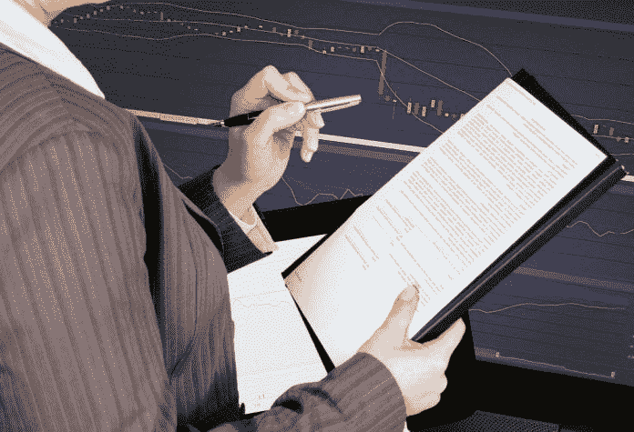
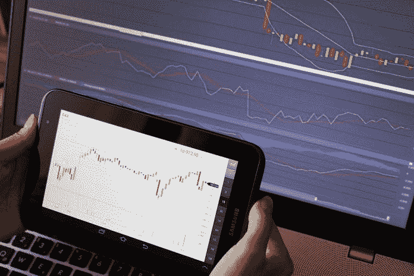
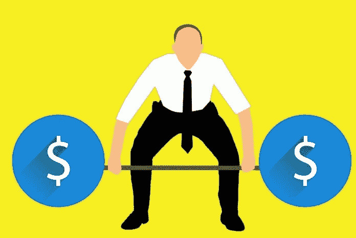

# 我如何投资一年成为一个有利可图的外汇交易者，然后完全停止交易

> 原文：<https://medium.datadriveninvestor.com/how-i-invested-one-year-in-becoming-a-profitable-forex-trader-and-then-stopped-trading-completely-13c73dadb374?source=collection_archive---------1----------------------->

我一直对投资和交易感兴趣。回到 08 年，我 18 岁，金融市场崩溃了。我觉得这是投资的好时机。我卖掉了一些我小时候就有天赋的金子；是的，在瑞士你会给孩子们送礼物，不，这在那里并不奇怪。

我用这次出售得到的钱，购买了诺华、科莱恩和瑞银的股票。前两者被证明是高利润的。几年过去了，我对投资的兴趣下降了。作为一名学生，我手头没有钱，有不同的优先事项。但是我从早期投资成功中学到的三个教训一直困扰着我:

 [## 投资算法快速指南|数据驱动投资者

### 让我们想象一下 30 年前的股票市场:让我们想象一下现在:像现在的许多其他领域一样，投资市场已经…

www.datadriveninvestor.com](https://www.datadriveninvestor.com/2019/01/31/a-quick-guide-to-investment-algorithms/) 

*   低买高卖
*   长期投资
*   基于价值而非股价进行投资

# 三年前，我处于人生的一个转折点，我知道有些事情必须改变。

我在完成学业后做了 3 年的化学家，感觉自己被困住了。我就知道会有更多。像许多其他人一样，我开始寻找网上赚钱的方法。日内交易是一个反复出现的话题。

是的，我知道，这与我上面提到的早期成功经验完全相反。

我很兴奋，准备好赚一大笔钱，于是开了一个交易账户。我在上面放了些钱，做了我的第一笔交易。你猜怎么着？我失去了一切。我想这对你来说并不奇怪，但这并不是他们在 YouTube 广告中所说的。

但我从未想过放弃。然而，引起我兴趣的是这样一个事实，当我深入研究时，每个人都说 10 个人中有 9 个人在交易中赔钱。我不认为我比其他人聪明。但我也知道许多人不知道如何学习新技能。

就在那时，我决定成为 10 个中的一个，至少不赔钱。

像安德斯·埃里克森在他的书《巅峰》中或者马尔科姆·格拉德威尔在《局外人》中这样的专家认为，达到精通需要大约 10 000 个小时。这 10 000 个小时必须经过深思熟虑的练习。当我年轻的时候，我踢足球。我喜欢一对一的比赛，讨厌那种你必须直接传球或者只用一次触球的训练。为什么？因为我知道如何运球，但我很难同时看着我的队友和我的对手。所有这一切，在准确的时刻传球，没有时间准备。这就是玩和刻意练习的区别。演奏感觉很好很舒服，而刻意练习很难，并且总是在你能力的边缘——迫使你走出舒适区，伸展身体。

如果我要花 10 000 个小时才能变好，我为什么要开始呢？嗯，我没有说这个规则是错误的，但是我也是 80:20 规则的忠实信徒。80:20 法则是一个你在任何地方都能遵守的权力法则。它说，要达到 80%的结果，你只需要投入 20%的努力。所以要达到真正大师 80%的水平，你只需要投入 20%的时间。因为我没有成为交易大师的愿望，只是一个盈利的交易者，我确信我可以在一年内达到目标。

## 多年来，我发展了获取新技能的秘诀。从那以后，我在自己和其他许多人身上成功地测试了它。

让我们来看看

# 找到你的原因

学习一项新技能就像坠入爱河。一开始，一切都像蜜蜂和蝴蝶。但随着时间的推移，需要有更深的联系。你可以在任何年龄学到几乎所有的东西。但是你需要一个强有力的理由。没有理由，一硬就放弃。我的理由是证明我自己，我能掌握只有少数人能掌握的技能。

# 智力游戏

我们都来自不同的背景。每次有人告诉你，你能做什么或不能做什么都会在你身上留下印记。根据你所处的位置，你必须随着时间的推移建立自己。做到这一点的方法是寻找小的胜利并庆祝它们。听起来可能很傻:每当你能记起你开始学习的东西时，庆祝一下。每当你做了你打算做的事情——庆祝。一旦你取得了这些小胜利，你就可以争取更大的胜利，直到你的目标大到每个人都会告诉你你疯了。

在交易中，心理因素很重要。你必须学会承受损失。如果你的赢大于你的输，当你输的次数比赢的次数多的时候，你甚至可以赚钱。我知道这听起来很棒，但在实践中，即使你相信自己的策略，失败也会带来压力。所以，为了能够承受交易的压力，坚持策略，你需要对自己的获胜能力有一个坚定的信念。通过庆祝小的胜利，你可以建立自信。

# 完全沉浸

无论你想学什么，你首先需要了解这门学科的语言。出于这个原因，我建议寻找 3 个最受欢迎的 YouTube 频道，并观看他们的 10 大剪辑。

*   然后找到 3 个最受欢迎的播客，听他们最受欢迎的 10 集。
*   找出 3 本最受欢迎的书，至少读其中一本
*   在 Udemy 上找到评分最高的在线课程并浏览课程。

记日记，总结和组织最重要的学习

我花了一些时间在 YouTube 上筛选出所有快速致富的人，并找到一些提供真正价值的频道。在线课程也是如此。书籍和播客不是问题。我的头几周是在听、看和读中度过的。一开始，你会觉得没有什么是有意义的，每个人都在教一些不同的东西。但是过了一段时间，你开始注意到模式和重复出现的主题。这是你准备进入下一阶段的时候。

# 实践

没有练习，你的笔记只是一张纸上的字母而已。在最初的几天里，我们往往会忘记我们所学的大部分内容。通过做笔记，你就迈出了防止这种情况发生的第一步。第二步是将你新学到的知识应用到实际问题中。在理论上听到一些东西是一回事，但在现实生活中去做是完全不同的一回事。就像迈克·泰森说的:“每个人都有一个计划，直到他们被打脸”。

通过将你的知识应用到现实世界的问题中，你实践了一个叫做间隔重复的基本学习法则。这意味着，在两天内分两次学习比一次学习更有效。每当你觉得你必须努力回想你在上一节课中学到了什么，你就在学习，而不是重复你已经知道的东西。不仅在理论上学习还有第二个好处。每次你在理论上学到东西，你把它转移到现实世界的问题上，你就会纠结。不同的参数、不断变化的环境和大量的不确定性将使现实世界的情况比构建的理论问题复杂得多。所以，不要在理论上浪费太多时间，去研究现实世界的问题。

在交易中，这很容易，因为你可以在每个严肃的经纪人那里开一个模拟账户。我打开我的演示账户，开始尝试我在听、看、读时学到的所有不同的战术和策略。

# 获得反馈

学习的一个重要部分是获得反馈。你越快得到反馈，它就越有价值。日内交易节奏非常快，所以你几乎可以立即得到反馈。不过，重要的是要有一个系统来利用你生成的数据。要做到这一点，有一本交易日志是很重要的。这可以是一个简单的 excel 电子表格，你可以写下所有交易的细节，如时间、进场、出场、赢家/输家、止损等。

随着时间的推移，这将成为一项非常有价值的资产，您可以在其中运行统计分析并优化您的策略。

# 实现流动

心流专家米哈里·齐克泽特米哈伊将心流描述为人类最佳表现的一种状态。为了达到心流，你需要在你能力的边缘运作。但是挑战也不会太难。在心流中，你发现自己失去了时间感。当你进入心流时，你的学习速度会提高 200 %以上，并且你可以发挥出你的最佳水平。所以每次你设法进入心流，你就设法缩短了你的学习时间。

交易提供了一个进入心流的好机会。你的钱在这条线上，你可以从市场得到快速的反馈。利用这一点。进入你的模拟账户，选择一个小的时间框架，[排除所有干扰，像你的生活依赖它一样交易。](https://www.datadriveninvestor.com/glossary/block/)

# 投入工作

不管你的学习方法有多聪明，总有一天你必须投入时间。我发现模式交易是我最好的选择。我选择了 Gratley，Bat 和 Cypher 模式，因为我找到了它们的最佳数据。我选择交易 4 小时的时间框架。

首先，我会用日线来评估市场结构和整体趋势。我会画出主要的波动和趋势线。然后我切换到 4 小时的时间框架来做同样的事情。

一旦我有了趋势，我就会寻找即将到来的模式。当我发现一个模式时，我就下一个挂单，一旦交易成功，这个挂单就会被执行。我要么做多，要么做空，这取决于模式显示了什么。

一旦你有了这样的策略，“有趣”的部分就开始了。你必须对你的策略进行回溯测试。这意味着你加载旧数据并用过去的数据测试你的策略。即使你有一个好的程序，这也是非常耗时的，因为你必须对你的结果进行大量的统计评估。

但是一旦你完成了，你就知道你的策略在过去会带来什么。当然，这并不能保证未来的结果，而是一个坚实的开端。

# 风险

交易的首要原则是不要破产。这听起来很简单，但许多业余爱好者在每笔交易中都全力以赴。在任何一笔交易中，我从未拿我账户的 1%以上冒险。最高提取 10 %。假设我连续损失了 10 笔交易，累计损失不能超过我账户的 10%。

一旦我制定了自己的策略，并在回溯测试后对其进行了调整，是时候进入市场了。我从小投资开始，随着时间的推移，我从交易中获得了更多的数据。刚开始的时候，每次有空仓你都会感到紧张。但是随着时间的推移，控制情绪和信任系统变得越来越容易。

# 为什么我不再交易了

此刻我完全停止了交易。因为即将到来的英国退出欧盟，我的英国经纪人关闭了所有账户，我觉得是时候退出了。我做了两年的交易，没有亏过钱。但是我也没有变得富有。我赚了一些钱，但我的账户还不够大，不足以只靠交易生活，或者像 Instagram 上告诉你的那样变得富有。我停止交易的主要原因是，在过去的几年里，我个人发生了很大的变化。当我开始交易时，我希望靠自己从市场中赚钱。今天，我觉得赚钱而不做贡献不是我想做的事情。我想建立一些东西，帮助别人实现他们的梦想。

尽管我从来不觉得自己是一个有创造力的人，但我意识到，我比自己想象的更有创造力，而且我喜欢创造性的工作。在交易中，你需要非常善于分析，你必须热爱统计。虽然创造力与不确定性密切相关，但你要在交易中尽可能减少不确定性。

我喜欢学习新的东西，通过博客，我发现了一种与志同道合的人分享我所学到的东西的可能性。目前，我对自己专注于博客和停止交易的决定非常有信心。

正如你所看到的，在大多数人告诉你你会失败的地方，学习是可能的。只是不要觉得一定要坚持什么东西，因为你投入了时间和精力。

*原载于 2019 年 10 月 19 日*[*【https://www.datadriveninvestor.com】*](https://www.datadriveninvestor.com/2019/10/19/how-i-invested-one-year-in-becoming-a-profitable-forex-trader/)*。*

# **准备好变得无限吗？**

如果你想变得无限并大大加快你的学习速度，看看我的小抄:

[点击此处立即获取备忘单！](https://roadtolimitless.com/cheatsheet/)