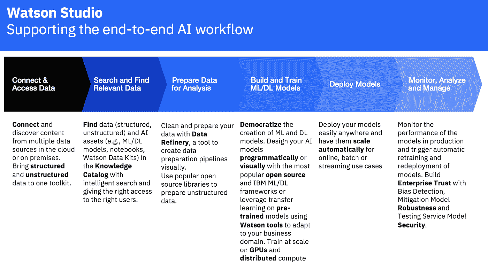
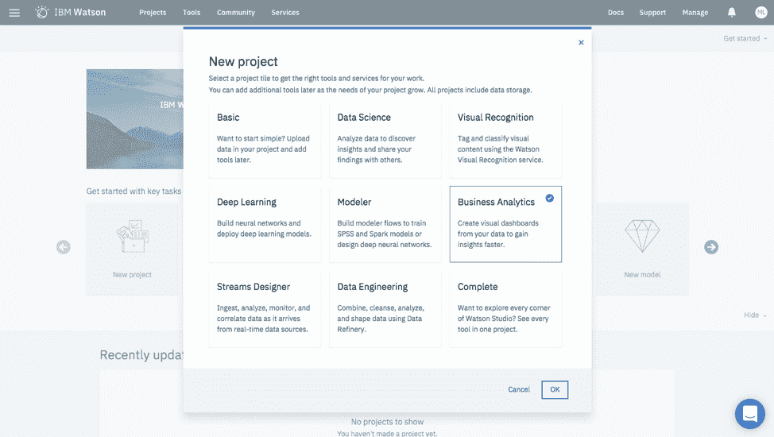
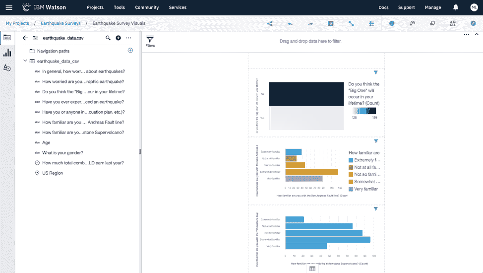

# 我是如何学会不再担心并爱上人工智能的。

> 原文：<https://medium.datadriveninvestor.com/how-i-learned-to-stop-worrying-and-love-the-a-i-9ca558b60aae?source=collection_archive---------28----------------------->

马克·林德

人工智能是一个几乎每个人都知道的现象，但有人真的设法将其实施到他们的工作流程中吗？网络安全和区块链顾问马克·林德在一系列文章中分享了他的经验。

在我作为一名 C 级高管和长期人工智能专家的经历中，我了解到想要利用人工智能的人发现入门是最困难的部分。即使是更自信的从业者也很容易被导航工具的阵列和复杂性所吓倒。

但这个问题现在已经成为过去。有了 IBM Watson Studio，您和您的项目现在可以立即投入运行了。该产品的集成环境使人工智能变得更加容易，允许用户快速轻松地构建视觉上有吸引力的项目和模型。

我不想陷入低效和缓慢的流程中，所以 Watson Studio 是一个与众不同的工具，因为它可以处理耗时的任务，并以竞争对手无法做到的方式整合工具。这使我能够专注于进行高层次的分析，并通过提供尽可能好的数据集来更好地让我这样做。让我提供一个我作为测试完成的例子。该平台有助于通过四个简单的步骤成功审查地震区的地震调查数据:

*   创建项目并上传数据集。
*   该平台自动清理和优化数据集。
*   使用分析仪表板分析和可视化数据。
*   使用人工智能生成启发性和相关的结果。

下面的动画展示了 IBM Watson 提供卓越产品和性能的方式。它强调了“大胜利”来自可用性的观点，因为用户不必导航多个工具、控制台和 ui 来有效地利用机器或深度学习项目。

使用大多数类似的工具，呈现是混乱的，并且利用是低效的。IBM Watson Studio 中的集成环境和 process steps 工作流消除了在不同工具之间切换的困难、耗时的过程，并使整个过程减少了时间和劳动强度。

事实证明，我第一次尝试使用这种产品节省了大量时间。在一个非集成的系统中，上述所有步骤都是困难的。这些工具流畅而高效，并呈现出简洁的用户界面。它们还使团队中的每个人(无论大小)更容易插入他们自己的数据来获得他们需要的信息，而不必从头开始。最重要的是，它很容易学习，所以如果你的团队经历人员变动，你甚至不会有表现失误。

我发现 IBM Watson Studio 最有趣的一点是其集成的协作环境，因为它允许由数据科学家、业务分析师、SME 和其他人组成的团队进行协作，而不必共享帐户、移动数据或使用在使用多个控制台、工具或不同产品来创建、管理和成功运行端到端的机器学习或深度学习项目时经常需要的变通办法。

尽管在这个特殊的项目中，我是独自完成的，但在不久前，我作为团队的一部分完成了几个项目，这些项目可以从这种协作能力中受益匪浅。

在进行我最新的项目时，我充分利用了内置的学习和教程来帮助我获得最好的结果。它还帮助我确定哪种算法对我的不同项目来说是最佳的，任何这样做的人都知道这并不总是容易的。例如，我正在运行一个项目，该项目使用了地震调查数据，并且能够快速地将数据集上传到云中，该数据集以前存储在 excel 电子表格中。然后，使用数据提炼特性工程功能，提炼数据变得很简单。它为我提供了数据的柱状视图和经过深思熟虑的工具，以便在分析数据之前对其进行适当的提炼。

让我印象深刻的一件事是使用代码或无代码来构建和/或训练我的模型的能力。但是，在我的特定地震调查数据示例中，我专注于以分析形式查看细化的数据，这使我能够看到答案的频率，以确定数据中是否有突出的趋势或相关内容，否则可能会被遗漏。

可视化数据给我提供了一些非直觉的见解。对我来说最突出的一点是许多被调查的人对圣安德烈亚斯断层不太熟悉。我能够对像这样的调查问题进行可视化，这让我对调查结果有了新的认识。甚至强调一些非直观的结果，这样它们就能获得适当的关注。

我期待着在 Watson Studio 中使用一些其他的集成工具，但它确实节省了时间，让我变得更有效率，我可以说这在团队环境中会产生更大的影响。

**关于作者:**

[*马克·林德*](https://www.linkedin.com/in/marklynd/) *是网络安全、区块链和 FinTech 的专家和顾问。数字转型、区块链和加密排名前 15，数字转型力量 100 排名前 15，InsurTech、FinTech 和 IoT 排名前 50*

在这里阅读最好的加密新闻分析！[bitnewstoday.com](https://bitnewstoday.com/)比特币、投资、监管和其他加密货币

*最初发表于*[T5【bitnewstoday.com】](https://bitnewstoday.com/news/how-i-learned-to-stop-worrying-and-love-the-a-i/)*。*