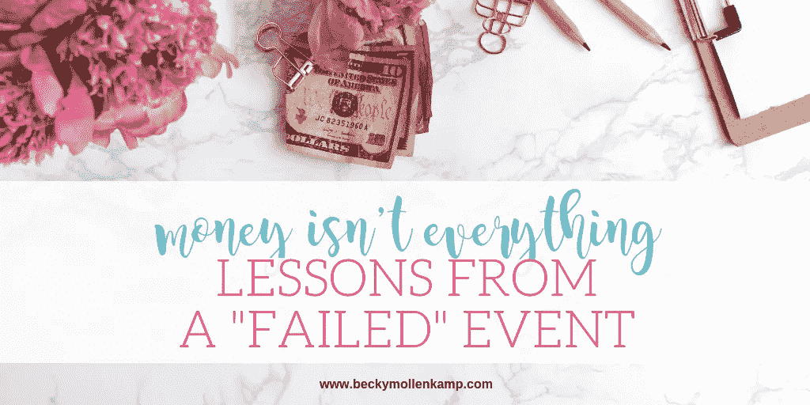

# 我是如何在我的生意中赚到每小时 4 美元的(&为什么没关系)

> 原文：<https://medium.datadriveninvestor.com/how-i-made-4-an-hour-in-my-business-why-its-okay-f323253b60b9?source=collection_archive---------52----------------------->

本月早些时候，我主持了一次商业务虚会(这是我今年主持的第二次)。大多数人认为，这次活动是失败的。我只获利 811 美元。计划、营销、组织和执行为期 3 天的务虚会需要大约 200 个小时。这意味着我每小时挣大约 4 美元。

五月份的第一次静修门票售罄，我净赚了 2800 多美元。大约每小时 14 美元。不太好，但比这多三倍。

为什么我要告诉你这些数字？我意识到我真的想和大家分享一个教训。

我总是很快告诉人们，他们应该总是[收取他们工作的价值](https://beckymollenkamp.com/creative-entrepreneurs-charge-worth/)。我意识到我需要更加谨慎地给出建议。任何规则都有例外，包括定价，我用粗线条画画是不公平的。

我很容易觉得举办第二次活动是一个彻底的失败，第二次活动的收入比第一次少了很多，参与者比计划/预算的少了三个。

事实是，**我每小时 4 美元的努力完全成功了**(坦白地说，即使我赔钱了也是如此)。原因如下:

数据:这是一次惊人的学习经历。我发现秋天是举办活动的艰难时期，因为主要的销售期是在夏季，此时大多数企业主都不处于购买模式。我意识到我需要得到全额或更多的预付款项，以降低赔钱的风险。我还了解到，我更喜欢小团体，因为它允许更深层次的联系。最后，我有机会测试新技术，看看哪些有效，哪些无效。

**服务:**出席者从静修中获得了惊人的价值。我为女性创造了一个安全的学习、分享和成长的空间。他们离开时对自己的业务、目标和自己有了更深刻的理解。他们与其他女性建立了有意义的联系，我相信这种联系在未来的几个月甚至几年里还会继续。当然，我想赚钱，但最终我成为了一名赋予女性权利的思维教练，而这个活动正是这么做的。

信心:我带着巨大的信心离开了这个活动。像大多数人一样，我有时会与怀疑和冒名顶替综合症做斗争。虽然做了 14 年的个体户，但是做教练才一年多一点。我很高兴有机会做这项工作，并得到积极的反馈。这不仅仅是拍一下后背；这是一次重申的经历，激励我继续做我热爱的工作。

这是否意味着我会满足于为未来的静修挣 811 美元？或者 4 美元一小时？绝对没有。

我会用我学到的一切来改变心态和战术，这样这种事情就不会再发生了。我会尽最大努力确保我的下一次活动或提供的结果是财务支出，让我感到自豪和成功。

也就是说，我还会记得，当事情不像我希望的那样顺利时(因为有时不管我多么努力，事情都不会顺利)，这并不意味着我是个失败者。我希望你也一样。

学会重新定义失败，并在失望中找到成功，这是非常强大的。