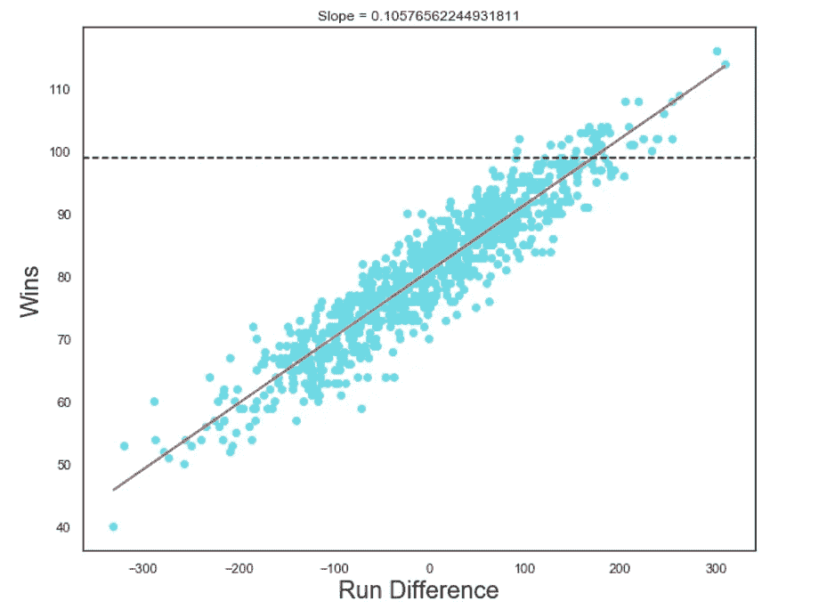
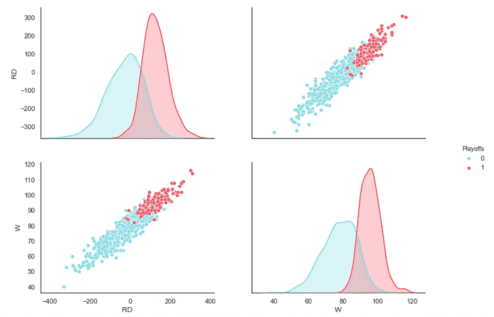
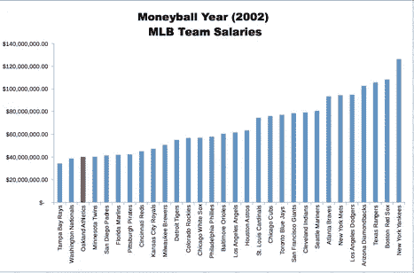

# 我是如何模仿《金钱球》中乔纳·希尔斯的角色来预测棒球赛季结果的

> 原文：<https://medium.datadriveninvestor.com/how-i-mimicked-jonah-hills-character-from-moneyball-to-predict-baseball-season-results-853167aaffed?source=collection_archive---------0----------------------->

Photo by [Ruari Bell](https://unsplash.com/@ruaribell?utm_source=medium&utm_medium=referral) on [Unsplash](https://unsplash.com?utm_source=medium&utm_medium=referral)

如果你是一个棒球迷，甚至是一个电影迷，那么你可能听说过 2011 年的电影'**'。这部电影改编自 Micheal Lewis 的书，基于一个真实的故事，讲述了奥克兰运动家队总经理比利·比恩在失去明星球员后，必须在预算紧张的情况下找到进入季后赛的方法。常春藤联盟的毕业生保罗·德波斯塔(Paul DePodesta)利用[的 Sabermetrics](https://sabr.org/sabermetrics) ，能够识别出“廉价”球员，以建立一支球队，延续美国队臭名昭著的 [20 连胜](https://localwiki.org/oakland/A%27s_20_Game_Streak)，并看到他们在常规赛中获得第一名，将 Sabermetrics 的艺术置于聚光灯下。**

> **你的目标不应该是买球员。你的目标应该是赢得胜利。为了赢得购买，你需要购买运行。**

**DePodesta(影片中的彼得·勃兰特，由乔纳·希尔饰演)这么说是什么意思？嗯…**

** [## DDI 编辑推荐:5 本让你从新手变成专家的机器学习书籍|数据驱动…

### 机器学习行业的蓬勃发展重新引起了人们对人工智能的兴趣

www.datadriveninvestor.com](https://www.datadriveninvestor.com/2019/03/03/editors-pick-5-machine-learning-books/) 

DePodesta 计算出，为了进入季后赛，一支球队需要赢得 99 场比赛。你是如何赢得比赛的？你比对方得分更多；相当简单，对吧？

首先，为了进入季后赛，DePodesta 从哪里得到 99 场比赛的想法？使用最初从[baseball-reference.com](https://www.baseball-reference.com/)收集的 [Kaggle](https://www.kaggle.com/wduckett/moneyball-mlb-stats-19622012) 数据，我们可以将这一理论形象化如下:

> 对编码爱好者来说，你可以在我的 [Github 页面上找到这个项目](https://github.com/HarryBitten/MoneyballPredictions)的完整代码

 [## 哈里比特/金钱预测

### 在 GitHub 上创建一个帐户，为 Harry bitten/money ball predictions 的发展做出贡献。

github.com](https://github.com/HarryBitten/MoneyballPredictions) 

Wins vs Runs Scored (Pre-’Moneyball’ Season)

正如我们所看到的，DePodestas 的理论似乎是准确的，因为只有 3 次球队没有以≥ 99 胜进入季后赛(在黑色虚线 99 胜“阈值”线后的蓝点中可以看到)。

DePodesta 还计算出，为了赢得 99 场比赛并进入季后赛，A 队必须得 814 分，同时只允许 645 分，分差 169 分，我们也可以想象一下:

Run Difference vs Wins (Pre-’Moneyball’ Season)

你可以看到，在 99 胜的基准测试中，胜率和跑差之间的直线相交，几乎正好是 169 跑差。

想必其他团队也知道这一点吧？这不是火箭科学，知道一个更高的运行差异意味着更多的胜利。然而，这正是有趣的地方。与当时的大球队相比，美国队的预算非常少，需要购买球员来增加他们的得分差距，从而增加他们的胜场数。

2002 MLB Team Salaries

这让我们回到前面提到的那句话，“你的目标不应该是买球员。你的目标应该是赢得胜利。为了赢得比赛，你需要赢得比赛。”为了“购买跑垒得分”,我们需要知道哪些球员会在这些跑垒得分。

> “在游戏中有一种普遍的失败，那就是无法理解到底发生了什么。这使得那些管理美国职业棒球大联盟球队的人对他们的球员判断失误，对他们的球队管理不善。”-彼得·布兰德(乔纳·希尔)

当时，MLB 球探专注于一个主要的统计数据，[击球率](https://en.wikipedia.org/wiki/Batting_average_(baseball)):这是衡量击球手击球成功的最古老、最通用的工具之一，击球率是通过将球员的击球次数除以他的总击球次数来确定的，数字介于 0(显示为 0.000)和 1(1.000)之间。

然而，DePodesta 得出结论，击球率被严重高估，实际上有两种更好的统计方法来寻找球员:

1.  上垒百分比(OBP)-这是一个统计数据，衡量击球手到达垒的频率，它不考虑击球手跑了多远，即三垒。
2.  击球百分比(SLG)-击球百分比:一个衡量击球“生产力”的指标，简单来说，它衡量击球手击球时能打出多远。

> “这是把事情归结为一个数字。用我们阅读统计数据的方式，我们会发现球员身上其他人看不到的价值。”-彼得·布兰德(乔纳·希尔)

这正是他们成功做到的，比利·比恩和湖人能够以低廉的价格得到高 OBP 和 SLG 的球员，因为球探忽略了这些属性。

但是我们怎么知道保罗是对的，而童子军是错的呢？嗯，如果我们再次采用相同的棒球数据集(同时从数据集中删除“moneyball”之前的数据)，我们可以使用皮尔逊方法来找出统计数据之间的相关性。

Correlation between attributes

请注意这里的右栏，它显示了 RS(得分)与 OBP(基本百分比)、SLG(击球百分比)和 BA(击球率)的关系。我们可以看到，击球率实际上是关于得分的*最不相关的属性，其相关性为 0.83。击发百分比和上垒百分比实际上相关性更高，分别为 0.93 和 0.90。这意味着 OBP 和 SLG 对得分结果的总体影响都比巴大。这证实了 DePodestas 对 SLG 和 OBP 的低估和对 BA 的相对高估。*

*现在，运动家队有了他们想要的球员，德波斯塔和比恩能够准确地预测他们会得多少分，他们会允许多少分，以及他们会赢得多少场比赛来结束这个赛季。*

*   *得分运行- DePodesta 预测 800–820，实际结果:800*
*   *允许运行- DePodesta 预测 650–670，实际结果:653*
*   *Wins- DePodesta 预测 97，实际结果:103*

*很不可思议吧。利用他们球队的统计数据，运动家队已经知道他们有一支值得进入季后赛的球队*

*但是他们是如何计算出这些预测的呢？这就是线性回归的由来。线性回归是最简单的机器学习形式之一，它基于独立变量对目标预测值进行建模(在我们的情况下，目标预测是运行差异和获胜，独立变量是击发百分比和基本百分比)*

****简而言之，线性回归模型的工作本质上是寻找投入(X)和产出(y)之间的线性关系。****

*我们实际上可以通过一点点编码来创建这个线性回归模型，并尝试重现 DePodesta 在 2002 年常规赛之前所做的事情。*

*首先，使用我们数据集中的所有数据，我们为得分运行建立一个模型，使用基本百分比和击球百分比进行预测，输出如下:*

**

*如果这看起来有点混乱，不要担心。简而言之，这意味着我们可以说我们的跑步得分模型采用以下形式:*

**RS =-804.627+(2737.768×(OBP))+(1584.909×(SLG))**

*接下来，我们可以做同样的事情，但是要模拟允许的跑动，使用对手的基本百分比和对手的击球百分比。*

**

*然后，我们可以说我们的允许运行模型采用以下形式:*

*RA =-775.162+(3225.004×(OOBP))+(1106.504×(OSLG))**

*然后，我们需要建立一个模型来预测给定运行差异时的获胜次数。*

**

*我们可以说，我们的 Wins 模型采用以下形式:*

**W = 84.092 + (0.085 ×(RD))**

*例如，如果我们的跑差是 20，我们将做 84.092+(0.085*×*×20*)
=*85.792，这意味着如果我们的跑差是 20，我们将有望在赛季中赢得 86 场比赛。*

*现在，我们剩下要做的就是得到 OBP，SLG，对手 OBP，对手 SLG，并简单地将它们插入模型中！*

*我们知道哪些球员在 2001 赛季后被转入和转出，所以我们可以用 2001 年的球员数据来建立 2002 年的球队。*

*2002 年 NBA 球队季前统计数据取自 2001 年:*

*OBP: 0.339*

**SLG: 0.430**

**OOBP: 0.307**

**OSLG: 0.373**

*现在让我们创建我们的预测:*

**

*The model predicts 805 Runs Scored*

**

*The model predicts 628 Runs Allowed*

*这意味着我们得到的 RD(运行差异)为 177(805–628)，然后我们可以将其代入 Wins 模型。*

**

*所以，最后，我们的模型预测得分 805 分，628 分，99 场比赛获胜，这意味着我们的模型预测，根据他们的球队数据，运动家队将进入季后赛，他们做到了！*

*让我们将我们的模型与 DePodestas 的预测进行比较:*

**

*该模型的表现相当出色，确实支持了 DePodestas 的理论，并解释了为什么他使用的战术成为人们关注的焦点，以及为什么奥克兰运动家队的“Moneyball”赛季结束后不久，这种战术在整个棒球运动中被大量采用。*

*感谢你的阅读，我们下一集再见！***