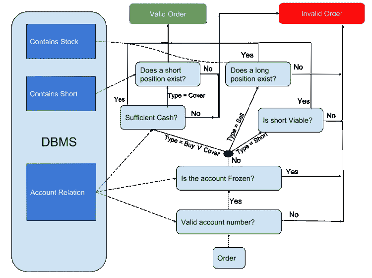
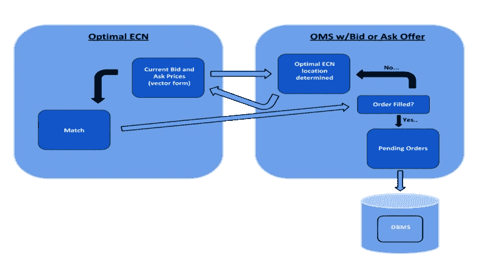
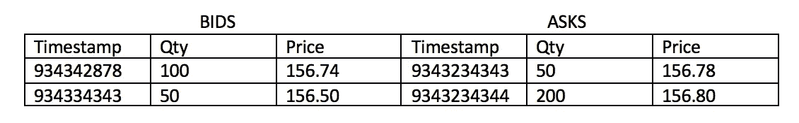
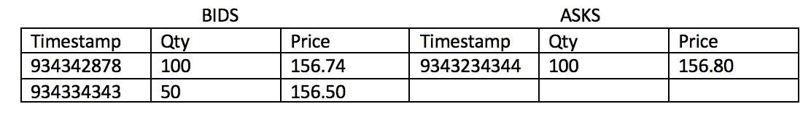
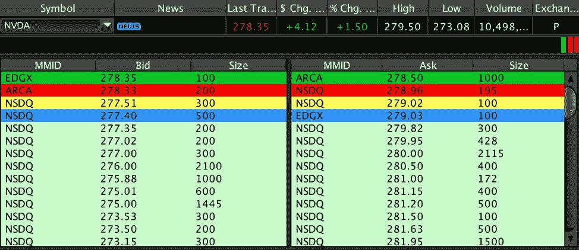

# 如何模拟股票市场

> 原文：<https://medium.datadriveninvestor.com/how-i-simulated-the-entire-stock-market-for-a-single-day-3df3bff5d49d?source=collection_archive---------1----------------------->

> 你有没有想过当你提交买卖股票的指令时会发生什么？

*Photo by* [*3844328*](https://pixabay.com/en/users/3844328-3844328/) *via Pixabay (CC0)*

在本文中，我将向您展示我是如何在一个交易日内模拟每个股票交易所的所有 IBM 普通股交易的。通过构建虚拟证券交易所，我们可以复制每一次精确到毫秒的交易。一旦它启动并运行，就太棒了！您可以看到市场流动性在交易所之间的分布，看到股票订单以如此精细的粒度处理令人着迷。

**项目**

当我被要求创建一个与数据库集成的软件应用程序时，我的脑海中灵光一现。我开始搜索互联网，直到找到它——这是一个毫秒级数据的免费样本，包含了一天内整个市场上提交的 IBM 普通股的每笔买卖。当我看到这些数据时，我设想客户订单通过股票经纪人的订单管理系统(OMS)流向交易所进行处理。下面概述的最终产品复制了股票经纪人、他们的客户和股票交易所使用的系统。

**模拟如何工作**
客户为 IBM 股票创建一个订单，他或她在模拟中指定下订单的时间。然后，交易日“开始”，系统开始一毫秒一毫秒地分析市场数据。正如您将看到的，这些数据指定了每笔买卖的目的地交易所或交易场所、要买卖的股票数量、提交的时间戳以及事件类型。当我们从数据文件中提取行时，这些报价中的每一个都被发送到适当的交易所。这模拟了全天发生在电子通信网络(ECN)上的所有交易。一旦我们在数据流中到达订单的时间戳，我们客户的订单就被提交给股票经纪人。股票经纪人然后决定如何履行我们客户的订单，并对其数据库进行任何必要的更改。

Order routing Source: Author

**背景:**

股票经纪人可以通过多种方式完成股票订单:

**1。** **发送到楼层**

在金融市场数字化之前，向场内发送订单是很常见的。纽交所的交易大厅曾经混乱不堪，挤满了大声喊着出价和要价的交易员。这种令人兴奋的交易方式被称为“公开叫价”今天，纽约证券交易所非常安静。它更多地被用作新闻工作室，而不是交易媒介。

**2。** **做市商**

做市商做你期望他们做的事情——他们做市场。做市商对市场流动性很重要。股票市场有一种叫做买卖差价的东西。买卖价差就是最佳出价和最佳要价之间的差额——最佳出价是以最高价格买入股票的报价，最佳要价是以最低价格卖出股票的报价。做市商是最佳买价和卖价之间的中间商，决定买卖价差。例如，如果 AAPL 的最佳买价和卖价分别是 220.50 美元和 220.90 美元，这意味着做市商以 220.50 美元买入股票，并以 220.90 美元卖出。在处理高度不稳定的证券时有很大的风险，做市商因承担这种风险而得到补偿。

**3。** **ECN(电子通信网络)**

ECN 是一个电子市场。他们接受股票报价，撮合买家和卖家。我们将在下面进一步讨论 ECN。

**4。** **内化**

当经纪人用他们的股票来完成客户的部分或全部订单时，内部化就发生了。

## 订单管理系统(OMS):

股票订单是市场流动性的根源。当有人——或者现在更常见的是计算机——下单购买股票时，市场活动就产生了。随着高频交易的出现，构成股票订单的参数(如订单大小、价格、订单类型)变得非常复杂。我让这个项目简单，只允许限价和市价单。

一旦创建了库存订单，就需要对其进行处理和履行。这是通过股票经纪人的 OMS 完成的。OMS 需要在通过内部化获得的资本收益和将订单发送到 ECN 获得的佣金之间进行权衡。

Functionality of the OMS I developed Source: Author

1.客户创建股票订单，并提交给 OMS。

2.然后，OMS 会进行检查，以确保订单符合条件。这包括确保客户有足够的账户余额，账户没有被冻结，客户没有试图出售他们不拥有的股票，等等。如果订单不合格，用户会收到通知(蓝绿色箭头)。

3.如果订单符合条件，将对其进行内部化评估(更多信息见下文)。请注意，无论订单是否内部化，订单都将被附加到未决订单列表中。该未决订单列表是 OMS 跟踪等待 ECN 处理的订单的方式。

4.OMS 需要确定订单是否可以内部化。如果可以内部化，那么 OMS 会评估订单中有多少应该内部化，以及这样做是否有利可图。如果 OMS 决定将订单内部化，经纪人将转让股份的所有权，更新未决订单列表中的订单，并检查订单以决定下一步。

5.如果订单没有内部化或者已经通过内部化部分完成，则订单在这里结束。然后，OMS 查询每个 ECN 的最佳出价和要价，并向 ECN 提交当前最佳价格的报价。这是一个简化版本。实际的 OMS 会考虑额外的变量，如市场流动性和路由激励。

6.这就是 ECN-OMS 协议的用武之地。我创建了一个名为 order_info 的数据结构来在 ECN 和 OMS 之间传递订单信息包。一旦订单被提交到最佳 ECN，OMS 就等待接收 order_info 对象(在 ECN 部分有更多相关信息)。它包含要约的当前状态信息，如已完成的股份数量。如果订单已经完成，我们转到 7。否则回到 5。

7.我们更新我们的数据库，并在订单完成后从未决订单列表中删除订单。

Decision criteria for order eligibility Source: Author

订单内部化:

经纪人往往有自己的股票库存。内部化是经纪人利用他们的库存来满足客户订单的行为。经纪人只有在履行了为客户提供最佳执行的义务的情况下，才能将订单内部化。这意味着，当有更好的价格提供给客户时，经纪人无法将订单内部化以获利。

出于多种原因，股份内部化可能是有利的。例如，经纪人可能希望在不显著影响市场价格的情况下卖出大量股票。由于缺乏可用的内部化政策文档，我实施的评估程序非常简单。我打电话给我的股票经纪人询问一些看法，但是他们不愿意透露关于他们内部化实践的信息。

本项目中的内部化程序不考虑销售或短缺订单，因为做出这些决定的标准取决于许多超出本项目范围的变量。我们假设股票经纪人不愿意将他们拥有的所有证券内部化(例如，他们可能会保留一些股票借给卖空客户)。因此，我们只会在评估过程中考虑他们愿意内化的证券集。我们的 OMS 将所有符合 SEC 法规的订单内部化，并带来利润。

How ECNs interact with the OMS Source: Author

如果股票经纪人以等于或优于最佳市场价格的价格执行订单，他就能够将订单与他所拥有的证券内在化。我在源代码中包含了更多关于这个项目中实现的国际化策略的信息。

电子通信网络:

如上所述，ECNs 是一种替代交易系统(ATS)。ECN 自动匹配买家和卖家。纽约证券交易所 Arca 就是一个 ECN 的例子。ECN 是这个项目的支柱，构成了我们正在模拟的市场。

简而言之，ECN 通过维护当前出价和当前要价的列表来工作。这些列表由称为报价的数据结构组成。要约包含 ECN 进行交易所需的所有信息。这些报价对象被系统地插入，因此最好的出价和要价总是在列表的前面。报价在这些列表中累积，直到在最佳买价和卖价之间的某个阈值内出现价格交集。当这种情况发生时，交易被创建，并且用于诱导交易的报价被相应地更新。ECN 还负责维护每个报价的平均填充价格。例如，考虑这个订单簿:

Order Book (before)

如果我们提交一个价格为 156.82 美元、数量为 150 件的投标，下面是最终的订单簿:

Order Book (after)

这是因为我们的报价吃掉了 best ask 和 100 股价格为 156.80 的 ask。我们的报价完全符合 156.793 的平均价格。

ECN 的工作是将所有交易信息转发回提交交易中每个报价的 OMS。在上面的示例中，ECN 通过名为 order_info 的数据结构将该数据发送给 OMS。Offer 和 order_info 对象作为 OMS 和 ECN 之间的基本协议一起工作。

支撑金融市场的软件要比这复杂得多。在学期开始的时候，我不知道该如何构建这个系统，但是随着我的不断努力，一切都变得井然有序了。这个项目中我最喜欢的部分是实现我疯狂的愿景；我看到了这些数据，想象着它们是如何在股票市场上在 ECNs 和 OMS 之间流动的，然后开始构建。

Level 2 GUI Source: Author

该项目最初是通过 C++ SQL API 集成到 Oracle DBMS 中的，但我为您创建了一个本地版本，您可以查看是否想运行模拟。

**外卖**

开始的时候，我不知道我该如何建造它。我的同学认为我疯了。我所拥有的只是一些数据、一个愿景，以及对现代金融市场内部运作的真正好奇心。这次经历让我明白，通过坚定不移地追求我感兴趣的话题，看似不可能的愿景也可以变成现实。因此，我鼓励你接受项目或追求想法，即使它们表面上看起来令人生畏。感谢阅读！

源代码和代码:

 [## ci hat 645/股市模拟

### 创建了一个股票经纪人应用系统，允许用户:在 IBM 的股票市场模拟中下单…

github.com](https://github.com/cihat645/StockMarketSimulation)  [## 交易执行:

### 当您下单买卖股票时，您可能不会考虑您的经纪人将在哪里或如何执行…

www.sec.gov](https://www.sec.gov/reportspubs/investor-publications/investorpubstradexechtm.html)  [## SEC.gov |做市商

### “做市商”是一个随时准备在定期和连续的基础上以一个固定的价格买卖特定股票的公司

www.sec.gov](https://www.sec.gov/fast-answers/answersmktmakerhtm.html)  [## SEC.gov |国际化

### 当你下单买卖股票时，你的经纪人可以选择在哪里执行你的订单。而不是…

www.sec.gov](https://www.sec.gov/fast-answers/answersinternalizationhtm.html)  [## 了解订单执行

### 通常投资者和交易者都不能完全理解当你点击网上的“输入”按钮时会发生什么…

www.investopedia.com](https://www.investopedia.com/articles/01/022801.asp)  [## 准备买卖未上市股票的经纪人

### 接受持有特定证券的一定数量股份的风险，以便…

www.investopedia.com](https://www.investopedia.com/terms/m/marketmaker.asp)