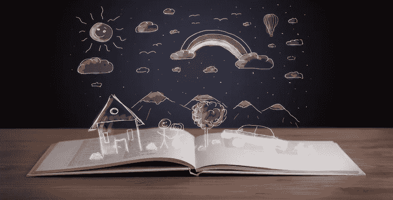
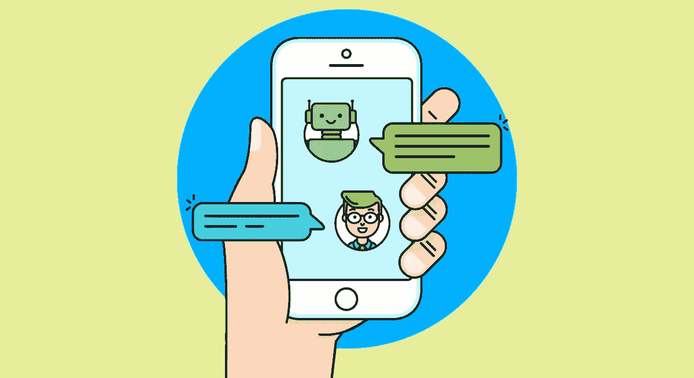
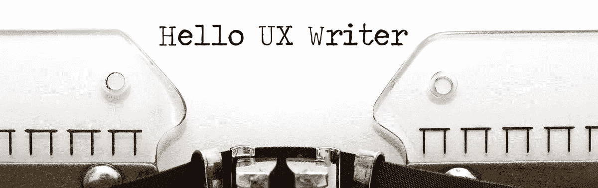
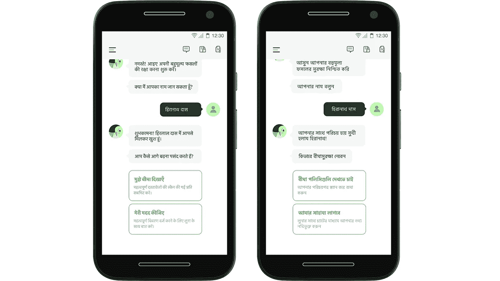
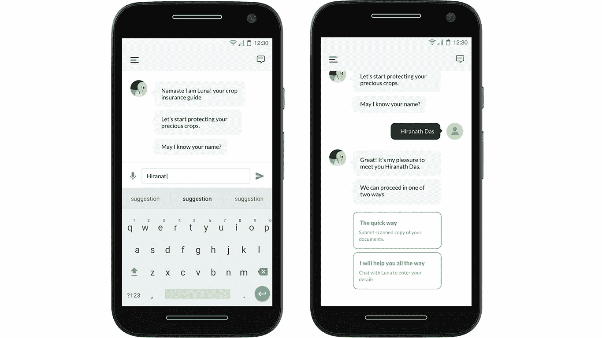

# 我如何开始讲故事来创造体验

> 原文：<https://medium.datadriveninvestor.com/how-i-started-storytelling-to-craft-experiences-dbe3cea81972?source=collection_archive---------6----------------------->

Courtesy: Digital Agency Network

现在是 2018 年，设计行业已经开始意识到有效的 microcopy 的存在，以增强跨平台的用户体验。客户旅程现在非常分散，因此需要跨渠道的连贯故事。戴上讲故事者的帽子已经成为所有设计师和文案作者的必做之事。

新的同理心驱动的设计原则不仅仅依靠线框和视觉屏幕来传递信息，它还专注于精炼产品试图表达的语言。只有这样，才能与最终用户建立具体的连接。对话式界面在设计师和开发人员中也变得非常流行，使他们意识到可以增强任何用户体验的强大副本。

> 聊天机器人是完全依赖文字交流来建立用户和机器之间联系的平台的优秀例子。这意味着每一个词都需要仔细选择和使用，以产生最大的影响，并给人一种真实和自然的对话的感觉。

Courtesy: Chatbots Magazine

我从 2017 年开始为设计写作。作为品牌实践的一部分，我开始写文章、背景研究和文案。我从事过各种项目，从以消费者为中心的有机食品到制作自动发票的财务软件。现在，在我与一些非常有才华的设计师一起工作的过程中，我经常看到他们过于专注于改进产品的外观和感觉，而在某些地方变得与产品哲学、品牌价值和客户体验如何与最终用户的个性和可用性特征相融合脱节。设计策略过于枯燥，最终结果严重依赖利益相关者的反馈。没有人关注产品如何与最终用户沟通。

但是，设计师的道德责任是什么呢？他应该深入思考最终用户，并建立一个产品生态系统，同时本能地提供帮助、友好、有用和创新。缺失的一环在哪里？

我的理解是，随着人工智能、虚拟现实、区块链、聊天机器人和其他新兴技术的出现，视觉界面不再是焦点。老实说，产品的外观和感觉应该仅限于以用户为中心的环境。目标不仅仅是创建外观精美的界面；它带来并分享我们的工具箱和流程，帮助企业创造健康、可持续的生态系统和故事。

courtesy: Medium

最近，我们为一家保险提供商开发了一个非常有趣的聊天机器人产品，我们的最终用户是农民社区。面临的挑战是为金字塔的底部开发这样一种易用性，它可以通过解决卫星图像、无人机监控和先进的土壤分析等技术的出现所带来的实际问题，影响农民的整体生活方式。该设计还需要舒适地适应印度次大陆农民社区使用的所有方言，以及流行的低端设备。

Work in progress product. All standard NDAs apply.

现在，在印度的背景下，很难吸引和教育农民，除非界面在功能、外观和可用性方面变得可对话和熟悉。

为了利用联想的力量扩大受众，并与最终用户建立情感联系以增加转化率，我们引入了代表聊天机器人的角色的概念。基于品牌特征和关键词，我们锁定了会说话的鸟的概念。

Work in progress product. All standard NDAs apply.

我们一直有意识地试图构建一个故事，我们希望这个故事中的人物和对话能够出现。这为我们带来了一个非常令人兴奋的地方，我们可以看到随着设计的进展，对话开始蓬勃发展。这种产品的可扩展性是巨大的，因为我们现在有无限的基于角色发展和用户旅程中的场景的对话线程。

作为一名 UX 作家，我完全相信讲故事的力量能够让用户的旅程更上一层楼。

在我们的设计团队中，在[**【GDD . design】**](http://gdd.design)**我们同时进行文字和设计工作。UI 文本的早期开发引导设计团队识别任何可能的设计问题，并采取明智的设计决策来解决用户和产品之间的沟通。**