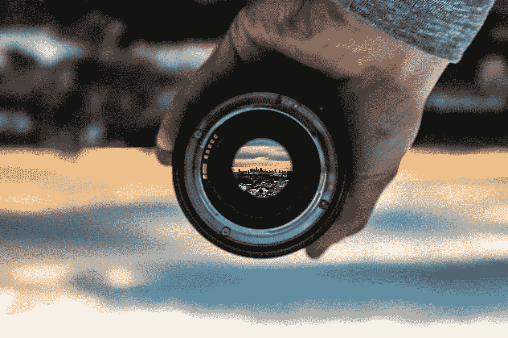

# 我是如何从一个待办事项清单到个人满足感和职业成长的

> 原文：<https://medium.datadriveninvestor.com/how-i-went-from-a-to-do-list-to-personal-satisfaction-and-professional-growth-353cab521200?source=collection_archive---------8----------------------->

> 有时候，当我想到小事会产生什么样的巨大后果时，我很想认为没有小事——布鲁斯·巴顿。

已经是十一月了。此刻你的新年决心清单是什么样的？对于我们大多数人来说，我们在二月左右忘记了它，也许我们正在走向下一年。我们都有自己想要完成的目标，但是我们越是尝试，我们就越对自己失望，觉得我们永远不会取得任何值得告诉别人的成就，所以我们舒服地在我们的教练中放松，让生活来生活我们，而不是我们去生活。

让我们直说吧。这个故事不是“早上 5 点起床指南”。这个故事是我个人的旅程，我相信它帮助我在日常生活中保持一套令人满意的有效习惯。

为了开始这个故事，我必须敲开布朗教授的门，这样他就可以开着他的德罗宁车带我回到 2015 年。那一年，由于油价下跌，我不得不离开目前的工作，这使我——当时并不知道——处于风暴的中心。我在我的小划艇上朝着那些高浪和高速风，以为我在一艘美国航空母舰上。

已经一年了，工作遥遥无期。从英语老师到高中老师，再到驾驶课，我几乎什么都尝试过。什么都没发生。懂两种语言和大量的数学和物理知识并没有多大帮助。有了很多空闲时间，我想学习一门新语言或者学习如何编码。还有，也许要多读书而不是看电视。但是你猜怎么着？这些事情在接下来的九个月里远离了我。我在浪费时间。就这么清楚。

已经是 2017 年了。我决定去西班牙的巴塞罗那完成我选择用英语学习的硕士学位，这样我就不会忘记我努力学习的那门珍贵的第二语言。头两个月是我适应新的文化、食物、人们以及当你从一个地方搬到另一个地方时你必须考虑的许多方面的时间。在那里，我发现了一个迷人的知识环境，人们在每个角落阅读，每个街区都有图书馆，大型书店等等。我觉得有什么东西在推动我去做一件新的事情。

在我的硕士讲座期间，我在学习金融和数据分析的同时，接触了一些使用 R 语言和 SQL 的编码。这在当时对我来说是全新的东西，所以我决定通过使用一些 Coursera 课程来改进它们。与此同时，我每两三个月读一本书。没什么突出的。正常生活。

2018 年初，我考虑更新我的 LinkedIn 个人资料，以便炫耀我的新硕士学位。一切都会改变，所以让我和你们分享一些我采取的小步骤来提高我隐藏的潜力。

**在 LinkedIn 上活跃起来**

LinkedIn 是我们认为无用的社交网络之一，或者至少在我们发现自己失业之前是无用的。这种思维方式可就更不对了。这个专业网络已经充满了杰出的专业人士，你猜怎么着；他们已经是成功者，完全愿意帮助他人在他们的领域成长，尽可能多地分享信息。一旦你到了那里，你就不会停下来，直到你成为其中的一员。这就是我的遭遇。我发现自己充满了可以与他人分享的小知识，不久，我见证了我的联系是如何与我的内容相得益彰的。

**有使命宣言**

我不会骗你。我从斯蒂芬·柯维的书《高效人士的 7 个习惯》中学到了这一点。
使命宣言是写给你自己的一封信，一步步地描述你想很快成为什么样的人。你想做一个好父母，好男朋友还是好叔叔？你想用你的生命去影响别人吗？你想成为什么？我发现我有很多事情要做，我想成为。信不信由你，在那里我找到了我真正的激情所在。

**全身心地投入**

你可以想写多少使命宣言就写多少，但是如果你不致力于那个使命宣言，什么都不会发生。所以，问题是:我怎样才能把这种技能传授给你？嗯，这不是一个简单的任务，但帮助我的是，每天，每一天，我必须做一些事情来完成使命宣言。每一天，我不做任何与使命宣言相关的事情，这离我的使命只有一步之遥，但我为完成使命所做的一切，都是向我的目标迈出的一步。

**无所不能的学徒**

我明白了，我们每天都想完成很多任务。我们想去健身房，读一本书，准备演讲，学习一门新语言，帮助无家可归的人，等等。但事实是，我们不是被编程来完成任务的机器。我们是人类，人类有局限性。所以我想让你明白，每天完成三到四项任务比半途而废要好。从使命陈述中挑选出那些能真正带你去你想去的地方的。就我而言，我想学习 R 和 Python 编程以及一门新的语言，我想尽可能多地阅读，我想与他人分享我的知识，我想随时出现在我的家人和朋友面前。我每天都专注于此，不多也不少。

**让激励你的人围绕在你身边**

我会说这是在 LinkedIn 上互动的结果。但你也需要有人站在你面前，帮助你实现目标。鼓励你在日常跑步中走得更远的人。我相信你的同事、朋友或其他人会和你分享你想要实现的人生目标。要小心；你周围有很多人会告诉你，你疯了，你不够强大，不够聪明，等等。你必须时刻警惕那些会耗尽你日常动力的人。

由于我在这里提出的结果，我发现自己连续近一年(所以你不认为这篇文章充满了短期帮助)实现了我的使命陈述。我已经完成了十多门 Coursera 课程。从 2017 年 9 月到 2018 年 9 月我读了 12 本书。我用 60 多天的连胜学了法语基础；我每天早上吃早餐的时候都会看一场 TED 演讲。上周，我回到我的大学参加了几次演讲，以激励未来的石油工程师。当然，我在 LinkedIn 非常活跃。就在今年十月，我读了三本书(已经完成了去年目标的 1/4)。现在，我在这里用一种甚至不是我母语的语言写作。

问题是，如今我们充满了可能性，有大量的资源。这个时代是信息时代！我们有责任抓住它，像布鲁斯·巴顿一样相信我们每天做的小事实际上表现得非常伟大。

我是土生土长的厄瓜多尔人，但我认为自己是世界公民，相信总有时间通过合作和知识变得更好。 [LinkedIn](https://www.linkedin.com/in/marco-brito-f/) ， [Instagram](https://www.instagram.com/marcobf30/) ， [Twitter](https://twitter.com/marcobfec) 。