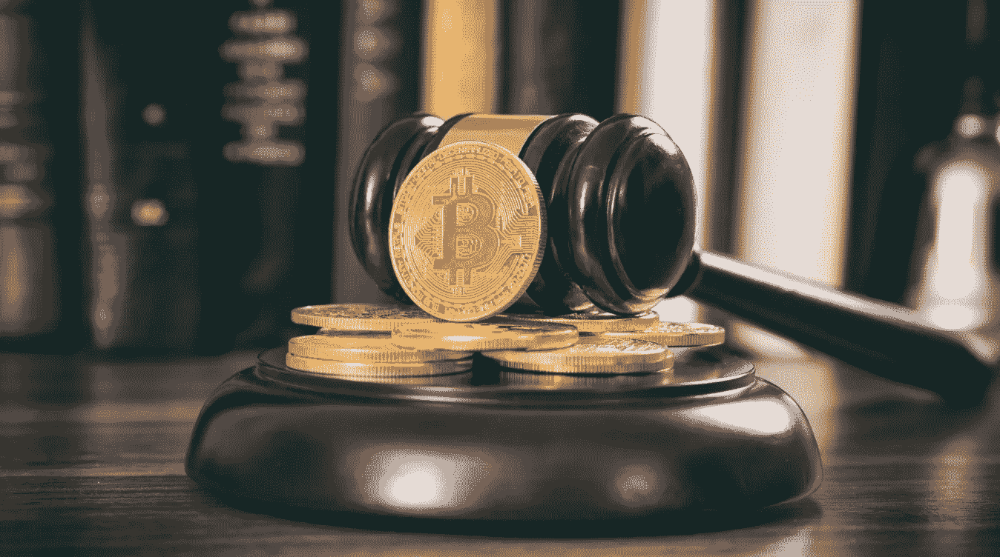

# ICO 监管如何促进创新

> 原文：<https://medium.datadriveninvestor.com/how-ico-regulation-could-actually-boost-innovation-a9b50359c2a2?source=collection_archive---------8----------------------->

2017 年，首次公开募股(ico)出现了爆炸式增长，自今年年初以来，区块链初创公司已经利用这种创新的融资形式筹集了超过 20 亿美元的资金。首次发行硬币不仅使初创公司能够筹集数百万美元的资金，许多新发行的数字代币的价值增加也为投资者带来了高回报。

初始硬币发行(ICOs)，也称为初始代币发行、代币销售或众筹销售，是一种创业融资形式，涉及向项目的早期支持者销售新的加密货币。然后，这种新的加密货币或数字令牌充当公司的准股份。从这个意义上说，ico 与股票市场的首次公开募股(IPO)并没有什么不同。

然而，直到最近，ico 还完全不受监管，因此在创业界引发了一些争议。在过去九个月冲击市场的首次公开募股浪潮中，出现了大量的骗局和各种低质量的项目，这些项目试图利用这一新的融资趋势为创始人筹集资金，而实际上并没有提供功能性的产品或服务。

不出所料，这一趋势没有被全球金融监管机构忽视。直到 7 月份，初创公司都能够在没有监管机构干预或审查的情况下筹集资金。然而，这已经改变了。

## **ICO 规定在此**

7 月 25 日，美国是第一个宣布监管首次硬币发行的国家。在美国证券交易委员会(SEC)的一份[声明](https://www.sec.gov/oiea/investor-alerts-and-bulletins/ib_coinofferings)中，监管机构强调了与投资代币销售相关的风险，并宣布新的数字代币(实际上充当与发行公司相关的证券)将受美国联邦证券法的管辖。换句话说，如果一家初创公司出于筹资目的发行新代币，作为该公司的象征性股票，其首次公开募股属于证券交易委员会的管辖范围，需要获得监管机构的批准。

8 月 1 日，新加坡金融监管机构新加坡金融管理局(MAS)发布了一份声明，称:“[……]如果数字代币构成受《证券及期货法》( Cap)监管的产品，新加坡的数字代币的发售或发行将受新加坡金融管理局监管。289) (SFA)。”因此，如果数字令牌可以被视为令牌化证券，那么它们的销售将受到监管。这实际上与美国采取的监管立场相同。

9 月 4 日，中国震惊了加密货币市场，更进一步，直接宣布[禁止代币销售](https://www.cnbc.com/2017/09/04/chinese-icos-china-bans-fundraising-through-initial-coin-offerings-report-says.html)，将新数字代币的发行与涉嫌欺诈活动联系起来。

包括中国证券监督管理委员会、中国人民银行和中国银行业监督管理委员会[在内的七个政府部门发表了一份联合声明](http://www.pbc.gov.cn/goutongjiaoliu/113456/113469/3374222/index.html)，宣布 ico 是一种未经授权的非法融资形式，禁止中国境内的所有公司和个人通过销售数字令牌筹集资金。

继中国之后，韩国也出人意料地宣布将禁止其境内的所有未来代币销售。金融服务委员会于 9 月 29 日宣布，所有类型的初始硬币发行(ICO)都将被禁止，因为它认为数字货币的交易需要受到严格控制和监控。

另一方面，英国的金融监管机构对 ico 采取了更自由的立场，并发布了一份声明[强调投资新发行的加密货币的潜在风险，并建议在投资前对项目进行彻底的研究。](https://www.fca.org.uk/news/statements/initial-coin-offerings)

“如果你在考虑购买数字代币，你应该意识到所涉及的风险[……]，并对具体项目进行充分研究。金融行为监管局(FCA)在声明中表示:“如果你是一名经验丰富的投资者，对 ICO 项目本身的质量(如商业计划、技术、相关人员)有信心，并准备好失去你的全部股份，你才应该投资 ICO 项目。”。

此外，瑞士金融监管机构 FINMA [宣布](https://www.finma.ch/en/news/2017/09/20170929-mm-ico/)将打击可能在其境内发生的欺诈性 ico，而加拿大金融监管机构加拿大证券管理局(CSA)[宣布](https://www.securities-administrators.ca/aboutcsa.aspx?id=1606)当新发行的加密货币可以归类为证券时，证券法要求现在可以适用于首次硬币发行。

## **监管可以促进创新**

尽管监管被广泛认为阻碍了新市场和新技术的发展，但现实是，正确的监管类型实际上可以带来科技领域的更多创新。

目前，有一波低质量的区块链项目，表现不佳的数字令牌仍在进入市场。此外，非区块链的创业项目也加入了 ICO 热潮，希望轻松赚钱，这进一步稀释了 ICO 市场。因此，那些致力于推出成功 ICO 的有前途的新创业公司现在正在努力实现他们的代币销售目标，因为缺乏进入壁垒和监管，市场已经被淹没。

如果监管机构设法在防止骗子和低质量项目进行 ico 之间找到平衡，同时仍然给运营良好的高质量项目足够的喘息空间，通过代币销售为自己融资，那么创业公司实际上可以受益于这一领域监管的增加。

第一步需要提高进入门槛，使骗子无法满足推出 ICO 的监管要求，从而阻碍他们的欺诈活动。

第二步需要发布监管要求，防止非专业运营的项目推出 ICO，例如，要求它们拥有一个法律团队、ICO 前的最低资本额，并能够透明地展示它们筹集的资金的用途。

如果监管机构能够设法建立一个采取上述两个步骤的 ICO 框架，那么 ICO 市场就可以淘汰那些稀释市场的低质量项目，相反，让那些选择首次发行硬币作为资金来源的真正创新和专业运营的项目获得授权。这将有助于保护消费者，因为表现不佳的代币将被赶出市场，并将推动创新，因为有前途的新公司可以获得重要的资金。