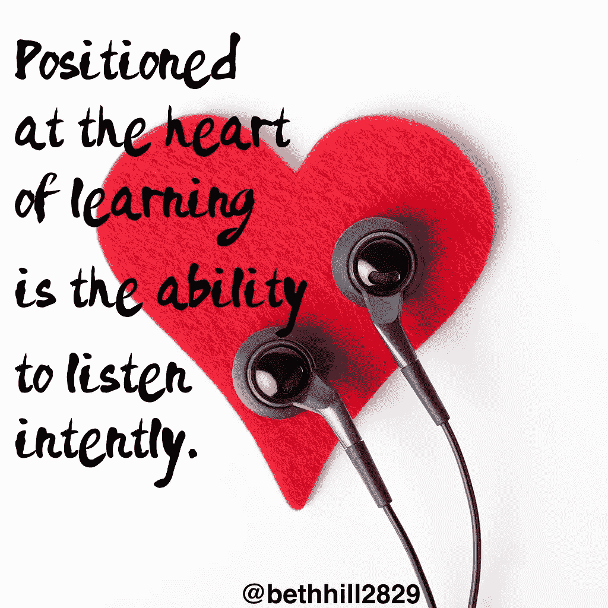

# 互动如何塑造你的命运

> 原文：<https://medium.datadriveninvestor.com/how-interactions-shape-your-destiny-5a8c5cdad1b3?source=collection_archive---------5----------------------->

你在破坏或促进与他人的互动吗？互动是自发发生的，有时是有计划的。有些互动是积极的和富有成效的，有些则不是。

有了这样的解释，社交技巧蔻驰、演讲者和培训师[凯特·纳塞尔](https://katenasser.com/)和[媒体博主、作家和沟通顾问](https://medium.com/@asanchez16)[安德里亚·桑切斯](https://twitter.com/asanchez16)权衡了互动的繁荣和萧条。

互动是你与人和事物相处的方式，就像与自然交流一样。

“这是信息的涨落，”桑切斯说。"互动是意识和交流的相互作用——语言的或非语言的."

纳赛尔举了几个互动的例子:

*   主动意识和与他人的联系。
*   信息、知识和情感的广泛接触和交流。
*   通过生命的脉动与他人联系。
*   我们如何在生活中前进。

你可以通过友好和开放的态度为互动做准备。换句话说，做自己最好的自己。

# 自然地行动

桑切斯说:“如果你按照自己的价值观生活，互动的准备工作就会自然而然地进行。”

纳赛尔说，互动是日常生活的一种自然功能。

“虽然互动是自发的，但我们可以通过开放的生活来为此做准备，”她说。“我喜欢自发的互动——这种心态是我的准备。

“我每天都在准备说，‘今天我能从别人身上学到什么？’“如果你需要‘计划’每一次互动，你会错过命运号提供给你的一些东西，”纳赛尔说了解他人是富有成效的会议和互动的重要准备。"

先入为主的观念和偏见可能会阻碍最初的互动。

对此，桑切斯补充道“认为你的想法不值得”，冷漠和恐吓。

纳赛尔说:“不喜欢别人会让人沮丧，同时认为自己比别人优秀。”。“还有就是怒容满面的脸，紧闭的双臂，消极的肢体语言加上*恐惧*。

她说:“希望每个人都像你一样，再加上种族主义、性别歧视、年龄歧视、隐性偏见和仇恨，会阻碍最初的互动。”。

# **从一开始就尊重**

自我和议程会导致消极的互动。积极的互动始于相互尊重。

桑切斯说:“理解和积极倾听的迹象使互动变得积极。”。“单向沟通和防御性会让互动变得消极。

她说:“与他人交谈使互动变得积极。”。"在和别人说话会使互动变得消极."

纳赛尔互动的优点是倾听、健康的自尊和乐于助人。消极的一面是伤害他人和自我驱动的人。

越多的参与者积极倾听，积极的互动就越多。[听明白](https://medium.com/@JKatzaman/tips-for-entrepreneurs-not-spoken-for-9de87df8653)，不回复。

桑切斯说:“通过意识到你的语言和非语言信号，促进互动变得更加积极。”。

# **问和听**

纳赛尔说，改善互动的关键是“好的问题和积极的倾听；开放的心态和爱心；用思考给予和索取；先给予再索取；由衷的言语和非言语欢迎。和充满敬意的好奇心。”

太多的我和太少的你会破坏互动。

桑切斯说，欺凌和“对权力的渴望使良好的互动变得糟糕”。

纳赛尔列举了基于恐惧的态度、贪婪和“我告诉过你”的感情对互动的伤害。

她说:“专横、尖刻的批评、缺乏人际交往技巧、借口、直言不讳、不礼貌和无视礼节都会伤害互动。”"自大狂和责备也会把好的互动变成坏的."

我们在互动中以自己的方式进入，喜欢听自己说话，把我们的优先事项放在第一位。

# **自我怀疑**

桑切斯说另一个绊脚石是当我们怀疑自己的时候。

纳赛尔说:“*假设*遮蔽了伟大的互动。”。“我们还让我们的恐惧扭曲了我们所听到的，试图‘证明’而不是互动，并将来自不同文化和种族背景的人拒之门外。”

自我认知和身份会影响互动。当你首先考虑自己的形象时，你看起来对别人不敏感。

“如果你想让别人看到真实的你，就要相信自己，”桑切斯说。

“你如何看待自己可以促进或破坏互动，”纳赛尔说，并补充了以下因素:

*   自信与过度自信。
*   你是谁，想成为谁。
*   合作者的身份导致积极的互动。
*   将自己视为“统治者或支配者”会让你的互动产生偏差。
*   爱你慷慨的冲动会让你的互动变得积极。
*   性别刻板印象。

# **两党制**

当双方都有相同的开放、给予和接受的心态时，互动效果最好。

桑切斯说:“我认识到，互动对于成长是必要的。

纳赛尔将她的成功归功于互动。

“互动产生了影响，”她说。“他们教会了我很多，是我命运的一部分。

“互动帮助我发展了我的业务，也帮助了我和其他人，”纳赛尔说。“他们滋养了我的心灵、灵魂和思想。当他们表现出尊重和爱时，互动是最好的。它们是值得珍惜的东西。”

**关于作者**

吉姆·卡扎曼是[拉戈金融服务公司](http://largofinancialservices.com)的经理，曾在空军和联邦政府的公共事务部门工作。你可以在[推特](https://twitter.com/JKatzaman)、[脸书](https://www.facebook.com/jim.katzaman)和 [LinkedIn](https://www.linkedin.com/in/jim-katzaman-33641b21/) 上和他联系。