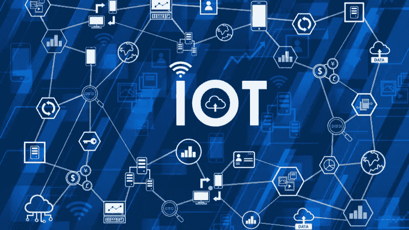
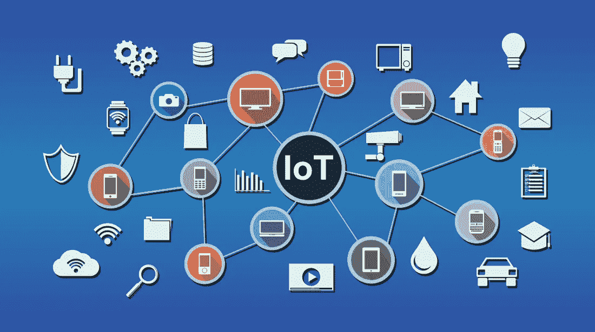
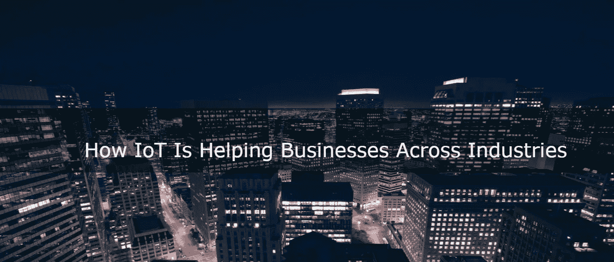

# 物联网如何改变移动应用开发

> 原文：<https://medium.datadriveninvestor.com/how-iot-is-changing-the-mobile-app-development-9c2d848af99e?source=collection_archive---------22----------------------->

物联网正迅速融入我们的生活。随着互联网上的海量数据和我们身边廉价设备的出现，技术正在不断发展。物联网是指通过互联网互连的设备，以实现操作兼容性。

随着物联网的出现，技术的传承已经在日常生活中缓解了我们的生活。因此，我们可以用最简单的术语来说，它是将各种事物或智能设备连接到互联网的概念。

物联网是一项革命性的技术，它让人们的日常生活变得更加便利，智能家居就是物联网的一个经典例子。它提供了一种可能性，即一台设备可以控制多台联网设备。有了这么多更好的用户体验解决方案，物联网也为移动应用开发创造了新的途径。

物联网是改变当今开发的移动应用的主要技术方面。物联网平台提供了设备和应用程序之间相互通信的通用语言。

**物联网如何改变移动应用开发……**

**连接**

随着许多创新想法的出现，移动应用程序开发人员正在关注如何在物联网领域利用移动应用程序。物联网创造了一个不同的场景，开发者只需添加一个层，而不是重建整个应用。从未来的角度来看，它将创造更好的选择，更容易和更方便地进入下一个阶段。

目前，物联网已经改变了当今世界的面貌。连通性是未来发展的唯一源泉。因此，连接到互联网的设备的性能会超出我们的预期。

**App 开发经验**

未来充满了可能性，开发者有责任理解这项革命性的技术。因此，对于应用程序开发人员来说，了解更多关于物联网的信息非常重要。

现在，物联网已经成为我们生活中不可或缺的一部分。智能手机用户总是热衷于探索这个世界的新机会。因此，如果你正在开发应用程序，你必须始终有一个专门的物联网专家。

有许多应用程序开发公司正在努力使他们的应用程序更接近物联网。可以理解，物联网是一种全新的方法，需要不同的技能组合。

转换到这项技术需要时间，这可能是一个渐进的过程，但可以肯定的是，这个想法是可行的。

**可持续应用**

通过应用实现的物联网将对用户体验产生巨大影响。这些应用程序的交互方式将在未来无缝地创造新的参数。

展望未来，有许多应用正在根据需要使用物联网修复应用。事实上，只有能够整合物联网的应用程序才能留在市场上。

物联网产生了更好的方式来帮助用户以不同的方式体验这个世界。所以，不如现在就把精力和金钱投入到正确的方向上。

**应用安全**

当我们谈论物联网时，数据安全一直是开发者关注的主要领域。正如我们所知，相互连接的设备共享大量数据。因此，不惜任何代价都不能泄露敏感信息是主要因素。

因此，必须以这样的方式保护或加密数据，以便用户有信心使用这项技术。在可被黑客攻击的世界中，互联设备的敏感和隐私可能会受到损害。

物联网正在增强移动应用程序开发人员以最佳方式利用这一概念的各个方面。因此，他们必须通过数据加密或其他方式确保应用程序与其他设备连接的方式足够安全。

## 这里有一些例子表明这些应用程序可以在无数方面给我们带来好处。应用程序开发利用数据共享和物联网连接的方式被证明是一个美好的未来。

**优步**

优步被认为是首批采用物联网的运输公司之一。该应用程序提供简单的功能，如乘客和司机都在不断发送数据，如位置和评级。除此之外，乘客只需简单地按一下按钮，就可以要求自雇司机搭车。

最棒的是，优步将数据存储在云中。因此，该数据随后被用于将驾驶员和乘客彼此联系起来。这为将来的目的保存了乘客的记录。猜猜看，当物联网开始运作时，这一切都变成了现实。

**鸣笛**

这种哨子还会记录他们的运动量和睡眠时间。收集的数据可用于确保他们的最佳和健康。因此，为了保护您的宠物免受通过主人的电话和项圈设备收集的数据的侵害。

通过使用 GPS，当他们在外面时，该应用程序会通知您他们何时在家。除此之外，它还可以跟踪他们在过去 24 小时内去过哪里，或者他们是否在安全区域。

**结束…**

[移动应用开发](http://www.quytech.com/mobile-application-development.php)完全专注于物联网的演进。市场上有一些应用程序可以通过互联网每天使用和执行。

自从物联网出现以来，技术范式发生了彻底的变化。甚至我们的日常活动也发生了变化，从我们如何开车，到我们如何购物，到我们如何利用家中的能源。物联网的到来正在将生活的各个方面重新洗牌到一个新的水平。因此，我们可以认为，当它来到我们的手机上时，它将成为一个巨大的技术亮点。

*最初发表于*[*【www.pixelstech.net】*](https://www.pixelstech.net/article/1535613976-How-IoT-is-changing-the-mobile-app-development)*。*