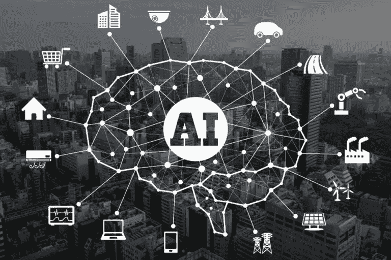

# 人工智能(AI)是如何帮助物联网(IoT)成长的？

> 原文：<https://medium.datadriveninvestor.com/how-is-artificial-intelligence-ai-helping-internet-of-things-iot-grow-de275eae8691?source=collection_archive---------46----------------------->

# 围绕人工智能有很多令人兴奋的事情(这是理所当然的)。专家表示，人工智能有望以前所未有的方式改变我们的生活。

你显然对人工智能将如何影响你的行业和工作感到困惑。虽然人工智能周围有很多噪音，但也有很多怀疑。人们想知道人工智能是否真的会彻底改变我们的生活，还是只是一场炒作？

有很多关于人工智能的文章(我们自己已经发表了一系列人工智能相关的博客)。人工智能有望执行许多智能任务(如语音识别、决策、语言理解等)。).人们认为它能完成以前只限于人类智力的任务。

另一方面，[物联网(IoT)指的是相互关联并通过网络传输数据的设备](http://www.eno8.com/blog/enterprise-internet-of-things-iot/?utm_source=Blog&utm_medium=Referral)。物联网设备不需要计算机或人类交互设备，并且已经在世界各地的日常生活产品中首次亮相。物联网设备严重依赖互联网连接。

根据高盛的预测，到 2020 年，物联网将把十倍多的设备连接到互联网(这些设备将包括腕带、汽车、家庭报警系统等。).物联网的发展受到计算数据和提取价值的速度和效率的阻碍。物联网产生难以想象的大量数据，许多组织不知道如何管理这些数据。您不能忽视这些数据，因为它与客户、他们的行为、购买习惯、个人信息等相关。

物联网允许数据在设备之间流动，人工智能可以帮助理解这些数据。人工智能有望成为物联网革命增长的关键推进剂，并将它提升到一个新的水平。

在这种情况下，人工智能(AI)可以极大地帮助聚合海量数据。[人工智能有能力提供提取有意义的](http://www.eno8.com/blog/google-artificial-intelligence-ai-masses/?utm_source=Blog&utm_medium=Referral)[大数据](https://en.wikipedia.org/wiki/Big_data)所需的分析。大数据是人工智能继续学习和变得更加智能的关键知识提供者。

[大数据为什么重要](http://www.ishir.com/big-data.htm?utm_source=Blog&utm_medium=Referral)？因为它可以管理传统数据处理应用程序无法管理的庞大而复杂的数据集。数据需要分析、管理、搜索、共享、存储、传输、更新和转移。需要大数据来增强人工智能的能力。

更多信息请访问—[http://www . ishir . com/blog/5144/artificial-intelligence-ai-helping-internet-things-IOT-grow . htm](http://www.ishir.com/blog/5144/artificial-intelligence-ai-helping-internet-things-iot-grow.htm)