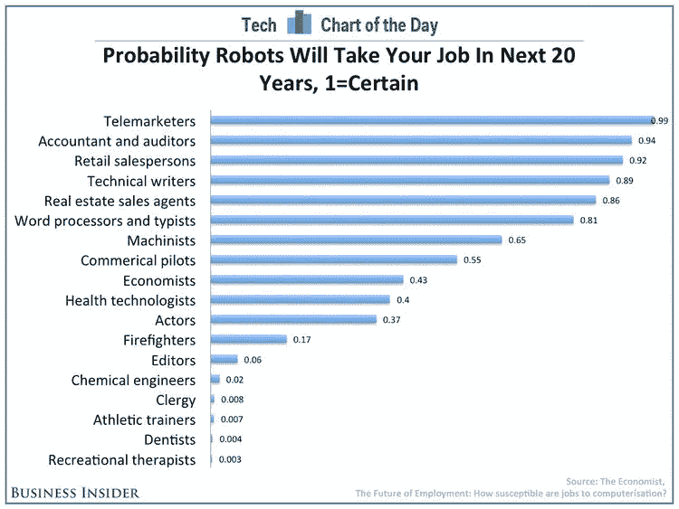

# 自动化是如何改变会计行业的？

> 原文：<https://medium.datadriveninvestor.com/how-is-automation-changing-the-accounting-industry-20573deaac7b?source=collection_archive---------9----------------------->

未来十年的自动化将极大地扰乱会计行业。虽然我们正在经历第四次工业革命，企业之间的联系越来越紧密，但将金融和非金融数据从交易源直接导向会计软件和税务机关的能力正在呈指数级增长。

麦肯锡全球公司(McKinsey Global)的一项研究预测，到 2030 年，全球将有多达 8 亿个工作岗位因自动化而流失，其中近三分之一的美国工作岗位将被自动化。《经济学人》编辑的下表支持了这一观点，认为在未来 20 年内，会计师和审计师的工作将有 94%的可能性被机器人取代，是第二高的职位，高于零售销售人员。

为了支持这种变化，所有领先的会计软件公司都放弃了他们的纯桌面产品，只专注于云和混合(云与桌面)解决方案。这一点很重要，因为它为附加产品提供了一个开放的生态系统和市场，为中小型企业创造了数据流动的途径。在这种情况下，一个新的行业和子行业已经出现，云集成商可以为会计公司及其客户提供建议和帮助。

 [## 不管准备好了没有，革命就在我们面前|数据驱动的投资者

### “对于技术如何影响我们的生活和重塑经济，我们必须形成全面的全球共识……

www.datadriveninvestor.com](https://www.datadriveninvestor.com/2019/02/12/ready-or-not-the-revolution-is-upon-us/) 

在我看来，会计革命将有三个关键因素:

1.  会计软件提供商；
2.  云集成商；和
3.  税务机关。

Xero、MYOB 和 QuickBooks 等会计软件提供商通过提供技术和生态系统使这一切成为可能。云集成商通过在 1000 多种选项中为企业提供建议和实施最佳解决方案来推动变革。一段时间后，税务当局将强制使用该技术，因为它符合他们创建高效税收系统的努力。这是显而易见的最新立法，使单点联系工资(STP)在澳大利亚是强制性的，以努力实现 PAYG 的自动备案。

我之所以没有把会计师事务所列为这场革命中举足轻重的一方，是因为它们的保守本性和保护职业的努力。随着市场、客户和/或法律要求会计师事务所做出改变，它们将被迫落后，而非领先。

我的预测是，许多云集成商将开始出现，这在行业整合和领先实践与会计公司合作或合并之前就已经出现了。

这不是第一次影响会计行业的革命，而计算机和电子表格对会计师来说是开创性的，使他们能够从如此多的耗时任务中摆脱出来。当时，这让会计师有更多的时间专注于特定的合规领域。在我们当前的革命中，自动化将使许多簿记、分析、合规和审计任务变得多余。因此，咨询收入将是未来十年的关键增长领域，会计师的核心技能将转向通信、计算机科学和业务流程。这些技能将用于向客户解释结果，而不是计算结果，审计和重新设计业务系统以自动化数据流，而不是手动收集和操纵数据，并随着更频繁的客户接触而改变管理和业务辅导技能。

那么什么可以自动化呢？目前，任何重复的，描述性的和可预测的。如果你可以为外包给菲律宾或印度的给定任务编写一个流程，你也可以编写一个脚本和/或构建机器人来模拟这个流程。如果你从现在开始展望十年，这项技术将允许更多的自动化。在我看来，我们的无现金社会转向一个能够直接从销售点进行纳税的系统只是一个时间问题，来自这项技术的数据流将会留下很少不能自动化的东西。

请与你的会计师分享这篇文章，并留下你的想法。