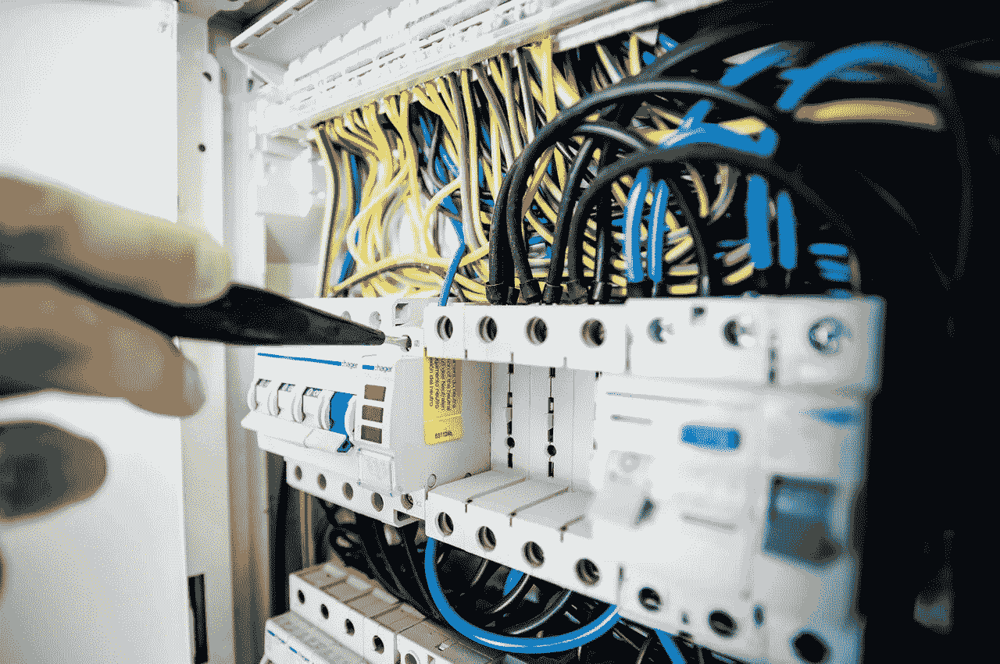
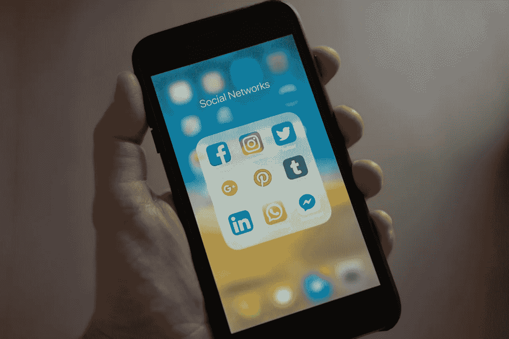

# 百思买(BBY)是如何赚钱的？

> 原文：<https://medium.datadriveninvestor.com/how-is-bestbuy-bby-making-money-c0d267b4ccc0?source=collection_archive---------8----------------------->

百思买(BBY) 正逆零售潮流而动，通过赚钱赢得新闻界的尊重。

这家电子产品零售商正在发展一批狂热的追随者，因为它生存在**亚马逊(纳斯达克代码:AMZN)** 的时代。独特的是，百思买与亚马逊和**苹果(纳斯达克股票代码:AAPL)** 合作，而不是与它们竞争。

例如，BestBuy 正在其商店销售 10 台亚马逊 Fire 电视机。此外，他们设计了 Fire 电视来播放亚马逊 Prime、HBO、索尼的 Playstation Vue、**网飞(纳斯达克:NFLX)** 和 Hulu，CNN [报道](https://money.cnn.com/2018/04/18/investing/amazon-best-buy-tv-partnership/index.html)。你甚至可以用 Alexa 控制 Fire TV。

此外，**百思买(纽约证券交易所:BBY)** 在其所在地和网上经营苹果品牌专卖店。因此，百思买正在拉拢其最大的直接竞争对手之一苹果商店。

**为什么百思买(BBY)需要亚马逊和苹果**

由于资源有限，百思买(BBY)需要亚马逊和苹果作为合作伙伴。

例如，百思买在 2018 年 8 月 4 日报告了 23.3 亿美元的现金和短期投资。因此，百思买缺乏资源来创造像 Fire TV 这样的东西。

另一方面，亚马逊有很多额外的现金。例如，亚马逊在 2018 年 9 月 30 日报告了 297.65 亿美元的现金和短期投资。此外，苹果在同一天公布了 709.7 亿美元的现金和短期投资。

因此，百思买正在解决传统实体零售商面临的最大问题之一，即现金供应有限。百思买通过与现金充裕的科技巨头合作来解决现金短缺问题。

**与亚马逊和苹果合作对百思买(BBY)来说是个好主意吗？**

与亚马逊或苹果的合作存在严重的缺陷。例如，巨人可以随时退出。

值得注意的是，如果亚马逊或苹果得到更好的报价，它们可能会放弃百思买。例如，**沃尔玛(纽约证券交易所:WMT)** 、**克罗格(纽约证券交易所:KR)** 或**塔吉特(纽约证券交易所:TGT)** 的合作提议。

很能说明问题的是，百思买在美国只有 257 家门店。相反，塔吉特在美国经营着 1822 家商店。此外，克罗格经营着 2782 家超市，沃尔玛在 2017 年拥有 6383 家美国门店。因此，百思买的小规模注定了它与亚马逊的亲密关系。

**百思买(BBY)的合作问题**

亚马逊自己也可以通过自己的商店退出这种关系，支持电子产品销售。值得注意的是，亚马逊计划在美国开设 3000 家无收银台便利店。

另一个问题是，亚马逊和苹果能够对百思买的库存和运营发号施令。例如，BestBuy 不得不停止销售苹果 Roku 电视机，以便在其商店中获得亚马逊 Fire。如果有一天杰夫·贝索斯打电话给百思买总部说，“把苹果扔出去，否则我就撤了你的店”，会发生什么

百思买可以通过寻求其他合作伙伴来抵消这种危险。例如，百思买可以与克罗格、塔吉特、沃尔玛、**梅西百货(纽约证券交易所代码:M)** 或**诺德斯特龙(纽约证券交易所代码:JWM)合作。**

百思买(BBY)可以在梅西百货或诺德斯特龙百货、[克罗格商场](https://www.businessinsider.com/kroger-has-a-plan-to-to-take-down-walmart-2016-8)、梅耶尔购物中心、劳氏百货、家得宝或沃尔玛和塔吉特购物中心内开店。除此之外，百思买还可以与诺德斯特龙当地或更小的零售商，如**美国柯尔百货公司(纽约证券交易所:KSS)** 或**巴诺(纽约证券交易所:BKS)** 开设混合店铺。

Nordstrom 已经在它的位置里面有特斯拉商店。与此同时，克罗格在其市场上经营比萨饼店、银行、星巴克和珠宝店。

因此，百思买可以适合在那里和诺德斯特龙的船舶到商店的概念本地。澄清一下，顾客可以在 Nordstrom Local 领取百思买订单；或者 Amazon Go，让极客小队为他们服务。

**百思买赚钱吗？**

百思买(BBY) 需要更多的合作伙伴，因为它赚不了那么多钱。

例如，百思买 2018 年第三季度的营业收入为 3.35 亿美元，净收入为 2.44 亿美元。然而，百思买同期收入为 93.79 亿美元，毛利润为 22.29 亿美元。

除此之外，百思买报告称，2018 年第三季度的运营现金流为 9.04 亿美元，投资现金流为 1.27 亿美元，自由现金流为 7.1 亿美元。因此，百思买的业务现金充裕。

另一方面，百思买需要保留更多的现金。这种合作关系非常重要，因为它们可以给百思买带来更多的现金流，而无需代价高昂的扩张。

**百思买是价值投资吗？**

**BestBuy(纽约证券交易所:BBY)** 现在是一个很好的股息投资，因为它在 2018 年 10 月 9 日支付了 45 的股息。对于 2018 年 11 月 2 日交易价格为 71.89 美元的股票来说，这是一笔不错的支出。

BestBuy 为投资者提供了六年的股息增长，股息收益率为 2.55%，派息率为 35.2%，年化派息为 1.80 美元。对于一个占地面积如此之小的零售商来说，这是极好的。

令人印象深刻的是，2018 年百思买的股息增长了 11。详细来说，百思买股东在 2018 年 11 月获得了 34 的股息。

尽管有股息，我认为市场先生在 2018 年 11 月 2 日对 BestBuy 的定价过高，为 71.89 美元。我认为市场高估了 BestBuy 因为它的规模小，容易受到更大、更富有的竞争对手的攻击，如亚马逊、沃尔玛、**洛斯(纽约证券交易所代码:LOW)** 和**家得宝(纽约证券交易所代码:HD)** 。

投资者应该等到百思买(BBY)股价跌破 60 美元时再买入。尽管很受欢迎，百思买仍然是一个很弱的零售商。

【https://marketmadhouse.com/how-is-bestbuy-bby-making-money/】最初发表于: