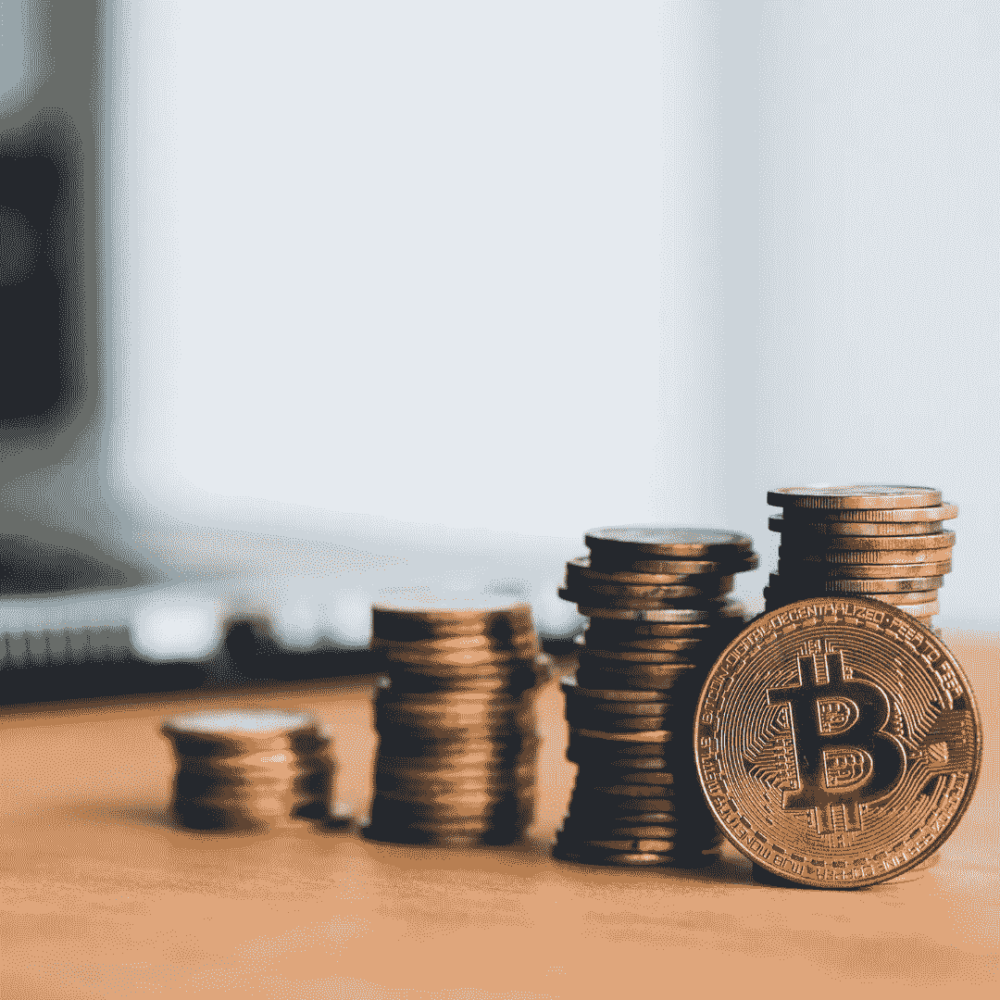

# 区块链技术将如何改变世界？

> 原文：<https://medium.datadriveninvestor.com/how-is-blockchain-technology-going-to-change-the-world-570e82e05bdc?source=collection_archive---------4----------------------->

**什么是** [**区块链**](https://www.mytectra.com/catalog/product/view/id/1708/s/blockchain-training-in-bangalore/category/170/) **？让我们从一个简单而精确的定义开始。**

区块链技术是一种数字化的分布式交易账本，在网络成员的每台电脑上都有相同的副本。各方都可以分析以前的记录并注册新的记录。交易按块分类，一个接一个地记录在一连串的块中。

区块内的链接及其内容受到加密技术的保护，因此以前的交易不能被破坏或伪造。这表明分类帐和交易网络是可信的，而没有基本权限。

 [## 创新警报:区块链 3.0、Terra 协议、ICO 门户和更多|数据驱动的投资者

### 尽管过去几个月加密货币的价格波动很小，但这项技术并没有停止发展…

www.datadriveninvestor.com](https://www.datadriveninvestor.com/2019/03/16/innovation-alert-blockchain-3-0-terra-protocol-an-ico-portal-more/) 

安全就是一切，无论您处理的是数据、信息还是资金交易，安全似乎都是首选。包括安全性的重要性，区块链成为转移资金和数据的安全平台。区块链将数据存储为一系列区块。对于传统数据库来说，这是一个很好的选择，传统数据库由有权访问数据的公司所有。

## **某些方面** [**区块链**](http://Infrastructure for cross-border activities  Digital assets as a class  Governance and businesses  Administrative reporting and compliance  Accounting and auditing  Clearance and Settlement) **正在改变世界**

## **分散计算:**

分散化技术使资产能够存储在通过互联网访问的计算机网络中。资产可以是一个游戏代币、一张门票、一本书的作者声明，或者像比特币这样的数字货币。通过分散化技术，资产的管理员可以通过他们的密码进行密切控制，该密码会立即与资产相关联。未经同意，任何个人都不能拿到它，当你想转移资产时，也没有人能阻止你。

**金融:**

一些创业公司制作白皮书，介绍他们非凡的创新或区块链技术的使用，通常包括更大的普遍问题:“这将如何改变事情？”

许多研究强调了变革的主要领域:

1.  跨境活动的基础设施
2.  数字资产作为一个类别
3.  治理和企业
4.  行政报告和合规
5.  会计和审计
6.  清算和结算

## 智能合约:

智能合同是在区块链收集的计算机程序。根据商定的条件，它们可以用来在用户内部自动进行不可阻挡的加密令牌转移。oracle 是一种实时数据供应，它向智能合约提供天气信息、货币市场汇率、航班信息和体育统计数据等内容。

智能合约需要稳定地访问真实世界的数据。没有这些，他们就“像一个没有电的城市”，核心组件是一个运行在一个被称为安全飞地的孤立硬件中的程序。

enclave 的功能是保护程序免受恶意攻击，并保持计算的机密性。它接收来自智能合同的数据查询，例如，航班保险合同可能会查询航班是否被取消，然后它从网站上检索答案，并将答案转发回区块链。

**广告:**

事实是，技术正以惊人的速度发展。甚至区块链在网络广告方面的这些可能的应用在短短几年前也是不可想象的。尽管如此，我们还是在这里。

因此，虽然我们仍处于数字广告革命的初期，但区块链的目标是我们都需要生活在其中的未来。

## **医疗:**

首先，个人分散的区块链数据库可以被认可的人——无论是医疗保健提供者、患者还是保险公司——在任何地方、任何时间以所有人都可以使用的形式访问。

这种系统的另一个好处是控制权的转移。总部位于特拉维夫的 Proof Work 提出了一个想法，将建立在患者手中分发医疗数据的能力，最好是在医疗提供商手中。

其次，区块链技术允许采用其他数字共享技术无法实现的安全措施，使隐私问题更容易解决。

最后，区块链技术减少了管理每项输入并维护每笔交易的永久时间戳报告的中介数量，这降低了出错的可能性，同时实现了高水平的透明度和安全性。

## **健身追踪:**

除了使用区块链技术来提高医疗保健提供商的能力，一些公司还推测，在等式中添加健康和营养因素将为患者提供一个额外的整体方面，使他们朝着健康目标发展。

诺基亚有一个导航程序，旨在将志愿者成员的健康数据，如睡眠水平和时间，存储在区块链的数据库中，以检验该技术收集实时健康数据的潜力。

根据诺基亚的说法，他们的 navigator 的目标是“在不断增长的数字健康领域探索新的可能性，旨在让人们对自己的健康数据有更多的控制权——如何共享，谁可以访问它，以及如何应用它——重点是区块链技术公司提供的隐私和保护。”

另一个新的基于区块链的原则，MintHealth，提供象征性的激励来帮助员工做出健康的选择；这些代币随后可用于支付医疗保健相关的债务，如健康保险费、自付额和药品。

## 教育记录:

被区块链技术改变的不仅仅是医疗保健行业。

通过利用技术，以可访问和安全的方式相互利用教育成果和活动报告，这一可靠的系统纳入了来自各种教育机构的数据管理，并使记录和参考机构数据和数字抄本成为可能。

这种方案可以使教师和学生在保护隐私的同时获得相关数据。它还可以为后续的教育机构和潜在的雇主提供一个清晰、可靠的位置来接收申请人的证书。

除了存储教育记录，索尼还建议教育机构可以应用这种平台中的人工智能数据分析，“为教育基金会的课程和管理提供拟议的改进。

**概要:**

我们仅仅触及了区块链技术潜力的皮毛。用不了多久，除了前面提到的那些创新者之外，企业中的创新者也会探索新的独特的想法，以挖掘必须假设的潜力。

如果你认识到区块链技术可以给你的职业生涯带来的优势，我们支持你联系我们，了解我们的区块链培训。从一开始我们就一直在培训区块链技术，并且在它的实施方面有实际的、真实的专业知识。

*最初发表于*[T5【https://www.mytectra.com】](https://www.mytectra.com/blog/How-is-blockchain-technology-going-to-change-the-world/)*。*