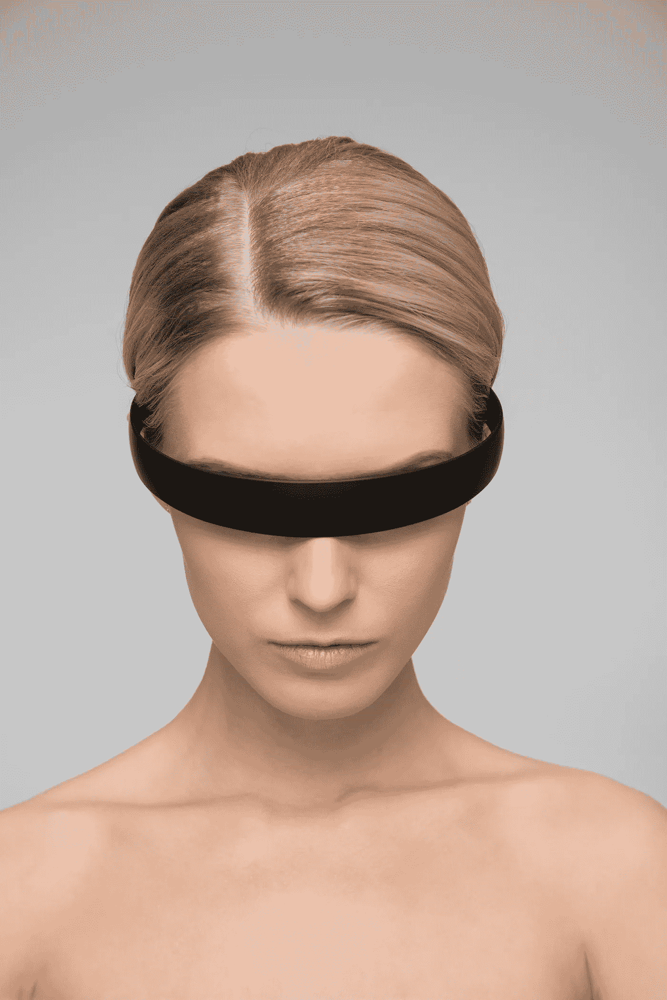

# 个性化、数据和人工智能如何塑造我们的思维方式？

> 原文：<https://medium.datadriveninvestor.com/how-is-personalization-and-artificial-intelligence-impacting-the-way-we-think-3612b99dde7e?source=collection_archive---------13----------------------->

技术正在塑造我的思维方式吗？我是我的喜好、偏好、种族和居住地的总和吗？我在虚拟世界里有一套定义我的制服，而我对此却一无所知吗？你知道吗？

人工智能已经发展了，并且在某些方面确实正在改变我们的生活。所以，我不是说这一切都不好。谷歌翻译应用神经网络翻译不同的语言。我相信当你在亚马逊上购买一台新的割草机或笔记本电脑时，你会体验并享受这种便利。机器学习算法或“推荐引擎”定期提出建议，预测并声称为我们个性化内容。

因此，推荐引擎可以被视为一种将你缩小到“喜欢”范围的方式数据驱动的营销活动正是营销人员急于挖掘的一种魔力。内容是通过算法、标签和推荐提供的，这就是你的新闻源如何被填充的。

如果你被送达你自己的信仰或更糟的虚假信息。在大多数情况下，这甚至不是故意的，因为这些差异是由机器从你的点击中学习的某些算法预测的。你点击什么，你就是什么。它基于一种算法来做到这一点，并在未经您允许的情况下向您发送内容。我相信你已经知道了。你可能正在阅读与你观点一致的内容，因此当你遇到另一种观点时，会非常震惊。根据我的喜好和兴趣对我的内容进行个性化是很好的，但是，被告知你应该和不应该消费什么感觉是不公平的。我们生活在数字监狱里吗？

汤姆·古德温解释说，尽管它让人们过上了更舒适的生活，但我们没有接触到其他观点和看法，这限制了思想、新思想和影响的多样性。我们需要重新定义个性化引擎、审计算法，并提供新的视角和新的想法，而不是“根据你喜欢的，我们认为你会对这样那样的东西感兴趣”。

一个有算法的 app，号称如何分辨漂亮的自拍，告诉你该删除哪些自拍。这是否意味着这种算法可以决定我们如何看待自己？我们假设美可以被定义为普遍的和永恒的，并且可以很容易地被简化为特定的数据组合。一切都可以简化为数据的想法也开始影响人们感知环境和日常关系的方式。我们应该相信算法告诉我们做出什么审美选择吗？

人工智能算法塑造了我们的所见所想。我甚至可以说它改变了我们的判断。

人工智能算法嵌入在社交媒体中。很明显，这些算法渗透到我们的社会和我们的视角中。用社会偏见编码的人工智能算法故意传播不准确的信息，并加速我们开始相信的谎言。当它们开始放大公众意见的回音室时，它们劫持了我们的注意力，甚至损害了我们的精神健康。由于算法将预测作为输出，因此提供给模型进行处理的样本数据可能已经渗透了偏见。

由纽约市发起的“自动决策系统任务组”已经部署了一个小组来研究和检查算法是否包含偏见，以做出导致种族偏见政策的决策。《经济学人》:有没有可能摆脱无处不在的数字技术和算法来追踪和影响我们？如果没有，我们真的能自由吗？

根据这个论点，HBR，关于[为什么我们需要审计算法](https://hbr.org/2018/11/why-we-need-to-audit-algorithms)，这些是我们在审计模型时需要问的一些问题“我如何最佳地建模和使用这些数据中的模式？”基于当今现实的分布是合适的吗？"

随着人工智能从实验过渡到现实世界的决策环境，人类必须根据这些预测采取行动，做出良好的判断并进行合乎道德的设计，以便该技术取得成功。我们需要审核人工智能算法，以同理心构建和设计产品，并整合和结合来自社会科学、心理学、行为经济学、以人为本的设计和伦理的多学科团队，以确保社会价值观得到反映和尊重。人工智能从根本上讲是基于算法和预测的。

是时候重新想象和定义信息是如何传递给人们的了。设计从根本上说是人类的，我们需要做得更好，因为设计要合乎道德，以人为本。