# 使用沃森分析工具分析 2017 年世界运动会

> 原文：<https://medium.datadriveninvestor.com/how-ive-analyzed-the-world-games-2017-with-watson-analytics-cdd37d194377?source=collection_archive---------3----------------------->

波兰的弗罗茨瓦夫市获得了 2017 年世界运动会(T3)的举办权(T2)。第十届多运动赛事将于 2017 年 7 月 20 日至 30 日举行。

拥有超过 64 万居民的[弗罗茨瓦夫](http://www.wroclaw.pl/en)位于中欧，波兰西南部，靠近捷克共和国和德国的边境。按居民人数计算，它是波兰第四大城市。弗罗茨瓦夫——在一千多年的历史中——处于不同文化的交汇点:波兰、捷克和德国。

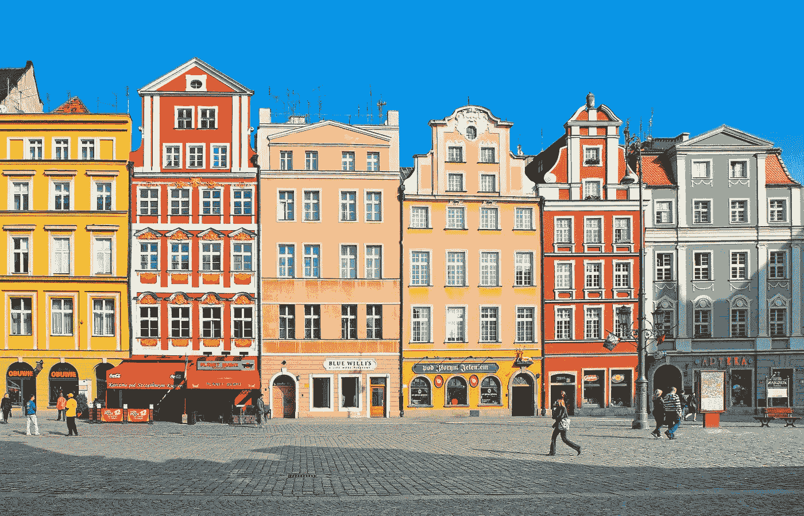

自 2016 年以来，我一直住在这里，我认为弗罗茨瓦夫是我生活过的文化最活跃的城市之一。这是一个宽容的地方，对新思想和挑战开放，以热情好客而闻名。这座城市非凡的历史不断被著名的科学、文化和体育赛事所丰富，如 2012 年欧洲足球锦标赛。弗罗茨瓦夫是 2016 年的欧洲文化之都。

世界运动会每四年在奥运会后一年举行，展示 25 个运动项目，来自 100 多个国家的大约 4500 名运动员和官员参加世界运动会。

说到这里，本周我开始从社交媒体的角度分析 2017 年世界运动会，使用 [IBM Watson Analytics](https://watson.analytics.ibmcloud.com/) 制作一些关于社交参与、情绪和其他方面的有趣图形。

利用沃森社交媒体分析，我检查了 7 月 1 日至 20 日之间“2017 年世界运动会”、“T10”、“2017 年世界运动会”和“世界运动会”提及率的 10%样本。在这个样本选择中，包括超过 25，000 个文档，7 种语言，按主题划分，如游戏，志愿服务，弗罗茨瓦夫，体育和其他来自不同来源，如 Youtube，tweeter，论坛，评论，博客，新闻和脸书网页。

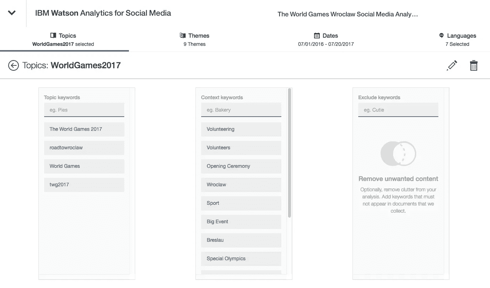

# 人口统计分析

我的数据集显示，女性观众比男性观众更投入，比如 15%的男性对 45%的女性。

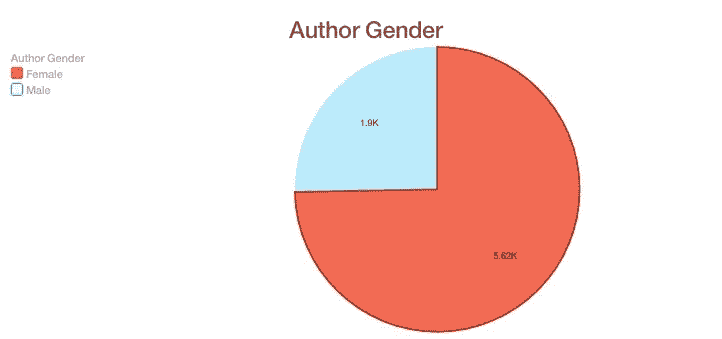

当然，我也关注了全球对奥运会的看法:

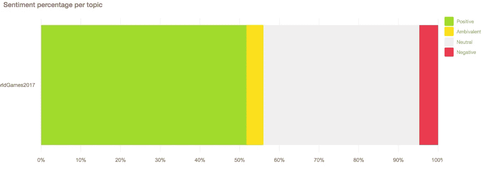

我的人口统计分析还包括语言。有趣的是，我发现 52.59%的对话是由法语主导的，而英语只占 20%。

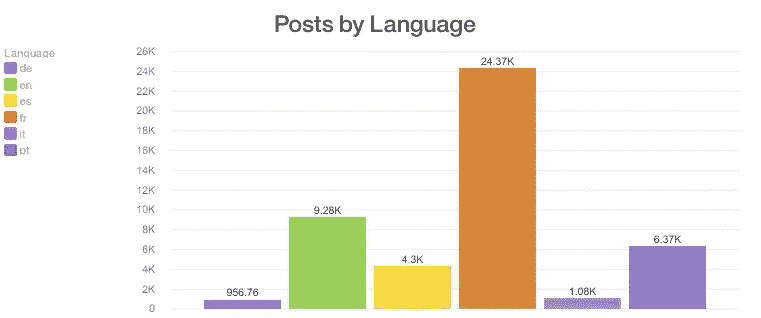

从地理位置来看，英国以 39%的提及率领先所有国家，其次是瑞典和西班牙

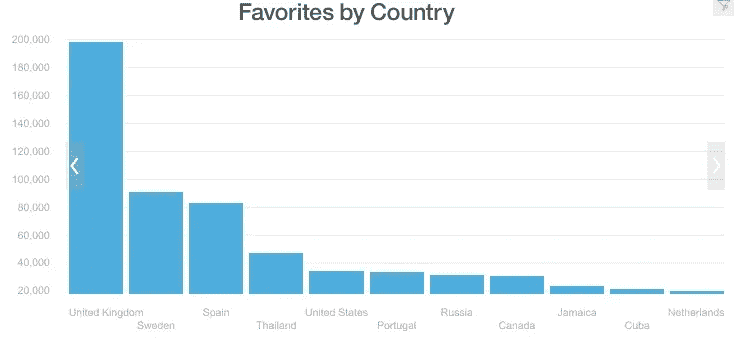

# 深入内容

更深入地观察对话，我根据喜爱和喜欢的数量分析了最重要的兴趣类别:如果最具代表性的类别是体操，那就没什么新鲜的了:-)

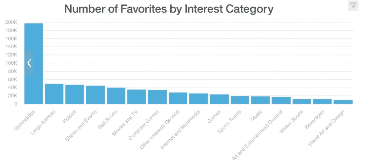

关于兴趣领域的关注者数量，艺术和娱乐领先，其次是体育和食品饮料。

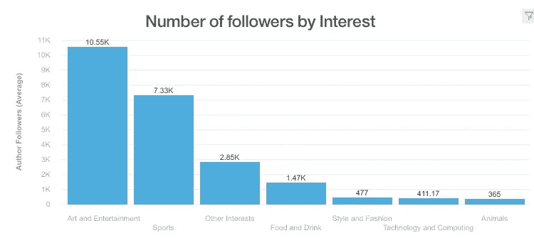

已经有许多有影响力的作者参与了 2017 年世界运动会的讨论。参与讨论的一些重要影响者包括凯西·戴维斯、[克里斯托弗·哈恩、](https://www.linkedin.com/in/chris-hahn-04121012/) [赫伯特·比克尔](http://www.bowlingdigital.com/?s=Herbert+Bickel)，当然还有[世界运动会](https://www.theworldgames.org/)的网页。

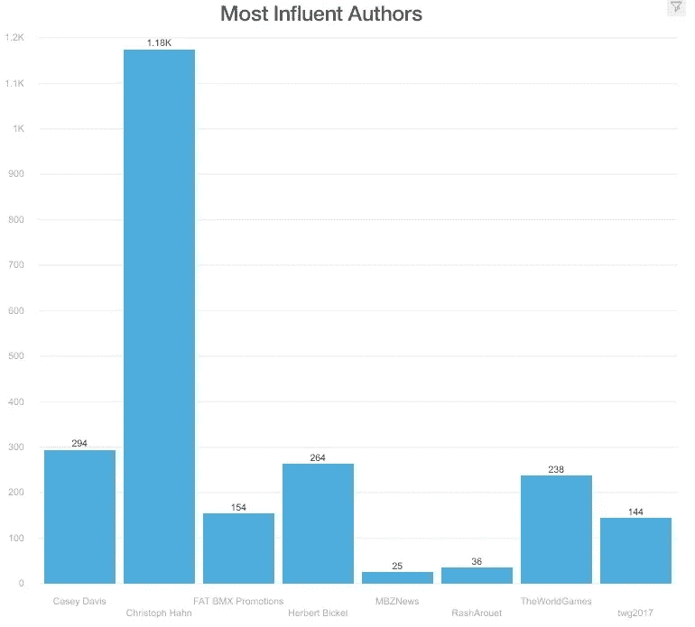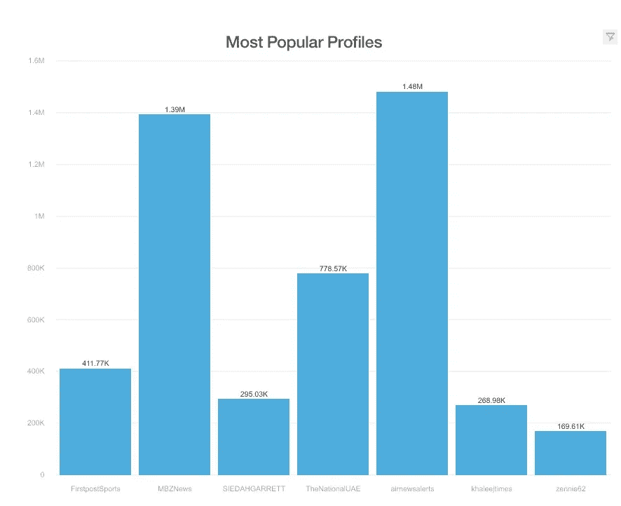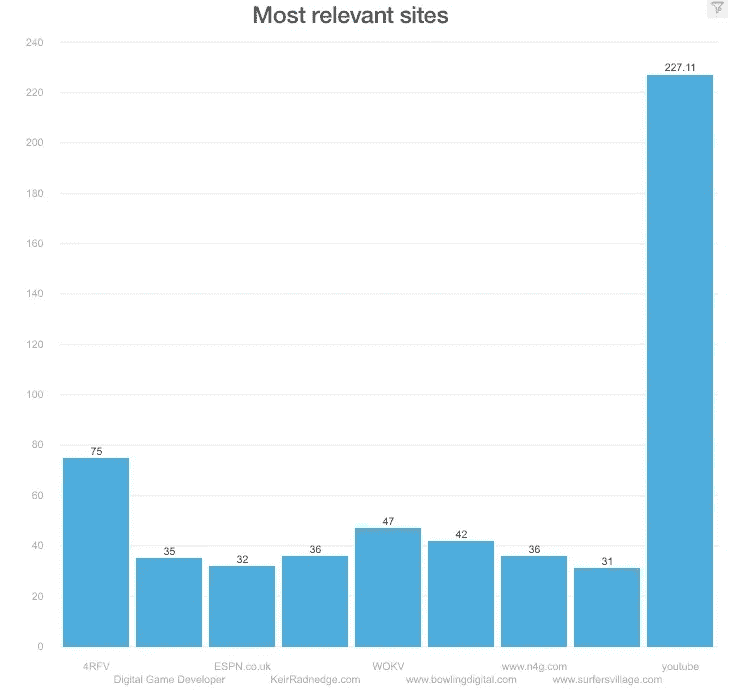

社交媒体分析是对品牌进行市场研究的方式的重大转变，同时它可以帮助品牌从社交网络中获取大量非结构化数据，从而帮助更好地了解品牌表现、品牌声誉、参与度、亲和力、影响者等。

IBM Watson Analytics 帮助我理解 twitter、脸书和一些博客等社交媒体在过去几个月里向我提供的无意义和零星的模式，当时我一直在我所在的城市观看世界运动会的到来。有了社交媒体分析，就有可能“听到”人们在说什么，即使对话跨越了海洋或大陆。

现代世界比以往任何时候都更加紧密相连。像世界运动会这样的活动凸显了从消费者、有影响力的人和名人那里产生的大量数据。

使用像 Watson Analytics 这样的认知工具，可以挖掘这些数据来了解特定的人口统计、目标受众或市场。例如，如果企业渴望接触特定的人群，他们可以学习社交媒体分析的见解。

在下图中，我分析了当月(2017 年 7 月 1 日至 20 日)按小时计算的平均帖子数、参与度和帖子总数:

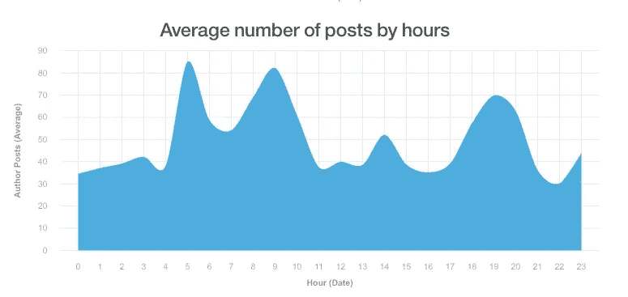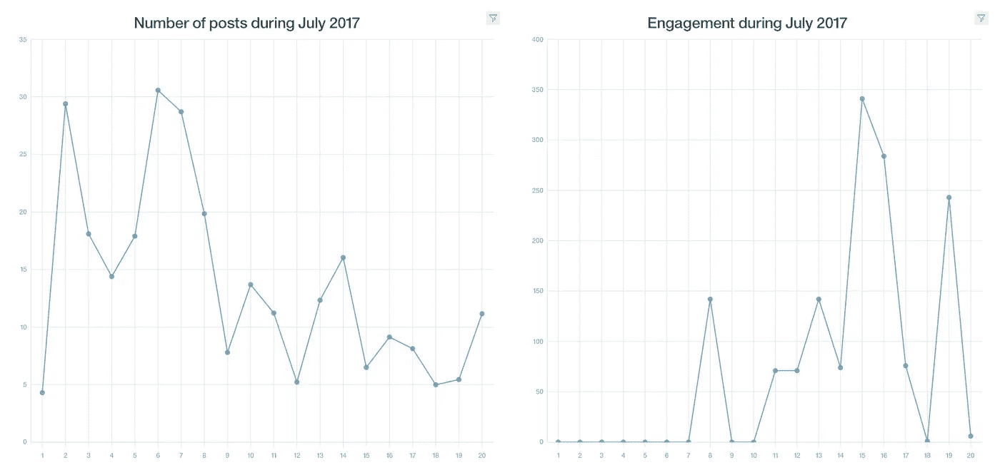

在接下来的几天里(世界运动会将于今天，7 月 20 日开始，7 月 30 日结束)，我将监控社交媒体，用每天的 tweet 和 retweet 的数量，每天关于这个话题的情绪和当天最重要的标签来更新图片。

除了我对分析的真正热情，我如此关注世界运动会的主要原因之一是志愿服务，因为我将在运动会期间在媒体中心作为志愿者工作，帮助该组织接待和支持来自世界各地的注册记者。

可能没有比这更好的地方让我每天用手触摸关于世界运动会的社交媒体感觉了。

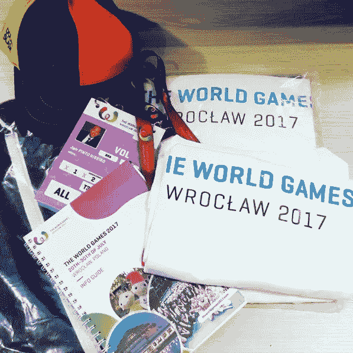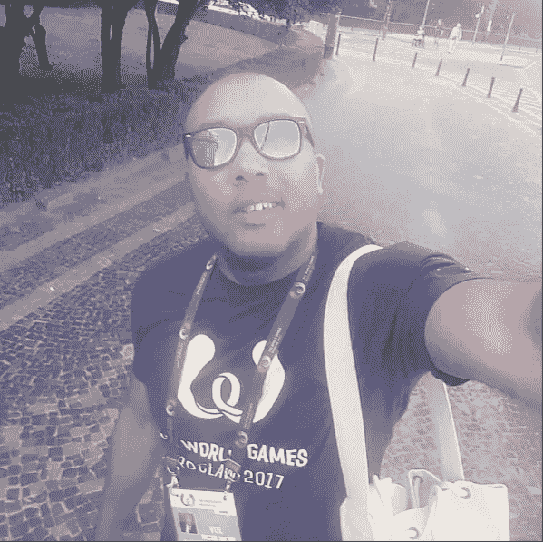

谢谢

贾伊尔·里贝罗

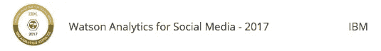

如果你想追随潮流..让我们保持联系！！我会每天在这里更新:

# 更新

# 2017 年 7 月 26 日

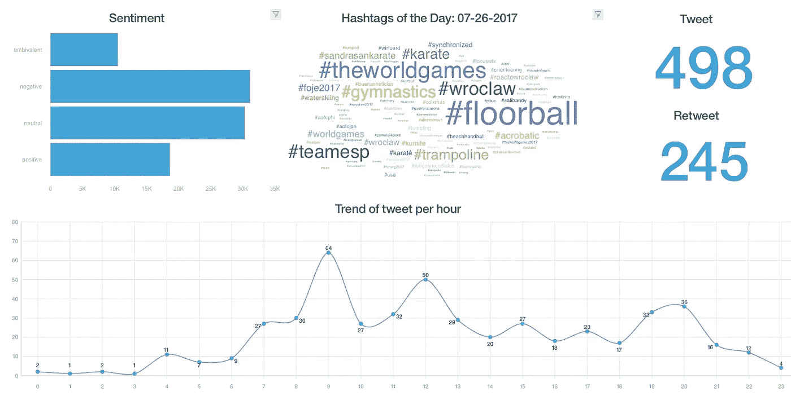

# 2017 年 7 月 25 日

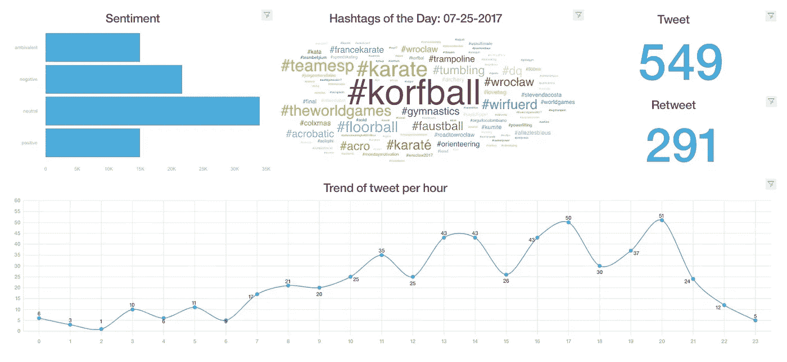

# 2017 年 7 月 24 日

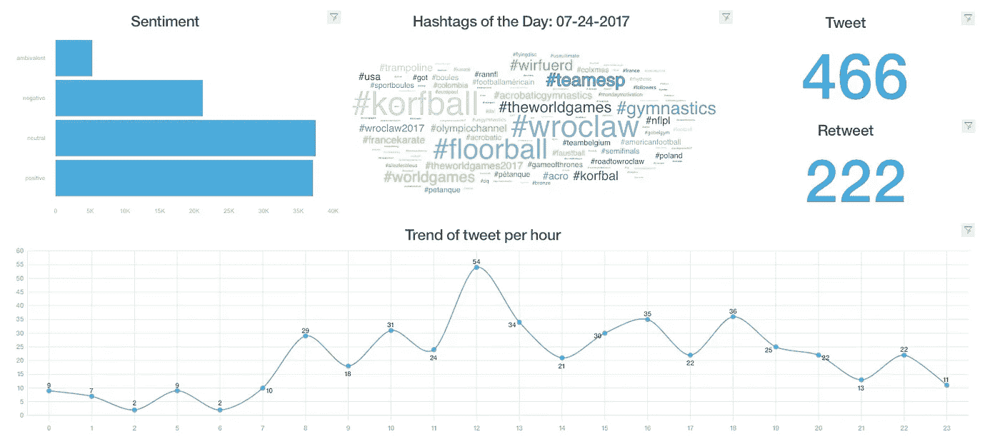

# 2017 年 7 月 23 日

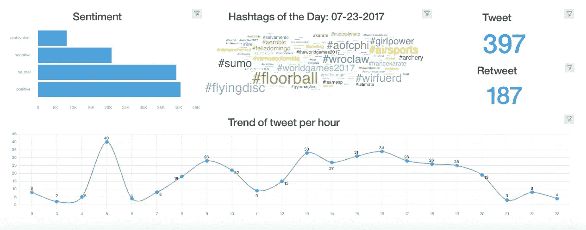

# 2017 年 7 月 22 日

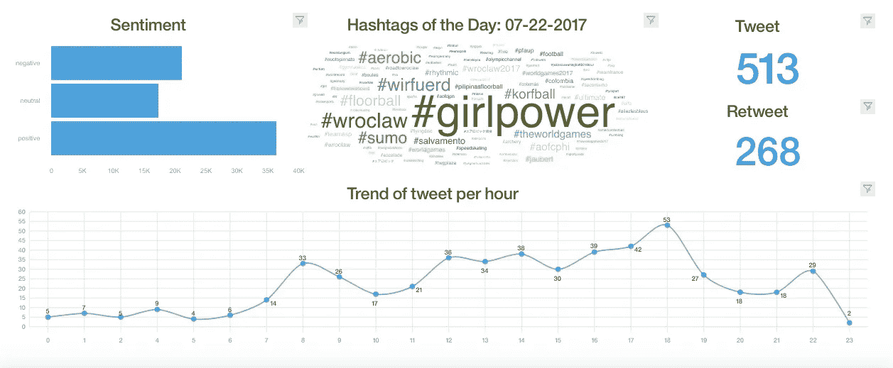

# 2017 年 7 月 21 日

# 2017 年 7 月 20 日

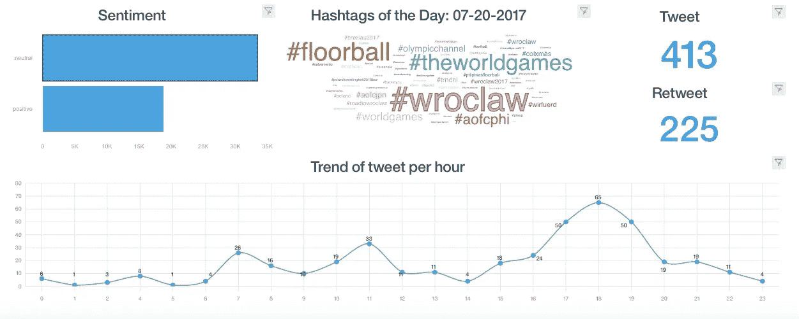