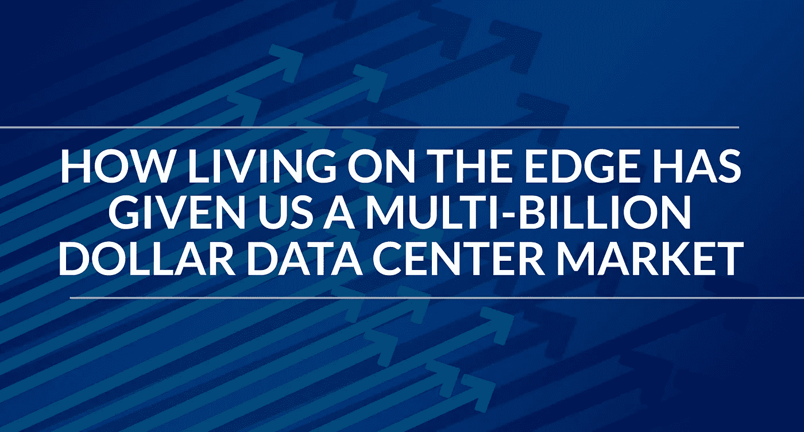

# 生活在边缘如何给我们带来了数十亿美元的数据中心市场

> 原文：<https://medium.datadriveninvestor.com/how-living-on-the-edge-has-given-us-a-multi-billion-dollar-data-center-market-7fcec090a4fb?source=collection_archive---------25----------------------->

由于拥塞和效率仍然是数据中心网络的一些最大障碍，推动行业内急需的变革变得至关重要。

数据中心流量的速率预计每两年翻一番。由于对能够处理大量信息的更高效数据中心的需求以及流量的增长，全球数据中心转型市场预计将从 2018 年的 64.5 亿美元增长到 2023 年的 120 亿美元以上。所有这些变化发生得如此之快的一个关键原因是现有数据中心内边缘计算的实施越来越多。

## **边缘计算和数据中心市场**

几年前，[云计算风靡全球](https://blogs.gartner.com/thomas_bittman/2017/03/06/the-edge-will-eat-the-cloud/)。云正在蚕食传统的数据中心，因为它不再需要物理存储空间。许多公司要么将所有信息转移到云上，要么以云为起点，完全绕过我们熟知的数据中心。在经历了 IT 和资源的大规模集中化之后，我们现在看到了边缘计算对这些资源的破坏。

与云计算相反，边缘计算使数据和其他信息尽可能靠近最终用户。数据中心属性使这成为可能。曾经将公司从数据中心推向云的同样的创新现在正在将潮流转向相反的方向。通过利用边缘技术，不仅数据中心运营的改善变得至关重要，而且物业本身对投资者也越来越有吸引力。

## **数据中心正在投资边缘计算**

根据 from 2018 年的一项研究,边缘解决方案是数据中心领导者的主要关注点。该研究发现，44%的公司计划在不久的将来部署某种形式的边缘计算能力，另有 17%的公司计划在未来 36 个月内这样做。

边缘计算数据中心的密度也很突出。边缘计算部署中的平均功率密度为每机架 6.7 千瓦，这意味着更多的融合解决方案和非常密集的环境。这些密集的 IT 部署鼓励轻量级使用先进技术，如物联网。对物联网的关注和实施导致许多数据中心领导者除了智能业务解决方案外，还在寻找用户需求。

## **边缘计算如何成为数据中心发展的关键因素**

边缘计算已经成为未来三到五年内影响业务的顶级技术之一。它也不仅仅被用作一种解决方案。它还创造了新的需求，导致其他创新服务直接影响市场。其中包括机器学习、数据管理/分析等方面的增强。

对如此多不同解决方案的需求为多个供应商的合作打开了大门，这创造了更智能的业务策略、更快的技术部署和更好的全面安全实践。

## **了解不断变化的数据中心市场**

在快节奏的数据中心市场导航可能会很棘手。要真正掌握数据中心房地产的现有优势和机会，以及即将到来的优势和机会，向能够指导您完成整个过程的[知识渊博的顾问](https://www.linkedin.com/in/steve-friedman-0785bb/)寻求建议是关键。