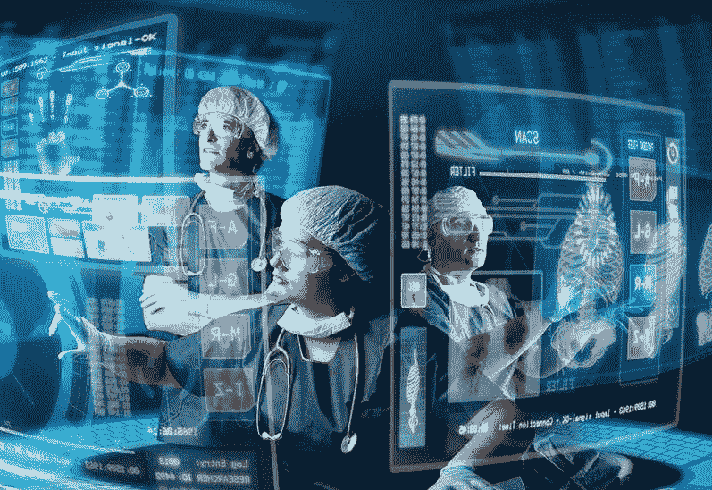

# 我还能活多久？癌症和其他慢性病管理中的人工智能

> 原文：<https://medium.datadriveninvestor.com/how-long-do-i-have-to-live-c4e73a00b8de?source=collection_archive---------2----------------------->

Adapted from [https://www.zhinengl.com/2017/03/medical-ai-new-progress/](https://www.zhinengl.com/2017/03/medical-ai-new-progress/) on 180818

每当我们(或我们所爱的人)患上绝症时，最常见的问题是:*“我还能活多久？”*根据提问者的不同，这个问题可以有多种形式。可能会这样，“*整个治疗计划需要多长时间才能缓解？*“为了回答这些问题，医疗服务提供者将根据之前出现类似情况和疾病阶段的一名患者或一组患者的回答。不幸的是，这种反应不是基于统计推断，而是基于直觉。要客观应对，应该采用预测模型。

预测建模是以可理解的方式开发算法(模型)的过程，该算法(模型)量化未来(*尚待观察*数据)的准确度。因为关于未来的决策是基于现有的信息做出的；这些信息可以是客观的有形数据(疾病诊断、分期、治疗计划)或直觉和过去的经验。搜索引擎等信息技术工具通过寻找与手头问题相关的模式来筛选数据，并返回答案。开发这些工具的过程可以称为*机器学习、模式识别、数据挖掘、预测分析*和*知识发现*。最终目标是做出准确的预测。用来最好地描述所有涉及预测和模式识别的信息技术的最常用术语是人工智能。

**人工智能(AI)** 旨在模仿人类的认知功能。由于更多医疗保健数据的可用性和分析技术的快速发展，人工智能在医疗保健领域的采用率有所增加。医疗保健数据可以是结构化的，也可以是非结构化的。

人工智能可以帮助医护人员做出更好的决策。虽然人工智能不能完全取代人类的判断；在某些功能领域，如放射学和病理学，它可以改善或限制人类的判断。

关于医疗保健领域大数据和分析的讨论产生了四个问题:

I .在医疗保健中应用 AI 的动机是什么？

二。使用人工智能分析的医疗保健数据类型有哪些？

三。使人工智能系统能够产生临床上有意义的结果的现有机制是什么？

四。人工智能社区目前正在解决哪些疾病类型？

***人工智能在医疗领域应用的动因***

人工智能使用复杂的算法从大量医疗数据中“T0”学习“T1”特征，并使用生成的见解影响临床决策。人工智能还可以配备学习和自我纠正能力，可以根据用户反馈提高其准确性。这些系统提供来自研究期刊、教科书和临床指南的最新医学信息，以告知患者护理。人工智能还可以通过从大量患者群体中提取有用信息，改善人类临床实践中不可避免的治疗和诊断错误。人工智能可以帮助对健康风险警报和健康结果预测进行实时推断。

***人工智能分析的医疗数据类型***

人工智能系统需要通过临床活动(筛查、诊断、治疗和结果)产生的数据进行训练，然后才能部署到医疗保健应用中。这使得他们能够从相似的受试者组中学习受试者特征和感兴趣的临床结果之间的关联。这些医疗保健数据可以包括患者人口统计特征、医疗记录、来自医疗设备的电子记录、体检数据、临床实验室报告、放射和病理图像。

在诊断过程中，AI 分析来自诊断图像(X 射线、磁共振成像、CT 扫描和超声心动图)的数据，以及来自实验室和其他医疗设备(血压、温度计和脉搏血氧计)的测试报告。随着遗传分析和患者基因组测试的广泛采用，AI 为分析 DNA 和 RNA 序列数据提供了良好的机会。

人工智能应用通常从将非结构化文本信息转换为机器可理解的电子病历开始。

***使人工智能系统产生有临床意义的结果的机制***

人工智能系统采用经典的机器学习(ML)、自然语言处理(NLP)和深度学习(DL)技术。机器学习对患者特征进行聚类，以推断患者结果的概率，而自然语言处理通过将非结构化数据(临床记录、医学期刊、治疗指南)转换为可使用机器学习进行分析的机器可读结构化数据来分析非结构化数据。

这些技术只有在受到临床(医疗保健)问题的激励，并最终应用于辅助临床实践(和公共卫生倡议)的情况下才能发挥作用。

***疾病类型人工智能焦点***

有无数的疾病和疾病类别。医疗保健领域的人工智能工作主要集中在三个关键疾病领域:癌症(肿瘤)、心脏(心血管)和神经(神经)疾病。

在癌症领域，Somashekhar 的团队在纽约纪念斯隆·凯特林癌症中心演示了 IBM Watson for oncology (WFO ),以帮助诊断各种癌症。斯坦福大学的 Andre Esteva 和 Sabastian Thrun 展示了深度神经网络在皮肤癌诊断中的作用。

对于神经疾病，俄亥俄州哥伦布市巴特尔纪念研究所的 Chad Bouton 及其同事已经使用人工智能来恢复和控制四肢瘫痪患者的运动。伦敦帝国理工学院的达里奥·法里纳(Dario Farina)的团队描述了人机界面利用脊髓运动神经元的放电时间来控制上肢假肢的力量。

巴尔的摩马里兰大学医学院的 Dilsizian 和 Siegel 等不同小组已经详细讨论了通过心脏图像分析将人工智能系统应用于诊断心脏病的潜力。

这三个疾病领域的偏见可能是由于它们在全球许多地区的高疾病负担(发病率)和高死亡率(死亡率)造成的。

具体而言，人工智能可用于鉴别诊断、放射学和实验室程序中的模式识别。许多诊断和治疗医疗设备都是带有内置软件的机器人，这些软件依赖于条件(if…then)语句。除非满足某些条件，否则程序不会进入下一阶段。这极大地减少了人为错误。

许多公立医院药品和其他医疗用品库存不足。使用预测模型，不仅可以正确管理库存，还可以通过预测耐药性和需求来正确规划治疗库存。

在制药行业，有一个潜在的化学分子库，可用于特定药物的开发。有了人工智能，通过高通量筛选(HiTS)来识别潜在药物变得更加容易。这可适用于具有新适应症的新药物或现有药物(使用该药物治疗特定疾病)。

肯尼亚《2030 年愿景》的中期计划三将全民医疗保险(UHC)作为其四项议程之一。人工智能可以用于为各种公共卫生机构选择最佳支付模式，对健康保险政策类别进行分类，减少国家健康保险计划中的欺诈行为，以及根据资源需求对卫生设施进行分层。

临床研究的目的之一是确定患者和治疗结果。通过确定临床结果，有可能预测 1、3、5 或 10 年的存活率。

所以，下次在问你还剩多少时间之前；你能问一下医疗从业者关于他们采用大数据分析和人工智能的情况吗？