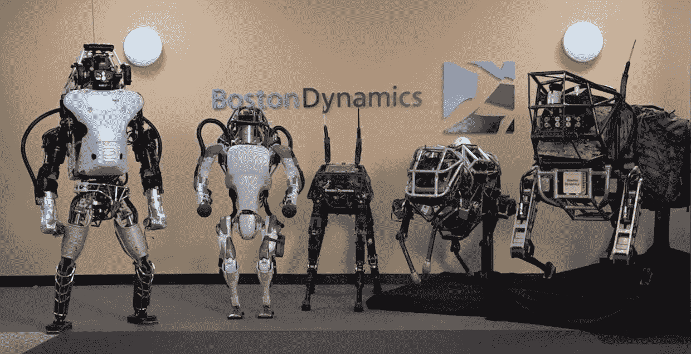

# 波士顿动力机器人多久能成为功夫大师？

> 原文：<https://medium.datadriveninvestor.com/how-long-until-boston-dynamics-robot-can-be-a-kungfu-master-e7d4b2120e30?source=collection_archive---------5----------------------->

## 对波士顿动力公司新的“更多跑酷图集”视频做出反应

Image Credit: Boston Dynamics

任何对人工智能和机器人感兴趣的人都应该看看下面的视频。

Atlas Doing Gymnastics Routine

在这段视频中，波士顿动力公司的阿特拉斯正在表演一整套体操动作，包括跳跃、翻滚和向前跳跃，双臂倒立，最后是 180 度垂直旋转。又一次，既令人惊奇又让人害怕。

 [## 模式和机器人:复杂的现实|数据驱动的投资者

### 哈耶克的名著《复杂现象理论》(哈耶克，1964)深入探讨了复杂性的话题，并断言…

www.datadriveninvestor.com](https://www.datadriveninvestor.com/2019/03/04/patterns-and-robotics-a-complex-reality/) 

这些动作如此像人，有点过了[的恐怖谷](https://en.wikipedia.org/wiki/Uncanny_valley)，开始显得非常自然。在这个非常短的视频中展示了流畅的动作，人们不禁会问:在我们看到一些功夫大师级别的机器人动作之前，我们是如何做到的？就像我们在[里看到的那样:战斗天使](https://www.imdb.com/title/tt0437086/)？

Alita: Battle Angel’s Bar Fight Scene

我能想到一件有用的事情。据我所知，历史上有很多古功夫都失传了，就是因为没有好的徒弟来学习和保存。我认为这是人类的巨大损失。如果我们能开发出一个可以“复制”成套动作的机器人，至少我们可以至少保留它的形式，对吗？

欢迎任何反馈或建设性的批评。你可以在 Twitter [@lymenlee](https://twitter.com/lymenlee) 或者我的博客网站[wayofnumbers.com](https://wayofnumbers.com)上找到我。