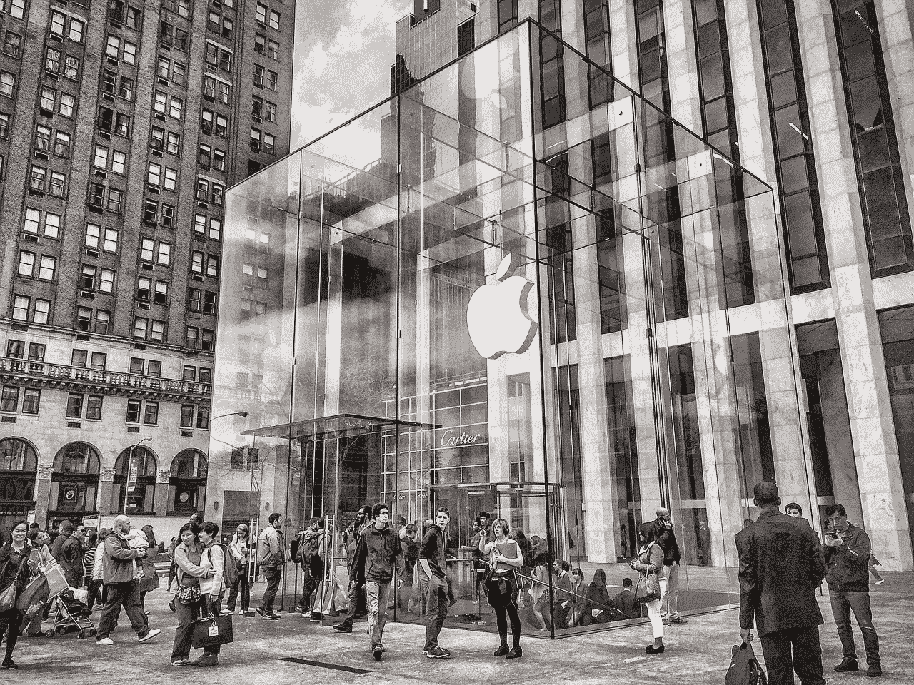
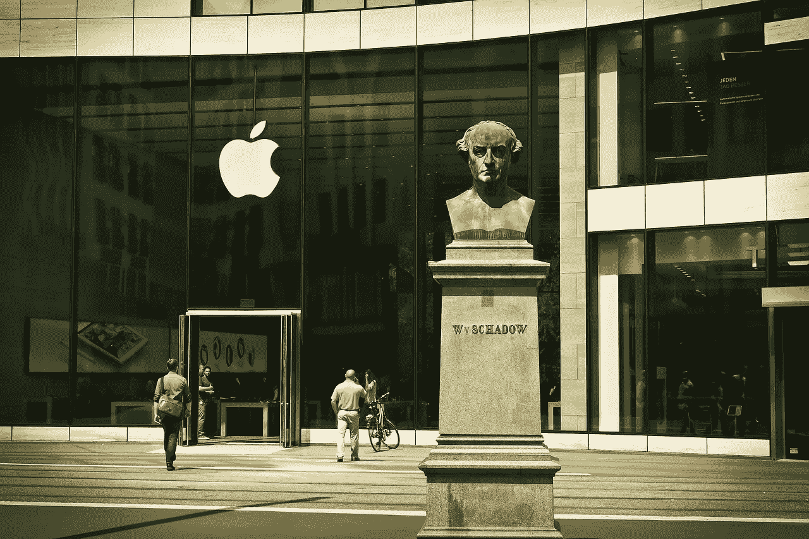
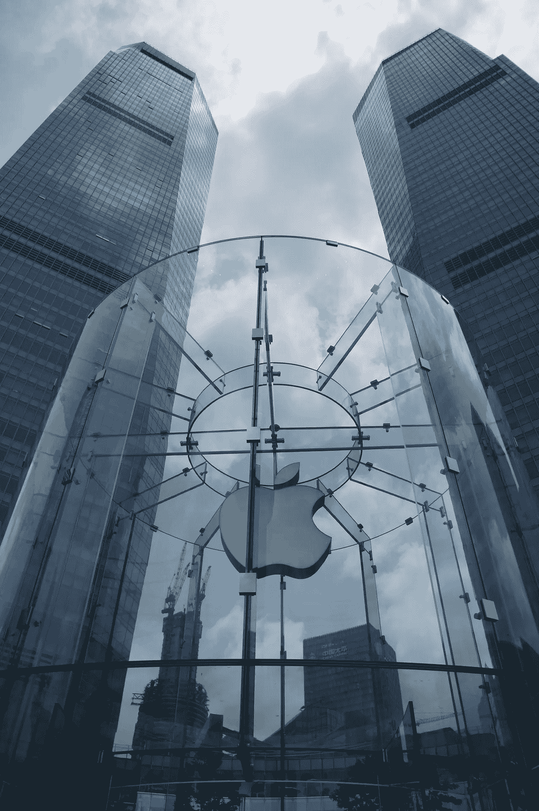
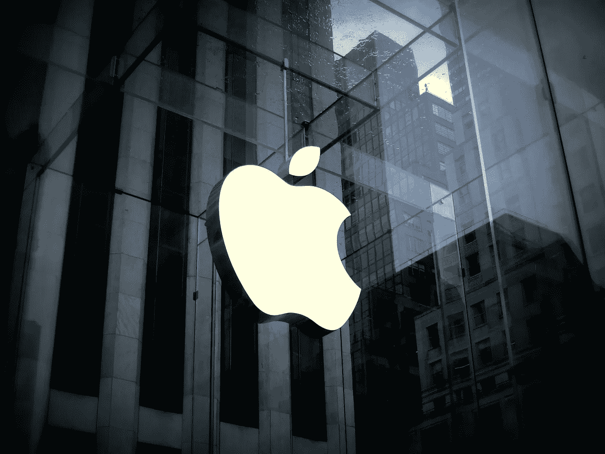

# 苹果(AAPL)的赚钱机器有多赚钱？

> 原文：<https://medium.datadriveninvestor.com/how-lucrative-is-the-apple-aapl-money-machine-7b7b1ba5d657?source=collection_archive---------36----------------------->

苹果(AAPL)的赚钱机器在 2018 年第三季度有点磕磕绊绊。沃尔玛(纽约证券交易所代码:WMT) 取代**苹果(纳斯达克代码:AAPL)** 成为美国第三大在线零售商。

澄清一下，**亚马逊(NASDAQ: AMZN)** 仍然是第一大在线零售商，拥有 43.1%的市场份额。此外，eMarketer [估计](https://retail.emarketer.com/article/walmart-overtakes-apple-no-3-e-tailer-us/5bec6a2cb979f109c0bb101a?ecid=NL1014)易贝是排名第二的电子商务品牌，拥有 7.2%的市场份额。

与此同时，沃尔玛以 4%的市场份额排名第三，苹果以 3.9%的市场份额排名第四。然而，苹果的销售额仍在经历 18%的健康增长。

**苹果(AAPL)在电子商务方面依然蒸蒸日上**

然而，沃尔玛的在线销售额正以令人难以置信的速度增长。例如，eMarketer 估计沃尔玛的销售额在 2018 年前三个季度增长了 39.4%。

公平地说，苹果只销售电子产品，而沃尔玛零售几乎所有商品。例如，Walmart.com 销售杂货、五金、工具、电动工具、化妆品、服装、鞋子、书籍、建筑用品和园艺用品。

此外，沃尔玛的大部分电子商务增长是在杂货领域。因此，苹果在线市场 3.9%的份额和 18%的增长率仍然是令人印象深刻的成就。

此外，我可以说苹果的商务实际上不受亚马逊的影响。澄清一下，苹果销售精选的高度专业化的产品，吸引精选的客户。

因此，苹果与亚马逊和沃尔玛属于不同的类别。相比之下，亚马逊和沃尔玛是面向所有人销售的大型零售商。话说回来，苹果向中上阶层销售专业电子产品。

**苹果(AAPL)赚钱机器的八个气缸都在工作**

AAPL 的股东可以高兴了，因为苹果赚钱机器的八个汽缸都在运转。

为了证明这一点，苹果(AAPL)在 2018 年第三季度的收入为 629 亿美元，毛利润为 240.84 亿美元。相应的，苹果 2018 年第三季度营业收入 161.18 亿美元，净收入 141.25 亿美元。

令人震惊的是，苹果 2018 年第三季度的自由现金流为 164.82 亿美元，运营现金流为 195.23 亿美元。因此，苹果赚钱机器是盈利公司的马力增强的肌肉车。

**苹果(AAPL)是现金之家**

毫不奇怪，苹果(AAPL)在 2018 年 9 月 29 日的银行账户中有 663.01 亿美元。具体而言，苹果记录了 259.13 亿美元的现金和等价物，以及 403.88 亿美元的短期投资。因此，苹果确实是一个现金之家。

这些现金给了苹果公司(纳斯达克股票代码:AAPL)进入新业务的能力。值得注意的是，苹果正在与精品电影工作室 A24 合作制作一系列故事片，*《华盛顿邮报》* [报道](https://www.washingtonpost.com/business/2018/11/16/how-apple-is-suddenly-player-an-unlikely-hollywood-realm/?utm_term=.cc4c05e2c79b)。

据推测，苹果将通过 AppleTV、iTunes 和苹果设备发布 A24 电影。然而，A24 电影不太可能成为大片。

澄清一下，A24 制作高质量的艺术类内容，面向受过教育的上层阶级观众。换句话说，A24 的电影针对的是可能购买 iPhone、Apple TV 或 iPad 的人群。

另一方面，据 Endgadet [报道](https://www.engadget.com/2018/03/02/apple-hires-sony-tv-executive-for-latin-american-programming/)，苹果正在招聘资深电视高管和节目主持人。例如，MacRumors [声称，苹果公司雇佣了*太空堡垒卡拉狄加*和*欧蓝德*负责人罗纳德·D·摩尔制作其新的太空歌剧。](https://www.macrumors.com/2018/08/14/apple-sci-fi-series-ronald-moore-casting/)

**苹果(AAPL)如何摧毁网飞**

钱多得花不完，这让苹果得以进入像娱乐业这样的高风险领域。我认为苹果能够对网飞(纳斯达克股票代码:NFLX)造成严重损害。

举个例子，苹果可以雇佣大明星、大导演和昂贵的人才来制作高质量的节目，而不影响其底线。特别是，苹果可以给明星和创作者开出大额支票，避免向他们支付版税或利润分成。

例如，苹果可以给小罗伯特·唐尼或成龙开出一张 3000 万或 4000 万美元的主演支票。因此，苹果可以通过现成的受众购买大量独家内容。

独特的是，苹果可以仅为 Apple TV 或 iTunes 创建独家内容。然后把它作为亏本产品送给购买者。例如，你唯一能看到小罗伯特·唐尼下一部电影的地方就是苹果电视。

另一方面，网飞在 2018 年 9 月 30 日报告了 30.67 亿美元的现金和短期投资。因此，网飞将不得不向人才支付版税或利润分成。

**为什么你需要苹果(AAPL)的股息**

如果你是一个股息投资者，你的投资组合中需要苹果(纳斯达克股票代码:AAPL)。澄清一下，苹果(AAPL)支付的股息是最好的之一，其收入也在增长。

例如，苹果股东在 2018 年 11 月 15 日收到了 73 英镑的股息。此外，2018 年股息增长了 10。苹果公司于 2018 年 2 月 9 日支付了 63 英镑的股息。

除此之外，截至 2018 年 11 月 16 日，苹果股东的股息收益率为 1.51%，年化股息为 2.92 美元，股息支付率为 24.8%。这些股东已经享受了五年的股息增长。

众所周知，苹果是一只重生的股息股。举例来说，苹果在 1988 年至 1998 年间支付了股息。2012 年恢复年度分红，2014 年重启季度分红。

我最喜欢苹果分红的是它的安全性。由于健康的收入增长，苹果的股息是安全的。因此，在 2018 年 11 月 20 日记录的 178.60 美元的价格上，it 买家物有所值。

例如，2018 年第三季度的收入增长率为 19.63%。因此，苹果可以支付健康的股息，而无需从公司的业务或研发中占用资源。

特别是苹果可以在支付可观股息的同时制作电影和电视节目。另外，苹果有钱开发更好的 iPhones，并投资苹果汽车计划。

在这种情况下，苹果是当今收益和股息最安全的股票之一。如果你需要退休收入，我建议把苹果放在你的投资组合中。