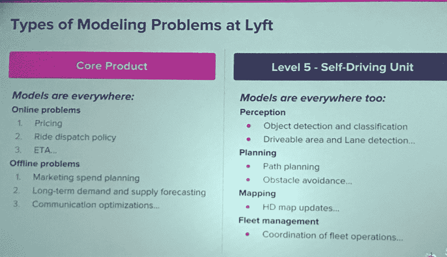

# Lyft、沃尔玛和飞利浦如何利用人工智能转变他们的业务

> 原文：<https://medium.datadriveninvestor.com/how-lyft-walmart-and-philips-are-using-ai-to-transform-their-businesses-5c1721799e7b?source=collection_archive---------17----------------------->

这篇文章是我上一篇关于人工智能在企业中的兴起的文章的后续。在这篇文章中，我将谈论运输、零售和医疗保健领域的企业如何利用人工智能实现转型。

虽然我在这里谈论的是具体的企业，但是用例是非常通用和水平的。用例多种多样，从转变后台应用程序到将同情心带回医疗保健，到检测欺诈，再到无人驾驶汽车的未来。例如，欺诈检测用例吸引了大量垂直行业，包括电子商务、金融和零售环境，在这些环境中，金融交易和/或用户行为监控至关重要。后台功能是任何企业组织不可或缺的一部分，大多数 800 磅的大猩猩都会看到它的适用性。

# 来福车

城市交通公司 Lyft 在品牌和市场份额方面正在快速追赶优步。[机器学习@ Lyft 的产品负责人 Gil Arditi](https://www.linkedin.com/in/gilarditi/) 就 Lyft 如何使用 AI/ML 发表了精彩的见解。

Lyft 的机器学习团队的任务是解决核心和自主业务的各种问题，包括确定现货定价、乘车调度、车队运营和避障。为了解决这些问题，Lyft 的 ML 团队使用了各种模型，包括决策树、神经网络、ARIMA、多臂土匪、SVR 回归和二次规划。模型的选择取决于手头的问题以及模型在大规模解决问题时的有效性。

Gil 讨论了欺诈检测的一个基本问题以及他的团队为解决该问题所经历的历程。先说问题定义。

> 欺诈检测问题的定义很简单:【Lyft 如何识别请求乘车的用户是欺诈者？

**为什么欺诈检测很重要**

欺诈的目的可能各不相同，从未经授权的支付(使用偷来的信用卡等)到通过产生短暂的乘车请求在供应/需求中插入偏差。如果欺诈者未被发现，可能会导致收入减少或客户等待时间延长。

**初始解决方案**

为了解决这个问题，Lyft 开始将用户操作和上下文用户信息输入到梯度增强决策树中。这些输入从位置、源 IP 地址、支付类型、乘车长度到用户的历史乘车消费模式各不相同。由于大量的输入，该模型非常适合以批处理模式运行。

**挑战与进化**

该团队在整体解决方案方面面临三大挑战。

1.决策树需要大量的输入和调整。表达树中输入特征之间的相互作用的特征工程也导致信号损失

2.一个典型的欺诈者的行为模式是“刺完就跑”因此，与历史活动相比，近期活动与欺诈的相关性更高。这需要实时捕捉输入信号，因为没有足够的时间用新的输入来重新编译/重新训练决策树模型

3.与数据工程相比，花费在建模/创造性思维上的时间是最少的。软件工程和运营团队专注于角落场景、扩展、维护和清理，而数据科学团队则专注于在实验室环境中修补小型模型。在生产和测试中获得一致的结果，以及缩短将新模型投入生产的时间是一个关键因素。

这些问题需要不同的模型和流程。

> 决策树被深度学习递归神经网络(RNN)模型取代，用于欺诈者检测问题。

实时决策(使用用户日志等功能)意味着传统的功能学习无法扩展。用一串输入实时检测用户行为与自然语言处理(NLP)问题没有什么不同。任何深度学习模型的可解释性都低于树模型，但总体而言，它带来了更好的结果(更高的精度和召回率)。

就流程而言，Lyft 现在拥有一个全功能的 AIOps 模型，有助于协调所有需要的利益相关者(数据科学、运营、软件工程)，最终有助于更快地推出新的/改进的 AI 模型。

# 沃尔玛

[雅兹迪·巴尔吉](https://www.linkedin.com/in/yazdi-bagli-57032a1/)，SVP，全球商业服务和新兴技术@沃尔玛强调了他们正在为他领导的沃尔玛后台办公室(也称为共享服务)应用程序解决的一系列问题。传统上，沃尔玛使用机器人流程自动化(RPA)等自动化功能，这些功能可以帮助处理日常办公任务，如数字化文档。RPA 系统利用基于规则的自动化以及可视化和脚本化流程图来自动化后端服务流程。

> 沃尔玛后台处理 2 亿多应收账款和 230 多万员工工资单。

自然，即使是很小的流程改进也可以转化为巨大的成本节约。他们注意到瓶颈通常出现在输入和异常处理中。AI 将 RPA 带到了自动化决策制定的下一个级别，以改进异常处理的情况。对于沃尔玛来说，人工智能算法约 85%的准确率是做出自动化决策的触发点。此外，任务现在看起来很简单，因为有数据证明过程的有效性。雅兹迪分享了一个如何使用人工智能和大数据改善销售退税和审计流程的例子。以前，只有一个税务项目的样本集被审计。抽样调查导致了政府的大量审计。

> 人工智能有助于扫描整个审计领域，而不仅仅是抽样审计。

全宇宙扫描使相关工作人员能够做出面向机器的定量和定性决策，以辅助他们的人类判断，或者在许多情况下以合理的准确度默认为机器决策。在一个关于沃尔玛是否使用区块链的问题上，雅兹迪的回答很有启发性。

> 机器学习和人工智能被高度低估。区块链被高估了。

你同意雅兹迪的断言吗？

# 飞利浦

@Philips 战略与合作伙伴全球首席医疗官 Roy Smythe 发表了一篇充满激情的演讲，讲述了当今医疗保健的现状，以及人工智能如何拯救医疗保健，使其更加人性化。传统治疗从同情到基于信仰再到草药疗法，最终发展成他所谓的医疗工业综合体。资金和技术进步创造了一个恶性循环，导致医生精疲力竭。结果是初级保健失去了人性。36 分钟中有 29 分钟用于记录(健康记录和与保险相关的日常开支)。

> 对于真正的人道主义护理，患者每次就诊通常只有 7 分钟，这几乎无助于提供基本的人文关怀，而这是初级护理学科不可或缺的。

人工智能如何帮助处理这个问题？Roy 强调了利用数据和分析来提高医生效率的三个方面，并最终使他们专注于初级保健的人文方面。

1.  **图像识别/计算机视觉**帮助扫描 X 射线或 MRI 图像并测量病变大小，消除手动和容易出错的工作
2.  **数据挖掘**将患者记录与全球数据库中具有相似疾病、年龄甚至基因组模式的患者进行比较
3.  **自我健康人工智能应用**提供健康提示(预防性或前瞻性),可能会减少 50%的医生就诊，让医生有时间处理重要的健康问题

我很想听到更多关于 AI/ML 如何改变你的业务的信息。其中一些例子和见解将被纳入即将出版的新书中，书名为 ***《商业中的人工智能:2019】***，作者为[编辑总监约翰·德斯蒙德](https://aitrends.com/editorial/)@[人工智能趋势](https://aitrends.com/)。你可以在亚马逊上查看他的第一本书 [AI in Business :2018](https://www.amazon.com/AI-Business-compilation-incorporating-artificial/dp/1979249466) 。

(这篇文章交叉发表在我的 LinkedIn 博客和 AiTrends 上。)