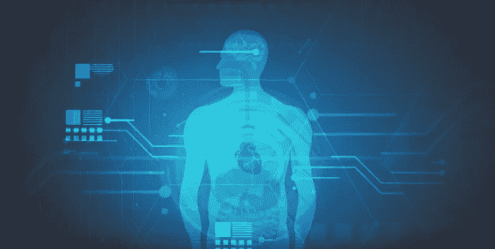

# 机器学习和人工智能如何改变医疗保健行业

> 原文：<https://medium.datadriveninvestor.com/how-machine-learning-ai-are-transforming-the-healthcare-sector-40787dbb5dd2?source=collection_archive---------11----------------------->

**Machine Learning & AI in Healthcare Sector** | [Pinterest](https://www.pinterest.com/pin/725501821200455458/)

人工智能和机器学习正迅速成为现代医疗保健行业的一部分。将人工智能融入医疗行业的主要目的是为医务人员提供有效的支持系统。医生将能够更好地诊断和更快地治疗病人。治疗机器变得越来越有用，越来越智能。

作为一名医学学生，我一直密切关注新的医学发明和人工智能驱动的机器——这要感谢我订阅了其中一个[光谱包](https://www.visioneclick.com/blog/spectrum-tv-packages)！现在，你也可以了解人工智能和机器学习如何改变医疗保健行业。你会惊讶地知道人工智能是如何增强医疗机器和专业人员的能力的。

医生为了找出身体肿块的位置而进行多次扫描的日子已经一去不复返了。或者，甚至首先要弄清楚它是不是一个肿块。自从人工智能被引入医学领域以来，诊断各种疾病变得容易多了。

人工智能驱动的应用程序配备了诊断技术和成像，有助于避免各种错误。这种系统仅通过查看各种扫描就能够进行诊断。人工智能机器和程序已经被开发用于放射学和心脏病学。这些可以帮助在早期阶段识别癌细胞。

在心脏病发作时，人工智能系统可以帮助轻松解决问题。人工智能机器减少了医生在人工检查报告时遗漏任何重要细节的可能性。这减少了错误诊断的机会，这是一个重要的改进。

多年来，修复术已经成为医学领域的重要组成部分。当代的现代技术革新了假肢。他们已经开发出了轻便的假肢，看起来就像真正的身体部位。

这些假体填补了身体缺失的部分，使身体看起来完整。但是当涉及到执行真实肢体的任务时，他们就不能这样做了。发生这种情况是因为不存在自然的联系。这就是人工智能的用武之地。

最近的研究有助于开发假肢，这种假肢可以在某种程度上完成真正的肢体的任务。他们配备了微型摄像机，通过感知周围的活动/物体。他们能够做出反应。我们期待他们进一步完善和提高。

[根据一项调查](http://techgenix.com/ai-health-care-industry/)，大约 92%的全球制药行业领导者认为精准医疗是一个巨大的机遇。人工智能有能力从大量的患者数据中分析微妙的趋势。这意味着研究人员和科学家可以加快开发新药和医疗程序的进程。

人工智能应用程序可以帮助为每位患者量身定制药物。创造一种新药需要多年的实验和艰苦的工作。但是人工智能框架正在使这个过程变得更容易和更快。药品生产变得比以往任何时候都更加迅速和有效。这也有助于在实验过程中节省资金。

医药是一个繁忙的行业。你去世界上任何一个地方的医院看看，你会看到医生们有多忙。每个医生都在同时处理几个病例。因此，有时医生不可能帮助每个人并持续进行多次随访检查。这里的问题解决者是基于人工智能的虚拟跟踪机器和程序。对于需要经常监测和检查的患者，这些随访系统为护士和医生提供了很大的帮助。

就连病人也免去了定期检查的麻烦。这些便捷的系统包括健康聊天机器人，患者可以通过这些机器人获得可靠、快速的医疗状况解决方案。这些机器人可以很容易地回答各种医疗问题，并能够评估症状，指导患者进行适当的药物治疗。

人工智能系统甚至能够识别手写文本和图像。发送手写订阅和扫描将服务的目的。

除了促进医生和医疗领域的进步，人工智能还帮助公众保持健康。随着人工智能及其应用程序的有效使用，个人可以保持健康，活跃，并保持良好的健康。有助于这项事业的人工智能设备是追踪器、手表等等。

以健身追踪器为例。他们帮助用户实现健身和健康目标。此外，他们还帮助他们的用户实现富有启发性和趣味性的目标，从而过上健康的生活。他们还提供一些关于用户健康的快速更新和低级别的帮助。

这些追踪器收集的数据也有助于医生更好地诊断和治疗。这些有用设备的使用者可以避免患慢性病的机会。

人工智能驱动的系统、机器和程序最迷人的地方在于，它们不仅限于大公司。小公司也伸出了手，并成为这一未来转型的积极组成部分。我们期待着整个医疗行业的彻底重组。不久，我们将能够在咨询一个人工智能驱动的在线程序后支付我们的医疗账单，就像我如何使用考克斯账单支付一样。将来它会越来越方便我们。

*原载于 2019 年 12 月 20 日*[*【https://www.aitimejournal.com】*](https://www.aitimejournal.com/@rosie.harman/how-machine-learning-ai-transforming-healthcare-sector)*。*