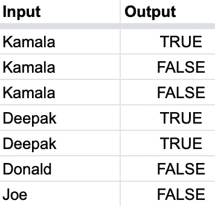
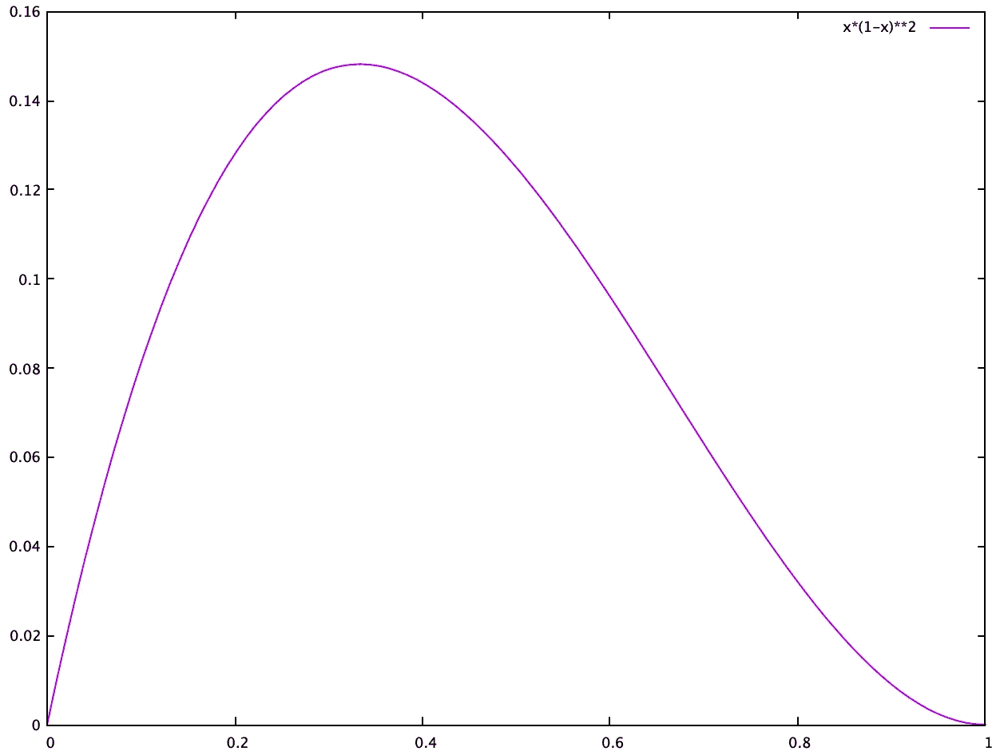
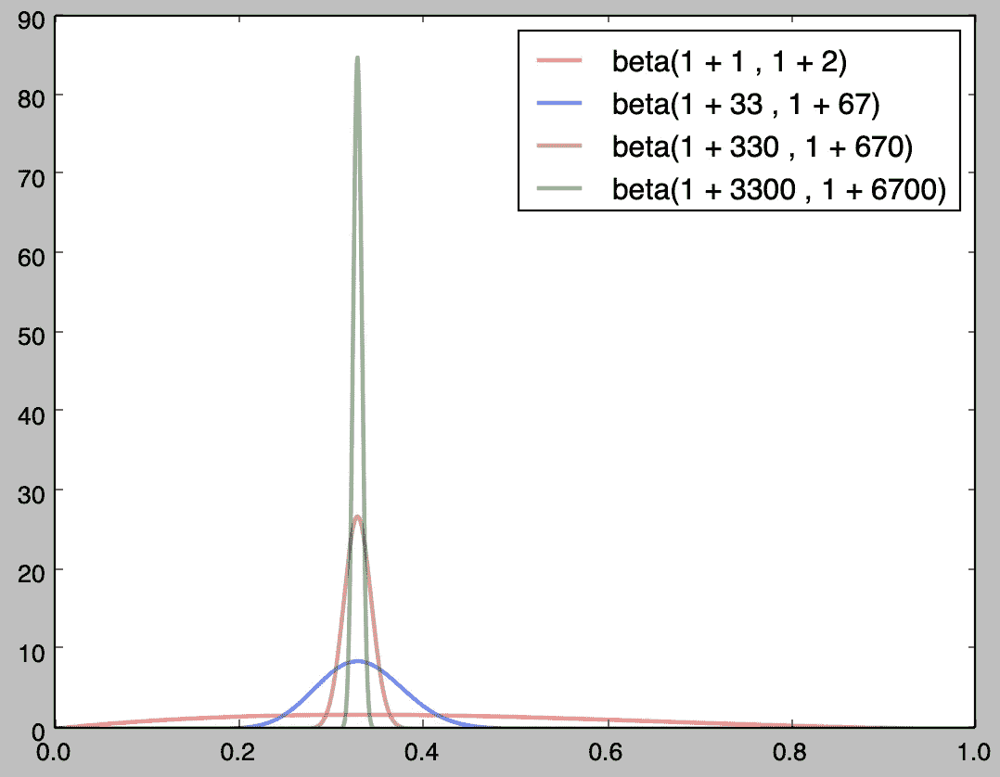

# 机器如何学会怀疑

> 原文：<https://medium.datadriveninvestor.com/how-machines-learn-to-doubt-c603a0eb45b7?source=collection_archive---------6----------------------->

[](http://www.track.datadriveninvestor.com/1B9E)

在我们如何解释机器学习模型得出的预测方面，正在发生一场革命。它的中心是预测的质量，以及模型对它所做的预测有多确定。

# 软件 1.0

为了对它有一个直观的感觉，我们先往回走几步。在软件 1.0 中，也就是算法软件，你可以从一组输入开始，比如“马来语”、“Joe”等字符串。并询问一些关于有确定答案的输入的问题。比如:字符串是回文吗？所以你最终得到成对的输入和相应的确定性答案，比如{ " malayan "，false}、{"Malayalam "，true}、{"Ana "，true"}、{"Anastasia "，false}。然后你去写一些代码，给定一个输入，给你预期的输出。

[](https://www.datadriveninvestor.com/2019/03/03/editors-pick-5-machine-learning-books/) [## DDI 编辑推荐:5 本机器学习书籍，让你从新手变成数据驱动专家…

### 机器学习行业的蓬勃发展重新引起了人们对人工智能的兴趣

www.datadriveninvestor.com](https://www.datadriveninvestor.com/2019/03/03/editors-pick-5-machine-learning-books/) 

# 软件 2.0

但现实世界太复杂，无法被这种确定性规则驯服。例如，让我们像以前一样从字符串开始，但这次问:字符串是印第安人的名字吗？现在在你给定的输入和输出对中，你开始看到像{“卡玛拉”，真}、{“萨提亚”，真}、{“萨提亚”，假}、{“卡玛拉”，假}这样的东西。对于同样的输入，现实世界有时会告诉你答案是对的，有时是错的。如何编写代码来处理这种模糊性呢？在软件 2.0 中，也就是机器学习，你通过说出真或假的概率来处理问题，而不是像绝对真或绝对假这样的艰难决定。

更具体地说，给定一个数据集，比如:



对于任何给定的输入，您将了解到该字符串是来自印度的某人的姓名的概率，并得到{ "卡玛拉"，0.33}、{"Deepak "，1.0}、{ "唐纳德"，0.0}、{ "乔"，0.0}。

虽然这比软件 1.0 有用得多，但是您可以立即看到现实世界与您的代码所告诉您的仍然相差甚远。代码现在告诉你概率*基于看到的例子*，那是你的训练数据。由于实际的限制，你的训练数据总是真实世界的一小部分。所以当你把这个认为“卡玛拉”有 1/3 的概率是印度人的代码应用到现实世界中，你会很快发现它严重低估了现实。那是因为绝大多数卡马拉是印度人，而你的训练数据太少了。

为了理解解决方案，我们需要先稍微深入一下这个问题。假设“卡玛拉”是印度人的真实概率是 *p* 。现在给三个人起名叫“卡玛拉”，如果你问他们“你是印度人吗？”你得到真，假，假答案的概率是多少？是 *p*(1-p)*(1-p) = p*(1-p)*

这个量，即观察你给定训练数据集的概率，被称为[可能性](https://en.wikipedia.org/wiki/Likelihood_function#Example_1)。注意， *p*(1-p)* 不是“卡玛拉”来自印度的概率，它仅仅是得到这个问题的真、假、假答案的概率。潜在概率的范围可以从 0.0 到 1.0，您将得到如下所示的可能性(x 轴是概率，y 轴是可能性):



请注意，似然图的峰值位于 0.33。也就是说，在我们已经计算出概率的朴素概念(也称为样本均值)的点上，可能性是最大的。这也将是来自机器学习模型的预测，该模型忠实地表示数据。换句话说，在给定训练数据集中的观察值的情况下，您的模型最终会猜测基础概率的最可能值。现实中，可能是也可能不是真实概率。

```
For the mathematically inclined, to build the model you'll be minimizing the sigmoid cross entropy, which is minimizing*cross_entropy = -{z*log(f(x)) + (1-z)*log(1 - f(x))}*where f() is the model you are trying to learn applied on input x, and z is the expected output where true is mapped to 1 and false to 0.Note minimizing cross_entropy is that same as maximizing the negative of it,*-cross_entropy = z*log(f(x)) + (1-z)*log(1 - f(x))*And maximizing the expression above also maximizes the exponentiation of the expression, ase^(*-cross_entropy) = e^(z*log(f(x)) + (1-z)*log(1 - f(x)))
                   = e^(z*log(f(x))) * e^((1-z)*log(1 - f(x))
                   = e^(log(f(x)^z)) * e^(log((1 - f(x))^(1-z)))
                   = f(x)^z * (1 - f(x))^(1-z)*This final form is exactly the expression for likelihood with f(x) standing in for the estimate of the underlying probability.Further, you can show that [maximum of the likelihood function](http://mathworld.wolfram.com/MaximumLikelihood.html) occurs at f(x) = mean(z), which is why the model output and the highest point of the likelihood plot above, all land at 1/3.Typically, f(x) will be constructed as f(x) = sigmoid(logit(x)) where logit is the direct output of your model. So if f(x) = p, the maximum likelihood estimate, then logit(x) = log(p/(1-p)) which is the direct output of the model, and it's not the probability.
```

# 软件 3.0

上述模型的问题在于训练样本的数量太少。如果模型看到了 1 万个“卡玛拉”的例子，而其中只有 3333 个来自印度，那么 0.33 的预测确实是有道理的。但是只看三个例子就得出这个结论似乎有点草率。请注意，由(来自印度的“卡玛拉”的数量)/(来自卡玛拉的总数量)给出的概率在 3，333/10，000 与 1/3 中是相同的。但在一种情况下，我们对概率相当有信心，在另一种情况下，我们则不然。为了对这种怀疑进行建模，我们不是依赖像概率 0.33 这样的单一数字，而是通过 [Beta 分布](http://varianceexplained.org/statistics/beta_distribution_and_baseball/)来表示这种情况，通过绘制 *Beta(1 +来自印度的“卡玛拉”的数量，1 +不来自印度的“卡玛拉”的数量)*来捕捉整个概率范围。下图显示了来自印度的“卡玛拉”与非来自印度的“”的数量分别为 1 比 2、33 比 67、330 比 670 和 3300 比 6700 时的各种情况。x 轴代表可能的概率范围，y 轴代表该概率的相对机会。当我们只看到 3 个例子时，可能的概率范围是很大的。但是随着我们收集更多的证据，可能性的范围明显缩小了。



“卡玛拉”是否是一个印度人的名字，这个问题的答案现在从一个概率演变成一个概率分布*，这取决于我们之前见过多少例子。*

*在软件 2.0 中，我们学习了如何猜测最可能的概率。但是我们如何让模型输出整个概率分布呢？这就是软件 3.0 和概率编程的用武之地。*

*获得概率分布的一种方法是建立大量的模型，而不是只有一个模型，每个模型都有自己对实际概率的猜测。因此，给定一个问题，比如一个特定的字符串是否对应于一个来自印度的人的名字，我们建立 1000 个模型，并查看来自这些模型的 1000 个结果。如果潜在的真实概率分布非常广泛，那么我们预计这 1000 个结果会有很大的不同。另一方面，如果真实概率在一个非常窄的范围内，那么 1000 个估计值中的大多数将聚集在该点周围，我们可以确信该概率非常接近该群集。*

*但是，即使处理一个机器学习模型似乎也够痛苦的了，我们如何管理成千上万个模型呢？这是通过像 [dropout](https://www.tensorflow.org/api_docs/python/tf/nn/dropout) 和 flip out 这样的技术来解决的，这些技术在模型中引入随机扰动来模拟它的数千种变化的影响。其他技术，如[贝叶斯神经网络](http://edwardlib.org/getting-started)具有对分布的本地处理，机器学习模型的分布，而不是单个模型。*

*总之，软件进化的弧线正从确定的答案向概率移动，并进一步向概率的分布移动。通过在结果中加入疑问，机器离模拟真实世界更近了一步。*

**参见:**

*[**神经网络是如何工作的？**](https://medium.com/machine-intelligence-report/how-do-neural-networks-work-57d1ab5337ce)*

*[**什么时候在你的神经网络内部相乘？**](https://medium.com/datadriveninvestor/when-to-multiply-inside-your-neural-network-ee39863da446)*