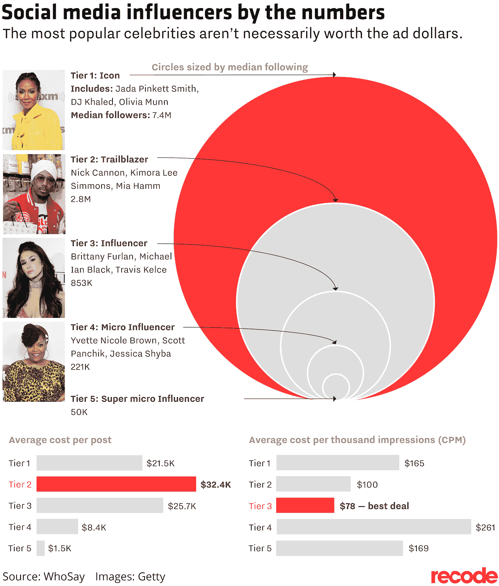

# 多少微影响力等于一个名人品牌大使？

> 原文：<https://medium.datadriveninvestor.com/how-many-micro-influencers-equal-one-celebrity-brand-ambassador-1d969ec76433?source=collection_archive---------11----------------------->

有人会认为这是一个很容易回答的问题；只要数一数他们的追随者的数量…好吧，可悲的是这并不那么简单。如果是的话，我可能会找到另一个主题来写；一个仍未被探索的，或有争议的，或一个每个人都在使用的时髦短语，但没有人真正知道它的确切含义。事实是，这个主题符合每一个标准。

重要的事情先来。**定义**。

不同类型的影响者有很多定义，所以我将为每种类型提供几个定义，然后分享我们关于什么是合理的观点。

 [## 在创业之旅中，拥抱学习|数据驱动的投资者

### 好像建立一个数百万美元的公司还不够困难，企业家必须额外照顾他们的…

www.datadriveninvestor.com](https://www.datadriveninvestor.com/2018/10/16/on-the-entrepreneurial-trek-embrace-the-learning/) 

在下图中，你可以看到由 [mediakix](http://mediakix.com/influencer-tiers/#gs.SRu2hQ0x) 创建的 Instagram 和 YouTube 的 5 层影响者。他们的定义分别基于关注者数量和平均视频浏览量。他们称之为影响者营销(STIM)的标准术语，但我找不到其他地方提到过它，所以下面的内容有一天会成为标准可能是一厢情愿的想法——或者我只是错过了它。

在另一张看起来与上面类似的图片中，mediakix 为那些拥有超过 500 万粉丝的人增加了第六个影响者级别，称为“名人”。

下面的下一张图片是由说话的的[创作的，并在](https://www.whosay.com/) [recode](https://www.recode.net/2017/9/14/16290536/social-media-how-much-celebrities-make-ads-advertising-instagram-influencer) 的一篇文章中找到。它对每一层使用完全不同的名称，它谈论的是一般的关注者数量，而不是特定于特定的社交媒体平台。它甚至提供了每个影响者层的每篇帖子的平均成本。我不确定 2 级怎么会比 1 级贵；可能和较高的参与度有关。

> 如果我们的任何一位读者对这个悖论有什么看法，请发推特@DigitalMR_CEO 或给我发电子邮件。

我曾将纳米影响者定义为拥有多达 1000 名追随者的人，因此这描绘了一幅完全不同的画面。50，000 名粉丝听起来太多了，以至于仍然不能被称为“微”，更不用说超过 200，000 人了。

我们认为，DigitalMR 对两个层次(即纳米和微米)的理想划分将彻底改变影响者营销:

> **纳米**影响者=多达 1，000 名追随者
> 微型影响者= 1001–10，000 名追随者

我们认为这是两种最重要的影响者，因为他们最接近“像我一样的消费者”。如果我必须在两者之间选择，我会选择纳米影响者，他们甚至不认为自己是影响者。他们更加真实，因此更加可信和可信。管理一个由纳米影响者组成的社区也比上图所示的要便宜得多。

igitalMR 正在申请一项名为“扩大客户倡导模式”(ACAM)的专利。这基本上是一个围绕口碑创造系统的过程(WOM)。消费者是否会在网上对一个品牌大加赞赏，这一系统使品牌能够从头开始重新获得对叙事的一些控制，而不是靠运气。该流程充分利用了 DigitalMR SaaS 的两大核心产品:[听音 247](https://listening247.com/) 和[社区 247](https://communities247.com/en/) 。谁知道我们是否会获得专利…它是 4 年前申请的。当然，现在市场赶上了我们的想法，我们被迫发挥；不管有没有专利。

> 81%的 Twitter 用户的关注者少于 50 人，70%的 Instagram 用户的关注者少于 1000 人。

让我们讨论一下这意味着什么；我们有:

1.  大众媒体上的广告，
2.  使用名人品牌大使来放大品牌信息，并将其与一个受欢迎甚至喜爱的名人联系起来，以及
3.  来自普通消费者的口碑。

你认为哪个消息更可信、更可信？嗯，直到几年前，我们还会在网上看到很多关于微观影响者比大众媒体上的广告好多少的统计数据，因为消费者更信任喜欢他们的消费者，而不是品牌的营销部门。正如任何非常成功的创新一样，唱反调的人会缓慢但肯定地发表评论，要么是用他们自己的糟糕经历，要么是分享他们在一次高调会议上听到并留下深刻印象的尖刻言论。当然，任何创新都会有失败和失望，但关键是要找出问题并解决它们。我希望这篇文章能对建立纳米/微影响者营销作为一个有效的营销学科有所帮助。

**发现了哪些问题？**

**问题#1:** 谁拥有你的听众的耳朵？

**问题#2:** 确定的影响者能在多大程度上影响他们的追随者？

**问题#3:** 有哪些法律陷阱？例如，每一个付费的影响者帖子都必须用#Ad 明确标识，或者贴上赞助帖子的标签

**问题#4:** 追随者是真实的吗？

**问题#5:** 一个影响者的合法追随者会因为他们认为是朋友的人现在通过“利用他们”获得报酬而疏远他们吗？

有影响力的人真的相信他们所倡导的吗，或者他们只是为了钱才这么做的？我确信还有更多；能否以令人满意的方式解决这些问题？你打赌！

**内容创作**

影响者将与他们的网络和朋友分享的内容来自哪里？是由品牌给他们，还是让他们自己创作内容，让他们保持真实性？因为通常情况下，这不是一个“或”的问题，而是一个“和”的问题:

1.  该品牌将为 Instagram、Twitter、脸书、YouTube 或他们关注的任何其他社交媒体平台制作帖子；然后，他们将与影响者分享这些帖子，影响者将在他们的帐户上发布这些帖子，并将它们标识为#Ad，并且
2.  影响者将制作关于品牌的内容，表达积极的情感，通过审批流程，以便品牌可以对其形象保持一定的控制，然后分享。

**影响者影响测量**

投资回报率是每个人在审批营销预算时追求的目标。衡量投资回报率的一个显而易见的方法是将数字内容的分享与销售直接挂钩。如果产品或服务是在网上销售的，那么追踪起来就容易多了。这就像在要分享的帖子中包含一个登录页面的链接一样简单。在登录页面上，领导应该能够轻松地购买产品或服务。当然，我们永远也不会知道有哪些客户看到了影响者的帖子，点击了(或没有点击)链接，但当时决定不购买任何东西，只是直接从网站上购买，而不是通过将他们与影响者活动联系起来的特定链接。

话虽如此，除了销售之外，像这样的活动还有许多方式可以对品牌的成功产生积极影响:

*   提高品牌知名度
*   增加积极的消费者情绪
*   增加时事通讯订阅者或竞赛参与者的数量等。
*   允许创建用户内容(免费),而无需雇用代理来创建它
*   通过喜欢、分享、观点和评论来提高消费者参与度
*   增加品牌社交媒体账户的关注者数量

**优点&缺点**

由成百上千的品牌大使组成的纳米/微米影响者社区的好处是，他们有动力分享关于品牌或事业的积极数字内容，这是一种比传统广告更值得信赖的方式。

像这样一个成功的品牌大使社区有潜力以名人影响者的一小部分成本推动销售增长。不利方面与上述所有问题有关；如果这些问题——一个或多个——得不到控制，整个活动可能会适得其反，不仅不会产生积极的影响，反而会让公司损失一些资金和品牌资产。值得庆幸的是，一旦你了解他们，他们很容易解决。

**题目的答案**

我们花了很长时间才找到这个答案，但提供背景很重要。如果一个名人影响者有超过 500 万的追随者，那么根据 DigitalMR 的定义，我们需要至少 5000 个纳米影响者或至少 500 个微影响者来匹配追随者的数量。

> 然而，许多人的追随者甚至不知道他们是有影响力的人，他们会比名人更好地为品牌做贡献。

有可能持续管理这么多人并取得可衡量的结果吗？我想是的。如果您有任何问题，请在 Twitter @DigitalMR_CEO 上或通过[电子邮件](mailto:mmichael@digital-mr.com)联系我。

分享这篇文章:

【www.digital-mr.com】最初发表于**。**