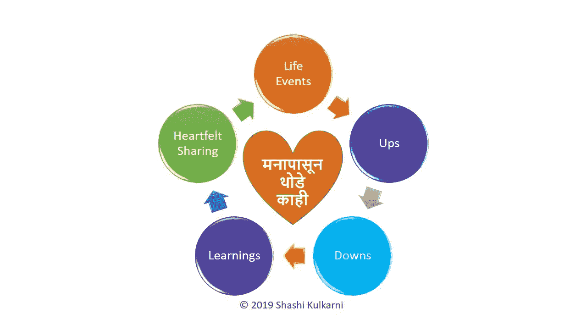

# 在远程工作和通过电话参加商务会议时，密切关注身体语言有多重要？

> 原文：<https://medium.datadriveninvestor.com/how-much-critical-is-paying-close-attention-to-the-body-language-while-attending-business-meetings-72dc9c010fc9?source=collection_archive---------0----------------------->

## 即使在远程工作时，肢体语言也很重要

## 我们知道肢体语言在会议、演示和演讲中的重要性。打电话时，远程参加会议呢？

Photo by [Dane Deaner](https://unsplash.com/@danedeaner?utm_source=unsplash&utm_medium=referral&utm_content=creditCopyText) on [Unsplash](https://unsplash.com/s/photos/global-meetings?utm_source=unsplash&utm_medium=referral&utm_content=creditCopyText)

远程工作的员工数量呈持续上升趋势，越来越多的公司提供远程工作选项。

这也意味着，在大多数日常商务会议中，可能会有超过一半的团队成员不在会议室。当我们考虑分布在多个国家的全球团队时，情况更是如此。团队可以是组织内部的，也可以是由组织外部的团队成员、第三方、客户、供应商和顾问组成的项目或项目群。

 [## 在家工作——当你的父母不理解你有一份“真正的”工作时。|数据驱动…

### 不承认现代科技给我们年轻人带来的机会，至少可以说是一种蔑视…

www.datadriveninvestor.com](https://www.datadriveninvestor.com/2018/09/17/working-from-home%e2%80%8a-%e2%80%8awhen-your-parents-dont-understand-that-you-have-a-real-job/) 

A 根据 GlobalWorkplaceAnalytics.com 于 2019 年 8 月 16 日发布的[最新远程办公/移动工作/远程工作统计数据](https://globalworkplaceanalytics.com/telecommuting-statistics)，该数据基于对 2005-2017 年美国社区调查(美国人口普查局)的分析，是关于美国在家工作/远程工作人口的:

*   **自 2005 年**以来，非自雇人口中的*定期在家工作，已经增长了**159 %,比其他劳动力**快了**11 倍以上，比自雇人口**快了近**50 倍。***
*   470 万员工(占员工总数的 3.4%)现在至少有一半时间在家工作。
*   大公司最有可能给大部分员工提供远程办公的选择。
*   全球财富 1000 强公司正在围绕员工已经移动化这一事实，彻底改造他们的办公空间。研究反复显示，桌子有 50-60%的时间是空着的。

为了开一个有成效的会议，在这些会议中的沟通需要比平时给予更多的关注。

> 当你远程参加会议时，你如何给分散在不同地方的团队留下深刻的印象，成为你成功的关键因素。

A 据[直接导师](https://www.directutor.com/content/non-verbal-communication-telephone)，

> 通过电话交流的好处之一是你不会被发现。也许你穿着泳衣在家工作，但这没关系，因为没人能看到你。虽然你的泳衣不会在电话中暴露，但你的肢体语言会。**你的肢体语言不仅会影响你的态度，还会妨碍良好的发声。**
> 
> 如果你有一种非常随意、放松、脚放在桌子上的姿势，这一定会在你的声音和态度中表现出来。你可能会听起来漠不关心或不尊重他人。你也不应该无精打采，因为这会表现出一种邋遢、冷漠的态度。此外，无精打采会限制你的横隔膜，这是允许你支撑和发出声音的肌肉。坐直，脚放在地板上给人最好的印象。

归结起来就是你如何给分散在不同地方的团队留下杀手般的印象，这成为你远程参加会议成功的关键因素。

简单的答案是使用正确的“肢体语言”

答在她的 TED 演讲中，我的 Cuddy 解释了 2 分钟内展示力量的重要性以及它是如何产生巨大影响的[你的肢体语言可能会塑造你自己](https://www.ted.com/talks/amy_cuddy_your_body_language_shapes_who_you_are?language=en):

> 我们知道我们的思想会改变我们的身体，但是我们的身体也会改变我们的思想吗？
> 
> 我们的身体改变我们的思想，我们的思想可以改变我们的行为，我们的行为可以改变我们的结果。
> 
> 艾米·卡迪

甚至在开始通话之前，也需要使用相同的技术。

O 这些年来，我观察到一些亲密的同事非常有效地使用一些技巧来获得令人敬畏的结果。他们使用这些技术，无论他们是在视频通话中——所有人都可以看到他们，还是在纯音频通话或会议中，只有他们的声音被听到。

在电话会议上，我们都可以使用这些肢体语言技巧，就像坐在电话另一端的人旁边一样。

**1。站起来而不是坐下:**

站着比坐着更能打开呼吸道。这让你的声音显得更加有力和自信。我的一些同事在谈话时也在房间里走来走去，这使他们感到精力充沛，这种精力在声音中表现出来。

**2。使用正确的姿势:**

站立时保持正确的姿势同样重要。[美国脊椎指压治疗协会](https://acatoday.org/content/posture-power-how-to-correct-your-body-alignment)给出了以下站立时保持正确姿势的建议。

*   主要用你的脚掌承受你的重量。
*   保持膝盖微微弯曲。
*   保持双脚与肩同宽。
*   让你的手臂自然地垂在身体两侧。
*   挺胸直立，肩膀向后拉。
*   收腹。
*   保持头部水平——你的耳垂应该和肩膀在一条线上。不要把头向前、向后或向旁边推。
*   如果你必须长时间站立，将你的重心从脚趾转移到脚跟，或者从一只脚转移到另一只脚。

**3。微笑:**

销售人员和客户服务代表总是被训练成打电话时总是面带微笑。当你微笑时，你的语气变得更加积极和友好。

微笑是一个简单而有效的行动，你可以用它来改善自己的情绪，也可以改善其他与会者的体验。

**4。使用宽泛的手势:**

即使是在打电话的时候，也要使用宽泛的手势。无论如何，没有必要感到害羞，因为没人能看见你。手势增加自信。

我的一个朋友曾经在他的办公室里有一面全尺寸的镜子，在里面他可以看到自己，他的脸和他打电话时的肢体语言。他提到，他一照镜子，就会自然而然地注意自己的姿势和脸上的微笑。

**5。排除杂念，增加注意力:**

到目前为止，在许多电话中，我听到了各种干扰谈话的声音。那些声音是翻动纸张的声音，家庭成员大声说话的声音，狗在附近叫的声音，孩子来通知父亲饭菜或早餐准备好了的声音，甚至是飞机起飞的声音。这导致许多团队成员要求重复某人刚刚说过的话，因为他们被这些声音分散了注意力。我不知道有多少次我们在电话中要求某人将自己静音以避免这些干扰。

如果附近有其他人，不要对他们做手势。最多的是通知他们保持安静，或者用手势告诉他们走开。当有人这样做的时候，他们会完全分心，这表现在他们忘记了他们在电话里说的重点，并问别人“那么我在哪里？”

**总结一下:**

打电话时，注意你的肢体语言。

*1。站起来而不是坐下*

*2。使用正确的姿势*

*3。微笑*

*4。使用宽泛的手势*

*5。消除干扰，提高注意力*

**© 2019 Shashi Kulkarni. All rights reserved.**