# 新人应该获得多少股权？

> 原文：<https://medium.datadriveninvestor.com/how-much-equity-should-someone-new-get-430fb92adebe?source=collection_archive---------8----------------------->

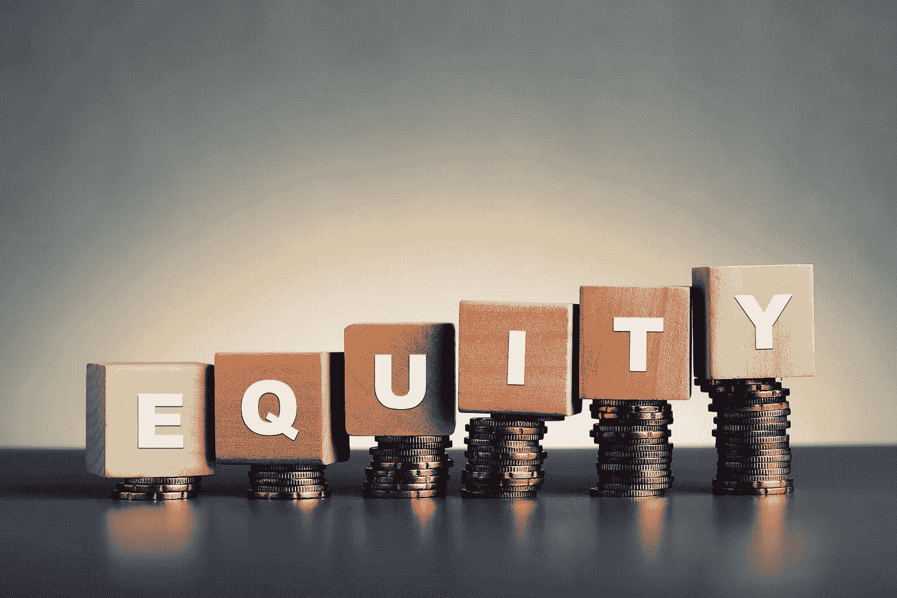

每个创业公司都需要吸引人才，解决大问题，并开始寻求共同改变世界。公平的话题肯定会出现多次，尤其是那些将扮演重要角色的人。

为了避免新成员加入时的频繁稀释，通常会预先确定一部分份额作为购买股票的期权，称为期权池。然而，有时没有足够的选择，或者关系的类型(例如联合创始人)要求发行新的创始人股份。

当新股发行时，它创造了两个有趣的动态:a)每个现有股东将拥有更少的馅饼(%所有权)，b)但与此同时，由于新人带来的价值，馅饼的大小(公司的估值)应该变得更大。

目标是当这种情况发生时，对现有股东和新人都公平。这意味着，尽管公司有更多的股份，但每个股东的股价应该与公司估值的增加成比例。

这意味着，理解这种感知到的估值增加是很重要的，以便能够确定向他们发行的新股数量。

这是一项商业交易，因此了解双方是确保交易过程公平和激励的关键。

# 公司的观点

核心思想是评估新人加入时公司估值的变化，从而了解他们带来的价值。从那里，我们可以计算出价值相当于多少股本。

当一家公司没有被外部投资者定价时，计算准确的预估值可能会很棘手。而一家被外部投资者估值的公司可能被高估或低估。不管外部投资者是否对一家公司进行了估值，我们都应该更深入地了解独立于市场价值的估值的组成部分。

这里有一个内部思考估值的框架。基本上，你有一个潜在的市场机会可以抓住，这给公司带来了价值，公司的估值由两个相反的因素决定:a)有多少市场已经被抓住，b)有多少风险(不确定性)被强加于业务的进一步发展。

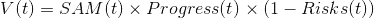

*   *V(t)*=**公司在 t 时刻的估值**
*   ***SAM(t) =* **可服务的目标市场**在 *t.* 时的规模**
*   ***进度(t) =* 在时间 *t* 获得的**目标市场的百分比**。**
*   ***风险(t)* =在现金耗尽之前无法退出的**概率**。**

**为了更好地理解的进步，我们可以把它看作是物质价值:**

*   **IP——开发的知识产权**
*   **收入——企业的年收入**
*   **人才——公司中关键资源的数量**

**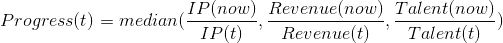**

**为了理解**风险**，我们可以将其分解为:**

*   **资本——无法从**到达下一个里程碑的风险缺乏资本****
*   **产品—不建立**正确功能**的风险**
*   **技术—不正确构建**功能的风险****
*   **运营支出——无法**赚钱的风险****
*   **文化——没有合适的人**的风险****

**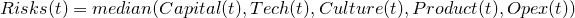**

**这些风险类似于债务，它可以累积并杀死公司。**

**当一个新人加入时，他们最终会降低业务中的风险。它们应该影响一个或多个风险。希望都是积极的。**

**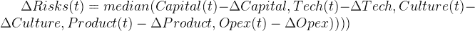**

**这些风险的变化可以被认为是人的能力，以及我们对他们提供这些能力的信心:**

*   ****能力** —由技能匹配和掌握水平决定**
*   ****信心**——他们交付的可能性。由以前的记录和动机一致性决定。**

**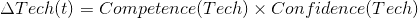**

**需要注意的一点是，之前几年的经验只对已经掌握的匹配技能有影响，还有他们交付成果的跟踪记录。在脸书谷歌这样的公司工作经验丰富的人很可能会拥有很高的能力和自信。然而，你可以有一些刚从学校毕业的人，他们拥有很高的能力和很低的初始信心，在那里他们很快解决了信心，达到了与在大公司有更多经验的人相似的 Delta。**

**风险的变化将给我们一个新的估价:**

****

**新估价的百分比变化可以被理解为权益。**

**虽然这是这个人带来的价值，但我们应该加入一个期权池，这样对未来的员工才公平。**

**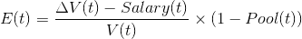**

## **例如**

**让我们假设一家成立一年的初创公司正在考虑聘请山姆作为他们的首席运营官。这家初创公司已经建立了他们产品的功能原型，正在市场上进行付费试点，并获得了 30 万美元的外部投资种子前可转换票据。该公司计划瞄准一个市场，其 SAM(12 个月)为 5000 万美元，12 个月内预计收入为 40 万美元。**

**该公司已经开发了达到这一里程碑所需的 30%的知识产权，达到了 10 万美元的 ARR，并雇佣了 10 个关键人员中的 3 个。**

**因为公司筹集的资金只够支付 12 个月的费用，他们很可能需要在资金耗尽前 3 个月进行融资。12 个月的资本风险是 100%。**

**首席执行官非常了解客户问题，非常以产品为导向，并具有将短期产品目标规划为长期愿景的分析能力。公司开发错误功能的风险是 30%。**

**该公司仍然缺少一名首席技术官，一名关键雇员。大多数技术是由初级开发人员开发的。这很有效，但客户开始抱怨应用程序的性能。可能会有大量的技术债务，整个堆栈将需要很快重写，以处理更多的客户。技术在 12 个月内失败的风险高达 80%。**

**这家公司经营复杂，客户数量少，还算过得去。为了扩大规模，公司需要一个首席运营官，这个职位将由山姆来担任。目前，该公司每笔交易都在赔钱，需要确保交易不会失控。随着业务的增长，企业能够高效运营的风险高达 90%。**

**这个团队仍然很小，所以每一次招聘都很关键。首席执行官组建了一个使命一致的团队，致力于长期发展，但对于这个年轻的团队来说，要建立一个世界级的高职能组织，还有很多工作要做。文化的风险是 50%。**

**基于这些数字，12 个月后的估值(不含 Sam ):**

> **p*progress(1 年)*为 0.28**
> 
> ***风险(1 年)为 0.70***
> 
> ***V(1 年)*是 425 万美元**

**Sam 为团队带来了多年的运营管理经验，愿意为公司投入一些资金，并将他的个人品牌置于危险之中。经过几次面试和一起出去玩后，CEO 对 Sam 的能力有了很好的认识，并相信他在任务上是一致的。**

**Sam 计划投资 40，000 美元，这将使公司的跑道增加 2 个月。降低 10%的资本风险。同时，在出售了之前的公司后，他应该在 30%的置信水平下进一步降低 10%的资本风险。所以他应该把资本风险降低 13%，把新的资本风险降低到 87%。**

**Sam 以前从事过许多类似的产品，非常了解这个行业。他可以给 CEO 很大的帮助，把产品风险降到 25%。**

**不幸的是，Sam 不太懂技术，无法为技术团队做出贡献。这项技术的风险仍然是 80%。**

**Sam 过去曾大规模管理过复杂的运营产品。他应该能够灌输过程、最佳实践和纪律。运营能力应能降低 50%的运营支出风险，但是，由于团队从未直接与 Sam 合作过，而且他以前的项目与公司的项目有很大差异，因此置信度仅为 20%。运营支出的新风险为 80%。**

**Sam 管理过 50 多人的团队，拥有凝聚高绩效团队所需的软技能。Sam 也非常认同公司的使命，并相信团队能够实现这一使命。他应该能够以 20%的置信水平降低 10%的文化风险，使新文化风险达到 48%。**

**基于这些数字，新的风险是 64%。所以 Sam 加盟一年后的新估值应该是 500 万美元，相差 79 万美元。该公司决定每年支付萨姆 6 万美元，以及 20%的期权池。公司应该考虑给山姆 12.6%的公司股份。**

# **新人的视角**

**当你考虑从一家初创公司拿股权来支付工资时，你需要考虑上升的机会，但也要考虑下降的风险。**

**由于股权通常在 4 年内授予，有一年的悬崖，考虑它的方法是使用在公司工作的未来价值与在其他地方工作的机会成本的概率。**

**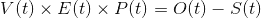**

*   ***V(t)* =在 *t* 时刻公司**估值**。**
*   ***E(t) =* **股权**人在 *t* 时的百分比。**
*   ***P(t)* = **时间 *t* 时退出可能性的概率**。**
*   ***O(t)* =人的**机会** **成本**持续时间 *t* 。**
*   ***S(t) =* 员工在公司工作期间 *t* 的**工资**。**

**所以解决公平问题我们得到，**

**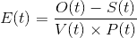**

## **例如**

**如果 Linda 打算在经过一轮有价格的种子期后加入一家公司。她想在 1 年悬崖后确定她的股票头寸。在目前的职位上，她每年能挣 20 万美元。因此，一年后，她大概每年能挣 23 万美元。假设该公司在种子期的最后一轮估值为 10，000，000 美元，那么大概在 1 年后，当他们准备筹集 a 轮融资时，估值将为 30，000，000 美元左右。退出可能性的概率为 50%[。该公司向她提供每年 8 万美元的薪水。基于这些参数，一年后的公平权益头寸，](https://techcrunch.com/2017/05/17/heres-how-likely-your-startup-is-to-get-acquired-at-any-stage/)**

**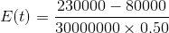**

**她应该有 1%。**

**但如果一年后公司估值不是 3000 万美元，而估值只有 1500 万美元呢？那她应该得到 2%。**

**通常，可行权期为 4 年，每年平均分配。**

**一种观点认为，要获得 4 年的总权益，我们可以将每年的权益相加，如下所示:**

**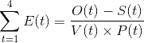**

**这种方法对 Linda 来说并不公平，因为她不是每年都重新加入，而是承担了更大的初始风险。**

**另一方面，我们可以考虑将第一年的股本乘以 4。这对公司来说并不公平，因为随着时间的推移，估值和她的工资可能会大幅增加。**

**公平的做法是取两者的平均值**

**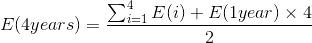**

**一种机会成本是不创办另一家公司。这可能是一个有用的练习，可以使用与使用公司的透视公式类似的方法来完成。**

# **摘要**

**这个问题没有确切的科学依据，但是有一个思考这个问题的框架不仅可以帮助你理解他们带来的价值，还可以帮助你理解哪些业务领域最需要关注。这种模式是相当新的，给它一个尝试，并希望听到你的想法。**

**链接到[示例模型](https://docs.google.com/spreadsheets/d/1tMAZhCtznAcor1C4QKjmkYdj_grVUTwYvOWEgcWZxGQ/edit#gid=0)**