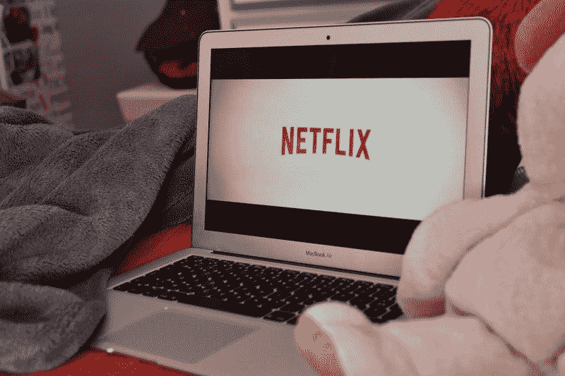
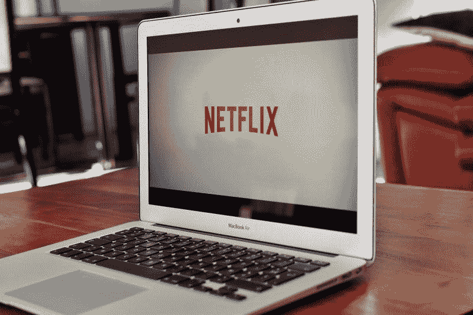

# 网飞赚了多少钱？—市场疯人院

> 原文：<https://medium.datadriveninvestor.com/how-much-money-is-netflix-making-market-mad-house-2a671638f05b?source=collection_archive---------8----------------------->

我认为**网飞(纳斯达克代码:NFLX)** 股票是目前定价最高的股票之一。例如，市场先生在 2019 年 11 月 4 日将网飞的价格定为 292.86 美元。

然而，网飞在 2019 年 9 月 30 日报告的收入仅为 52.45 亿美元。然而，Stockrow 估计这些收入在最后一个季度以 31.14%的速度增长。此外，网飞的收入增长率高于上一季度的 26%。

此外，网飞的收入从 2019 年 6 月 30 日的 49.23 亿美元增长到 9 月 30 日的 52.45 亿美元。因此，我估计网飞在三个月内获得了 3.22 亿美元的新收入。

 [## 算法交易的机器学习|数据驱动的投资者

### 当你的一个朋友在脸书上传你的新海滩照，平台建议给你的脸加上标签，这是…

www.datadriveninvestor.com](https://www.datadriveninvestor.com/2019/01/30/machine-learning-for-stock-market-investing/) 

# 审查制度对网飞是一种威胁吗？

因此，我得出结论，投资者押注于网飞的增长能力。然而，网飞的增长可能面临严重威胁。

有趣的是，审查和监管可能是网飞增长的最大威胁。例如，57%的印度人希望政府审查流媒体视频，*商业内幕* [声称](https://www.businessinsider.in/business/news/indians-want-censorship-for-netflix-amazon-prime-hotstar-according-to-yougov-survey/articleshow/71837315.cms)。

解释一下这个数字来自 YouGov 的一项民意调查。同一项民意调查发现，91%的印度人希望政府监管(审查)流媒体视频内容。

因此，9 月份，中央邦高等法院的 Indore 法官裁定一些视频内容是淫秽的，需要审查。高等法院是印度人口第六多的中央邦的最高法院。

法院对一个压力集团的诉讼做出裁决，该诉讼指控印度政府逃避责任，没有审查流媒体视频。在印度，所有电影都需要获得中央电影认证委员会的批准才能获得上映。然而，董事会忽略了视频流。

Vice 推测，审查制度可能会通过将视频内容变成温和的、对家庭友好的糊状物来摧毁印度的视频。我认为，如果各国的审查者对其内容强加标准，网飞可能会损失很多钱。

# 印度能审查网飞吗？

与此同时，印度信息与广播部正在考虑认证(审查)流媒体视频，*商业内幕*声称。

历史表明，审查制度会限制媒体的创造力。例如，臭名昭著的生产代码；或者“[海耶斯法典](https://www.npr.org/templates/story/story.php?storyId=93301189)”，对好莱坞电影的内容进行了 30 多年的严格限制。

有趣的是，好莱坞部分采用了海斯法则来满足英国电影审查委员会[的要求。人们担心电影审查委员会可能会禁止好莱坞电影进入大英帝国。](https://en.wikipedia.org/wiki/British_Board_of_Film_Classification)

在 20 世纪早期到中期，大英帝国是英语电影的最大市场。因此，美国电影公司在 20 世纪 30 年代和 40 年代制作了许多颂扬大英帝国的电影。比如*[*一个孟加拉枪骑兵的生命*](https://www.imdb.com/title/tt00026643/)*[*冲锋的轻装大队*](https://www.imdb.com/title/tt0027438/?ref_=nv_sr_2?ref_=nv_sr_2)[*那个汉密尔顿的女人*](https://www.imdb.com/title/tt0034272/?ref_=nv_sr_1?ref_=nv_sr_1) 。**

**如今，印度是英语流媒体视频的最大市场。所以历史可能会重演。**

**20 世纪 60 年代，英国和意大利电影开始在票房上超过美国电影之后，好莱坞才废除了海斯法则。因此，外国审查对美国科技公司来说是危险的。**

# **网飞的增长有极限吗？**

**审查不是网飞面临的唯一威胁。网飞的用户增长可能会受到严重限制。**

**网飞未能加入分析师在 2019 年第三季度预测的 700 万用户， *Recode* [估计](https://www.vox.com/recode/2019/10/16/20917867/netflix-q3-earnings-streaming-stranger-things-disney-apple)。然而，网飞上个季度增加了 680 万用户，几乎达到了这个目标。此外，网飞在美国增加了 50 万名用户，而不是分析师预期的 80 万。**

****

**因此，网飞仍像野草一样疯长。然而，流媒体视频服务对华尔街来说增长不够快。股价高表示市场先生；另一方面，中国对网飞的增长感到满意。**

**此外，网飞声称，2019 年全球将增加 2670 万用户。如果这一预测是真的，网飞将比 2018 年增加更少的用户，当时其平台增加了 28.6 个用户。**

**Statista [估计，总的来说，网飞仍然拥有一个巨大的平台，全球有 1.583 亿用户，美国有 6060 万用户。在 2019 年第三季度，网飞在美国以外拥有 9770 万用户。](https://www.statista.com/chart/10311/netflix-subscriptions-usa-international/)**

**因此，网飞容易受到印度审查者的攻击，因为印度是最大的英语国家。Worldometers 估计，2019 年 11 月 1 日，印度人口为 13.71 亿。因此，印度是网飞产品的最大市场。**

# **网飞令人难以置信的竞争**

**然而，我认为竞争是对**【网飞(纳斯达克代码:NFLX)** 的最大威胁。网飞的竞争对手数量惊人，而且每天都在增长。**

**在印度，网飞与 Balaji Telefilms、网飞、Amazon Prime、Ullu、Viacom 18、VIU 和 Yash Raj Films 等竞争。在美国，迪士尼+、亚马逊 Prime、 [HBOMax](https://www.cnet.com/news/hbo-max-price-15-dollars-release-date-launch-may-us-shows-movies-podcast/) 、Apple Plus TV、CBS Digital、Hulu 和 Acorn 引领着越来越多的流媒体视频平台。**

****

**分析公司 Jumpshot 声称 Disney+在 2019 年 10 月 31 日拥有超过 100 万美国订户， *TechCrunch* [报道](https://techcrunch.com/2019/10/31/study-claims-disney-already-has-over-a-million-u-s-subscribers-pre-launch/)。不可思议的是，Disney+还没有。**迪士尼(NYSE: DIS)** 计划于 2019 年 11 月中旬推出 Disney+。**

# **迪士尼+对网飞是个威胁吗？**

**此外，瑞银分析师估计，他们在 2019 年 10 月调查的 1，000 名美国消费者中，有 44%计划订购迪士尼+， *TechCrunch* 声称。因此，Disney+可以迅速聚集起庞大的用户群。**

**同时，据 TechCrunch 报道，迪士尼公司预计，到 2024 年，Disney+将拥有 6000 万至 9000 万用户。如果这一预测成真，Disney+平台将在五年内与网飞的用户群相匹敌。**

**然而，Jumpshot 声称，许多人订阅了多个流媒体视频平台。Jumpshot 发现，12.5%的迪士尼+潜在用户已经订阅了一个以上的流媒体视频服务。**

****

**此外，31%的 Disney+粉丝已经订阅了至少一个流媒体视频平台。具体来说，19.4%的自处理迪士尼+用户来自亚马逊 Prime，9.1%的迪士尼+成员使用 Hulu，18.5%的迪士尼+粉丝订阅网飞。**

# **迪士尼+ vs 网飞**

**迪士尼+似乎正成为网飞的一大威胁。我认为迪士尼+通过提供安全的“家庭友好”威胁到了网飞换句话说，审查，编程。**

**此外，迪士尼拥有主要的流行文化特许经营权；包括《星球大战》、《漫威》、《辛普森一家》和《吸血鬼猎人自助餐》。这种特许经营拥有庞大的粉丝群，因此它们可以带动数百万新的迪士尼+订户。**

****

**网飞面临的一个问题是，它没有大型流行文化产业。几年前，网飞播放了漫威的节目，但迪士尼取消了。可以预见，新的漫威秀将会在 Disney+上播出。**

# **迪士尼能摧毁网飞吗？**

**另外，Disney+背后有大量的资源。这些资源包括两个主要的美国电影制片厂；迪士尼和 21 世纪福克斯，皮克斯，漫威漫画，一个巨大的销售机器，主题公园，和几个美国电视网。全网飞都有自己的政纲，也有一些不大不小的政纲；按照好莱坞的标准制作设备。**

**此外，迪斯尼比网飞更有钱。迪士尼在 2019 年 6 月 29 日报告了 67.28 亿美元的现金和等价物以及 2094.75 亿美元的资产。网飞于 2019 年 9 月 30 日报告了 44.3502 亿美元的现金及等价物和 309.42 亿美元的资产。**

****

**因此，我认为 Disney+和它的姐妹平台 Hulu 是网飞最大的威胁。解释一下，Hulu 最初是 21 stFox、迪士尼、**康卡斯特(纳斯达克代码:CMSCA)** 和时代华纳的合资企业。**

**然而，据 CNN 财经[报道](https://www.cnn.com/2019/05/14/media/disney-buys-comcast-hulu-ownership/index.html)，迪士尼于 2019 年 5 月收购了 Hulu 的全部控制权。Statista [估计](https://www.statista.com/statistics/258014/number-of-hulus-paying-subscribers/) Hulu 在 2019 年 5 月拥有 2680 万用户。然而，他们只在美国提供 Hulu 订阅。**

**迪士尼正在组建一个庞大的流媒体视频帝国，其规模和范围可以与网飞媲美。此外，迪士尼有资源创造或购买大量的独家节目来主导市场。**

# **网飞赚了多少钱？**

**令人印象深刻的是，**网飞(纳斯达克代码:NFLX)** 正在赚钱。例如，网飞在 2019 年 9 月 30 日报告了 21.47 亿美元的季度毛利。**

**该毛利高于 2019 年 6 月 30 日的 19.17 亿美元。此外，网飞报告的季度运营收入为 9.8024 亿美元，季度净收入为 6.6524 亿美元。这些数字高于 2019 年 6 月 30 日的 7.0642 亿美元和 2.7065 亿美元。**

****

**然而，网飞仍在消耗大量现金。例如，网飞在 2019 年 9 月 30 日报告了-5.0179 亿美元的负“经营现金流”。同一天，网飞公布的自由现金流为负 5.5176 亿美元。**

**很明显，网飞在 2019 年 9 月 30 日报告了 119.9 亿美元的融资现金流。我认为这意味着网飞为其运营融资的唯一方式就是借钱。解释一下，网飞通过用它没有的现金借款来赚钱。**

**所以网飞目前赚了一些钱。然而，它并没有产生可能导致灾难的现金。**

**为了解释这一点，我认为只要订阅量大幅下降，网飞就会陷入死亡漩涡。当一家公司赚不到足够的钱来偿还债务时，就会出现死亡螺旋。**

# **为什么网飞永远无法支付股息**

**我认为投资者需要远离网飞(纳斯达克股票代码:NFLX) ，因为市场先生对它的估值过高。雪上加霜的是，网飞不支付股息，也不提供安全边际。**

**此外，我认为网飞永远不会支付股息。解释一下，你需要现金来支付股息，而网飞不产生现金。**

**因此，我建议对流媒体视频感兴趣的投资者调查一下**迪士尼**。迪士尼于 2019 年 7 月 5 日向 88₵支付了一年两次的股息。2019 年 11 月 4 日周一，市场先生将迪士尼定价为 132.92 美元。**

***原载于 2019 年 11 月 4 日*[*https://marketmadhouse.com*](https://marketmadhouse.com/how-much-money-is-netflix-making/)*。***