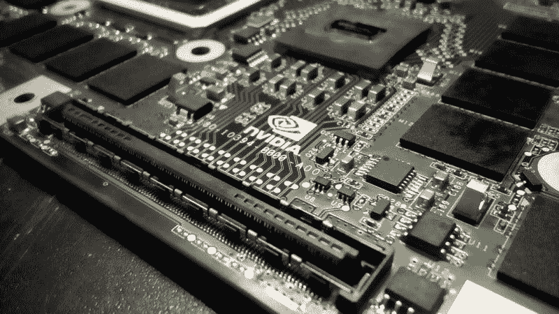
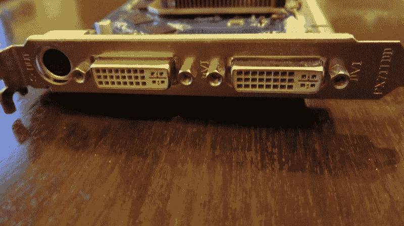
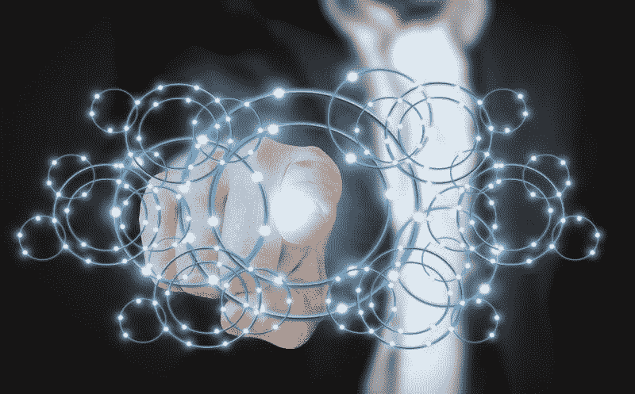
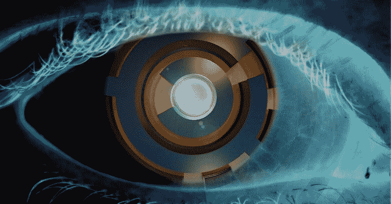
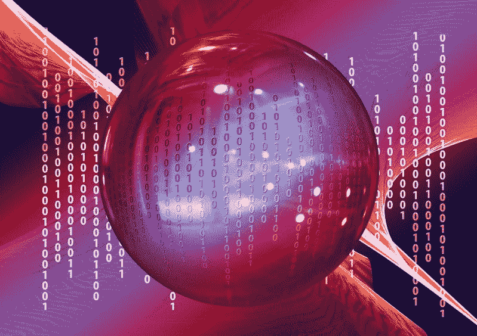

# 英伟达赚了多少钱？—市场疯人院

> 原文：<https://medium.datadriveninvestor.com/how-much-money-is-nvidia-making-market-mad-house-b378c37cc1a2?source=collection_archive---------7----------------------->

NVIDIA(纳斯达克股票代码:NVDA) 是典型的巴菲特式投资，因为它很无聊，但却能赚很多钱。

例如，英伟达在 2019 年 10 月 27 日报告的季度收入为 30.14 亿美元，季度毛利为 19.16 亿美元。此外，NVDIA 在同一天报告了 8.99 亿美元的季度净收入和 9.27 亿美元的季度营业收入。

 [## 值得购买的 4 大人工智能股票及其原因|数据驱动型投资者

### 人工智能(AI)在 2019 年继续进入大众意识。通过应用程序…

www.datadriveninvestor.com](https://www.datadriveninvestor.com/2019/03/06/top-4-artificial-intelligence-stocks-to-buy-and-why/) 

此外，NVIDIA 每个季度的利润、收入和收益都会大幅增加。例如，NVIDA 的净收入从 2019 年 7 月 28 日的 5.52 亿美元跃升至 2019 年 10 月 27 日的 8.99 亿美元。与此同时，英伟达的毛利在 2019 年 7 月至 10 月期间从 15.41 亿美元上升至 1.916 美元。此外，英伟达同期的收入从 25.79 亿美元增长到 30.14 亿美元。

相反，NVIDIA 可能会经历收入、利润和收入的大幅下降。例如，英伟达报告的毛利为 19.21 亿美元；2019 年 10 月 28 日的收入为 31.81 亿美元，净收入为 12.30 亿美元。然而，NVIDA 报告称，过去 7 个季度没有亏损。

# 英伟达的赚钱机器一直在盈利

因此，**英伟达(NASDAQ: NVIDA)** 不断有回报。因此，游戏玩家不应该期待 NVIDIA 图形处理器(GPU)的价格下降， *Techradar 的* Darren Allan [沉吟道](https://www.techradar.com/news/nvidia-is-making-megabucks-so-dont-expect-cheap-rtx-cards-any-time-soon)。

观察家们将 NVIDIA 的利润归功于 RTX 和超级 GTX 独立显卡。重要的是，英伟达首席执行官黄仁勋将公司的利润归功于游戏玩家。

“我们的游戏业务和超大规模客户的需求推动了第三季度的业绩，”黄在一份新闻稿中说随着 Nvidia RTX 的出现，计算机图形的真实性向前迈进了一大步。"

英伟达可以在 2019 年第四季度赚更多的钱，因为他们在 2019 年 10 月 29 日发布了 GTX 1660 超级 GPU 卡。此外，英伟达计划在 2019 年 11 月 22 日发布 1650 超级 GPU 卡，正好赶上美国和欧洲的圣诞购物季。

NVIDIA 的另一个利润驱动力可能是 9 月份发布的 RTX208 ti。RTX208 包含图灵架构， *PC 游戏玩家* [报道](https://www.pcgamer.com/looking-forward-to-nvidias-rtx-3080-and-the-next-generation-7nm-gpus/)。游戏玩家喜欢这种卡，因为它们更快，更真实。

# 英伟达利用人工智能和深度学习赚钱

除了游戏，**英伟达(纳斯达克股票代码:NVDA)** 正在利用其 T4 GPU 从深度学习中获利。T4 GPU 是一个接口，使人们能够使用人工智能(AI)进行训练和深度学习。

黄在英伟达第三季度财报电话会议上表示:“今年，我们开始看到推理的增长，我们销售的推理设备超过了我们销售的 V100s，两者都创下了历史新高。”。澄清一下，V100 是安装在自动驾驶汽车中的 GPU **特斯拉汽车公司(纳斯达克股票代码:TSLA)** 。

具体来说，客户可以使用[英伟达 T4 GPU](https://www.nvidia.com/en-us/data-center/tesla-t4/) 来加速云工作负载、深度学习培训、机器学习、数据分析和图形。他们将 T4 GPU 基于 NVIDIA Turning 架构。他们利用 70 瓦的小型 PCIe 外形、图灵张量内核和 RT 内核，针对主流计算环境优化了 T4 GPU。

# NVIDIA 在云上赚钱

而且，英伟达是在云上套现。CRN [估计](https://www.crn.com/news/components-peripherals/nvidia-ceo-huang-ai-inference-kicking-into-gear-as-t4-sales-soar)英伟达的超大规模云服务业务在 2019 年第三季度增长了 11%。

此外，CRN [报道](https://www.crn.com/news/components-peripherals/nvidia-mellanox-deal-may-not-close-until-early-2020)称，英伟达正试图通过以 69 亿美元收购以太网和互联解决方案提供商 [Mellanox Technologies](https://www.mellanox.com/) 来扩展其云业务。Mellanox 通过提高以太网的可扩展性和效率来支持云。

Mellanox 的业务包括 IP 视频、游戏、流媒体视频、安全、电信、数据中心、电信、数据中心、互联网计算和数据存储。例如，互联网协议视频(IP 视频)是流媒体视频平台的基础。

因此，NVIDIA 正在利用流媒体视频的增长来赚钱。流媒体视频服务正在像野草一样疯长。

例如，**迪士尼(NYSE: DIS)** 声称其 Disney+平台在运营第一天(2019 年 11 月 12 日)就吸引了超过 1000 万订户， *The Verge* [报道](https://www.theverge.com/2019/11/13/20963172/disney-plus-subscribers-10-million-star-wars-marvel-pixar-launch)。此外，迪士尼声称人们下载了迪士尼+ plus 应用程序 320 万。

# 英伟达产生了多少现金？

重要的是，**英伟达(纳斯达克股票代码:NVDA)** 正在产生大量现金。例如，英伟达在 2019 年第三季度报告的运营现金流为 16.4 亿美元，投资现金流为 12.56 亿美元，自由现金流为 15.37 亿美元。

自由现金流从 2019 年 7 月 28 日的 8.23 亿美元和 9.36 亿美元增长。然而，投资现金流从 2019 年 7 月 28 日的 35.45 亿美元下降。此外，NVIDIA 报告称，过去五个季度的五项投资现金流为正。

最后，英伟达在 2019 年 10 月 27 日拥有 97.65 亿美元的现金和等价物。这一数字比 2019 年 7 月 28 日的 71.05 亿美元有所增长。

因此，英伟达是一家现金充裕的公司，总资产为 158.1 亿美元。所以 NVIDIA 符合我心目中最重要的价值标准。它产生并保持大量现金。

# 英伟达被低估了吗？

我认为市场先生在 2019 年 11 月 22 日低估了英伟达股票 210.56 美元。我认为英伟达被低估了，因为它有潜力赚更多的钱。

特别是，英伟达可以通过人工智能(AI)产生大量现金。值得注意的是，麦肯锡全球研究所[预测](https://blogs.wsj.com/cio/2018/11/16/the-impact-of-artificial-intelligence-on-the-world-economy/)到 2030 年，人工智能将为全球经济产出增加 13 万亿美元。

相反，*普华永道的全球智能研究* [声称](https://www.pwc.com/gx/en/issues/data-and-analytics/publications/artificial-intelligence-study.html)到 2030 年，人工智能可以为全球经济增加 15.7 万亿美元。此外，普华永道声称，到 2030 年，人工智能将增加一些国家的国内生产总值(GDP)。

英伟达可以从人工智能中赚钱，因为公司和国家会购买像 T4 这样的 GPU 来赚更多的钱。有趣的是，普华永道的研究显示，到 2030 年，45%的经济收益将来自人工智能和 GPU 等产品创造的产品增强。

此外，普华永道预测，NVIDIA 的两个主要市场北美和中国将获得最大收益。具体来说，普华永道预测人工智能将推动中国 GDP 增长 26%，北美 GDP 增长 14.5%。总的来说，人工智能将为北美和中国经济增加 10.7 万亿美元。

**英伟达(纳斯达克股票代码:NVDA)** 在一个不断增长的行业中，它是一个公认的赚钱机器，可以产生大量现金。因此，英伟达是一只集成长股和价值股于一身的股票。

# 英伟达是一个伟大的股息股票

英伟达是一只增长和价值型股票，股息丰厚。英伟达将于 2019 年 11 月 27 日支付 16₵股息。

此外，股息还在增长。Dividend.com 认为英伟达连续六年的股息增长功不可没。总的来说，英伟达股东在 2019 年 11 月 22 日获得了 0.30%的股息收益率，64₵年化派息率和 9.65%的派息率。

因此，英伟达是一个很好的收入和股息股票，具有很高的安全边际。英伟达的安全边际很高，因为它产生了大量现金。

# 为什么 NVIDIA 很重要

NVIVDIA(纳斯达克股票代码:NVDA) 是一家重要的公司，因为它通过创新赚钱。特别是，英伟达从游戏、深度学习、人工智能、机器学习、自动驾驶汽车、流媒体视频和机器人中赚钱。

NVIDIA 的成功向我们展示了新技术可以赚钱。然而，NVIVDIA 证明了这些技术的发展是有限的。

为了解释这一点，英伟达已经连续四个季度报告收入负增长。详细来说，英伟达报告的收入增长收缩率为 2019 年 1 月 27 日-24.25%，2019 年 4 月 28 日-30.78%，2019 年 7 月 28 日-17.42%，2019 年 10 月 27 日-5.25%。

因此，NVIDIA 的收入增长并没有增加，即使它的收入在增加。因此，英伟达的一些技术市场有限。

相反，英伟达证明了你可以从那些新技术中赚很多钱。因此，想赚钱的人需要调查英伟达股票。

*原载于 2019 年 11 月 22 日*[*【https://marketmadhouse.com*](https://marketmadhouse.com/how-much-money-is-nvidia-making/)*。*