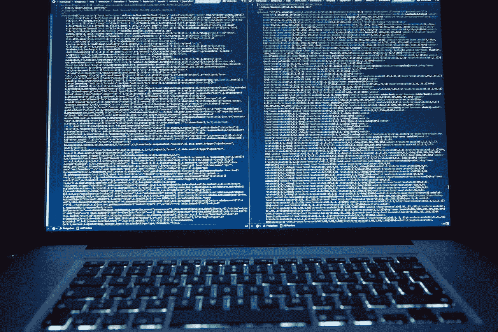
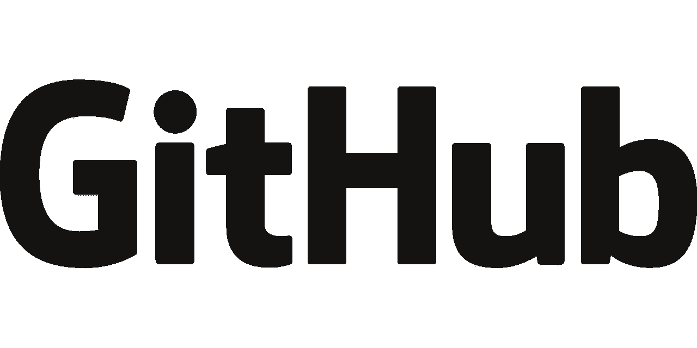

# 甲骨文(Oracle)赚了多少钱？

> 原文：<https://medium.datadriveninvestor.com/how-much-money-is-oracle-orcl-making-3325fd3cb0a6?source=collection_archive---------33----------------------->

甲骨文比以往任何时候都更有利可图，但其核心软件业务面临严峻挑战。

从积极的一面来看，旧的甲骨文赚钱机器正在所有八个气缸上工作。例如，甲骨文 2018 年第四季度的收入为 91.93 亿美元，毛利润为 72.4 亿美元。

值得注意的是，**甲骨文(纽约证券交易所代码:ORCL)** 报告称，2018 年第四季度营业收入为 27.78 亿美元，净收入为 22.65 亿美元。此外，Oracle 报告第四季度运营现金流为 67.72 亿美元，投资现金流为 35.32 亿美元，自由现金流为 63.39 亿美元。

**甲骨文仍然是一家现金充裕的公司**

因此，甲骨文仍然是一家现金充裕的公司。令人印象深刻的是，甲骨文在 2018 年 8 月 31 日记录了 184.55 亿美元的现金和等价物以及 416.39 亿美元的短期投资。因此，截至 2018 年 8 月 31 日，甲骨文的银行存款为 609.4 亿美元。

我认为甲骨文是一项价值投资，因为它有那么多现金和低廉的股价。例如，2018 年 11 月 29 日，甲骨文的股价为 47.90 美元。

此外，甲骨文的收入增长缓慢。例如，Stockrow 报告称，甲骨文在 2018 年第四季度的收入增长率为 0.98%。

甲骨文是一项价值投资

甲骨文(Oracle)是一个相当乏味的赚钱机器，但却能产生大量现金。因此，尽管市场先生对甲骨文不屑一顾，但它仍是一项价值投资。

然而，甲骨文在云计算和财务软件的核心业务上面临着严峻的挑战。令人惊讶的是，甲骨文(Oracle)的最大威胁现在是微软(纳斯达克股票代码:MSFT)。

澄清一下，微软通过 Excel 是财务软件的主要参与者，通过 Azure 是云的主要参与者。此外，微软以 75 亿美元收购 GitHub，成为开源软件领域的大玩家。

**微软和 GitHub 如何威胁甲骨文**

值得注意的是，据《金融时报》报道，全球有 180 万家企业和财富 50 强中的一半使用 GitHub 软件。澄清一下,《财富》50 强是美国最有价值的 50 家上市公司。

通过收购 GitHub，微软可以增加 3100 万开发人员。GitHub 声称有 3100 万开发者在它的 9600 万个仓库中发布软件。

除此之外，GitHub 声称有 210 万个组织在使用它的软件。此外，他们还提出了 2 亿次软件拉取请求。

甲骨文(ORCL)能与 GitHub 和微软竞争吗？

甲骨文无法与微软通过 GitHub 获得的所有开发者力量相抗衡。例如，微软可以用成千上万的应用程序充斥市场。

此外，微软可以在全球 10 亿台装有 Windows 操作系统的个人电脑上“宣传”该软件。此外，微软声称全球有 4 亿台电脑运行 Windows 10， *The Verge* [报道](https://www.theverge.com/2016/9/26/13057980/microsoft-windows-10-400-million-devices)。

例如，微软可以通过在未来版本的 Windows 和微软 Office 中添加 GitHub 应用程序，向数亿用户介绍 GitHub。解释一下，GitHub 将让用户通过 Windows 购买 GitHub 软件。

此外，微软可以为客户提供一个用 GitHub 构建自己的软件的功能。澄清一下，微软企业或云客户可以在 GitHub 上订购新的应用或功能。然后 GitHub 开发者将投标创建一个定制的解决方案。

**甲骨文公司(Oracle)有可能与微软的 GitHub 竞争吗？**

因此，企业家可以从印度的 GitHub 开发者那里订购几乎任何他或她需要的应用程序。因此，任何高管都可以从自己的桌面订购 Oracle 解决方案的低成本替代品。

我不知道甲骨文如何与之竞争。然而，商人、高管、企业家和管理人员需要一段时间才能意识到这种能力的存在。

因此，甲骨文将长期保留其大量的政府、机构和企业客户。这些客户将继续使用甲骨文，因为他们没有意识到存在更好或更低成本的替代产品。此外，花别人钱的机构客户将没有什么动力去购买更便宜或更快捷的 Oracle 产品的替代品。

另一方面，依赖懒惰、缺乏想象力或愚蠢的客户不是可持续的商业策略。尤其是这样的客户，很可能是没有增长能力的。因此，甲骨文可能会发现自己的市场正在萎缩。

甲骨文(Oracle)仍然是一项极好的价值投资

尽管面临 GitHub/微软的威胁，甲骨文公司仍然是一笔极好的价值投资。

特别是，甲骨文是一个伟大的股息股票。为了澄清这一点，Dividend.com 报告称，甲骨文在 2018 年 11 月 27 日提供的股息收益率为 1.61%，年化派息为 76，派息率为 6 年。

甲骨文投资者于 2018 年 10 月 30 日享有 19 英镑的现金股息。此外，2017 年股息增加了 4。甲骨文在 2017 年 1 月提供了 15 英镑的股息，在 2017 年 4 月提供了 19 英镑的股息。锦上添花的是，甲骨文正在完成六年的股息增长。

所以，如果你在寻求一只低成本的分红股票，**甲骨文(ORC)** 是个不错的选择。我认为，尽管来自微软和 GitHub 的威胁，甲骨文仍有数年的红利。