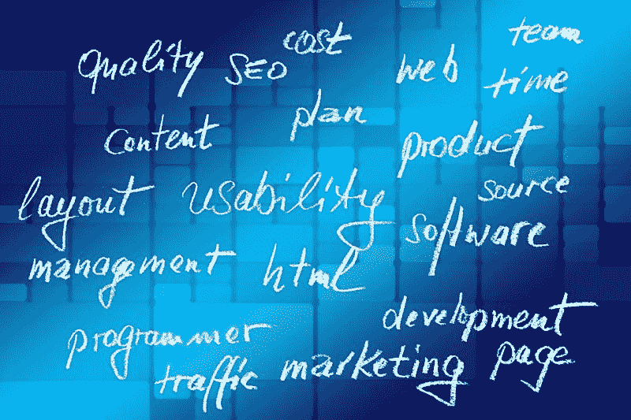

# Salesforce.com 赚了多少钱？—市场疯人院

> 原文：<https://medium.datadriveninvestor.com/how-much-money-is-salesforce-com-making-market-mad-house-719fed95076c?source=collection_archive---------12----------------------->

我的结论是**Salesforce.com(纽约证券交易所代码:CRM)** 是一个现金充裕的软件价值投资，市场先生定价过高。

解释一下，2019 年 10 月 30 日，Salesforce 的股价为 158.28 美元。此外，截至 2019 年 7 月 31 日，Salesforce 拥有 35.1 亿美元的短期投资和 25.32 亿美元的现金及等价物。因此，Salesforce.com 有 60.42 亿美元的流动资产。

 [## 数据驱动投资的兴起|数据驱动投资者

### 当 JCPenney 报告其 2015 年 2Q 的财务结果时，市场感到非常震惊。美国零售巨头…

www.datadriveninvestor.com](https://www.datadriveninvestor.com/2019/02/28/the-rise-of-data-driven-investing/) 

然而，**甲骨文公司(纽约证券交易所代码:ORC)** 在 2019 年 8 月 31 日拥有 310.83 亿美元的现金和等价物以及 46.21 亿美元的短期投资。因此，甲骨文拥有 357.04 亿美元的流动资产，但其股票在 2019 年 10 月 30 日的交易价格为 54.85 美元。

因此，我认为 Salesforce.com 估值过高，因为它的现金和安全边际太低。为了解释，我认为 60.42 亿美元的现金对于直接竞争对手来说是太低的安全边际；甲骨文公司有 357.04 亿美元的银行存款。

一个更大的威胁是**微软** **(纳斯达克:MSFT)** ，它在 2019 年 9 月 30 日拥有 1366.36 亿美元的现金和等价物。我认为市场先生在 2019 年 10 月 30 日对微软的定价是 144.61 美元。

# Salesforce 有很多价值

然而，我认为 Salesforce.com 仍然有很多价值，因为它的生态系统。

例如，Salesforce.com 在 2018 年 5 月 29 日拥有 19.6%的客户关系管理(CRM)软件市场，*数字部* [估计](https://expandedramblings.com/index.php/salesforce-statistics/)。对于非销售人员来说，CRM 是连接企业和客户的软件。因此，CRM 对许多企业的成功至关重要。

此外，Salesforce.com 是云业务的主要参与者。数字部估计 2018 年 5 月 Sales force 34%的收入来自其销售云解决方案。此外，2018 年 5 月，服务云产生的 sales force 30%的收入来自服务云，21%来自应用云。

# 微软拥有商业云吗？

所以我估计 2018 年 5 月 sales force 85%的收入来自云端。因此，我认为对云的依赖使得微软成为 Salesforce.com 最大的威胁。

例如，TechCrunch [估计](https://techcrunch.com/2019/10/23/microsoft-reports-a-strong-fiscal-first-quarter-but-azures-growth-rate-continues-to-decline/)截至 2019 年 9 月 31 日的季度，微软 Azure Cloud 智能云的收入增长了 27%。此外，同期来自微软 Azure 云解决方案的收入增长了 59%。

然而，商业趋势对微软和 Salesforce.com 都有利。例如，Gartner [估计](https://www.gartner.com/en/newsroom/press-releases/2019-07-29-gartner-says-worldwide-iaas-public-cloud-services-market-grew-31point3-percent-in-2018)基础设施即服务(IaaS)云在 2018 年增长了 31.3%。Gartner 将微软列为市场上第二大供应商，仅次于**亚马逊(NASDAQ: AMZN** )。

# 竞争对手能把 Salesforce.com 挤出云端吗？

此外，Gartner 估计了五大 IaaS 提供商；亚马逊、微软、**、阿里巴巴(NYSE: BABA)** 、**Alphabet(NASDAQ:GOOG)**和 **IBM (NYSE: IBM)** ，占据了 2018 年全球 IaaS 市场的 77%。但是，我认为小型供应商也有发展空间。

不幸的是，小供应商需要更有竞争力。Gartner 估计，前五大 IaaS 供应商的份额从 2017 年的 73%增长到 2018 年的 77%。因此，五大巨头可能会将 Salesforce.com 和甲骨文这样的小公司挤出云市场。

2018 年，Gartner 估计亚马逊的公共 IaaS 云市场份额增长 26.8%，阿里巴巴的公共 IaaS 市场份额增长 92.6%，微软的 IaaS 市场份额增长 60.9%， **Alphabet 的(NASDAQ: GOOGL)** 公共 IaaS 云份额增长 60.2%，IBM 的 IaaS 公共份额增长 24.7%。

与此同时，所有其他供应商在 2018 年的增长率为 11.1%。特别是，我不得不怀疑 Salesforce.com 如何与 Alphabet 等公司竞争；截至 2019 年 6 月 30 日，谷歌拥有 1210.56 亿美元的现金和短期投资。

# Salesforce.com 赚钱了吗？

逆势者；然而，威尔说**Salesforce.com(纽约证券交易所代码:CRM)** 是一个价值投资，因为它在所有这些竞争中赚钱。然而，Salesforce.com 是一家大多数人从未听说过的默默无闻的公司。

值得注意的是，Saleforce.com 在 2019 年 7 月 31 日报告的毛利为 30.3 亿美元，收入为 39.97 亿美元。重要的是，Salesforce.com 在 2019 年 7 月 31 日报告的收入增长率为 21.82%。

然而，Salesforce.com 报告 2019 年 7 月 31 日的营业收入为 5500 万美元，净收入为 9100 万美元。因此，Salesforce.com 从其不断增长的业务中赚了一些钱。

# Salesforce.com 的风险

此外，Salesforce.com 报告 2019 年 7 月 31 日的运营现金流为 4.36 亿美元，自由现金流为 2.58 亿美元。因此，Salesforce.com 的业务赚了一些钱，但它不是像甲骨文、Alphabet 或微软那样的赚钱机器。

因此，购买 Salesforce.com 股票可能会冒很大的风险。这只股票的安全边际很低，市场先生高估了它。

此外，Dividend.com 报告称 Salesforce 不支付股息。因此，对于普通人来说，CRM 不是一只好股票。相比之下，微软计划在 2019 年 11 月 20 日支付 51₵股息，甲骨文在 2019 年 10 月 9 日支付 24₵股息。

总之，我认为有比 Salesforce.com 更好的云计算和软件股票。我认为高昂的价格和缺乏红利使得 CRM 成为一项糟糕的投资。

*原载于 2019 年 10 月 30 日*[*【https://marketmadhouse.com】*](https://marketmadhouse.com/how-much-money-is-salesforce-com-making/)*。*