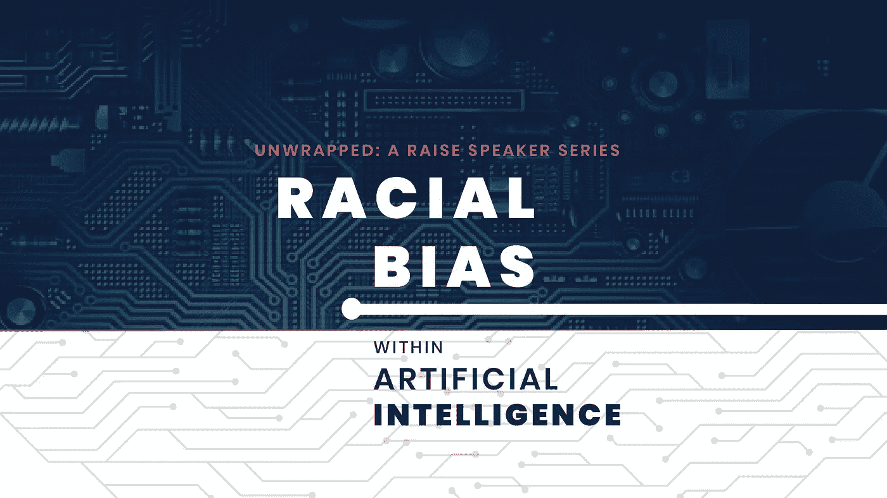
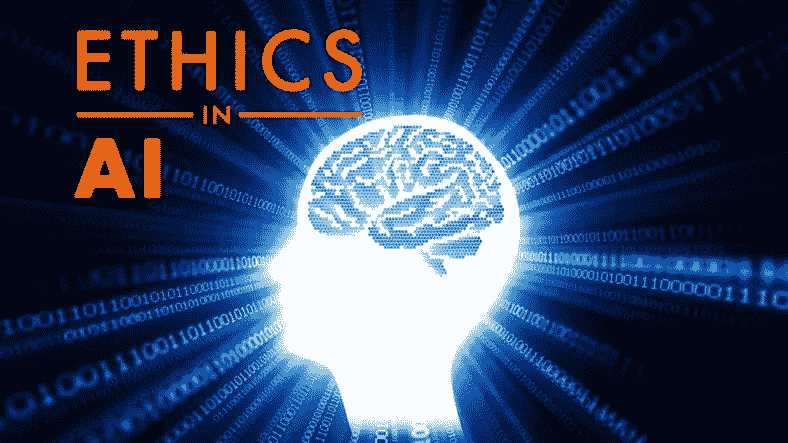
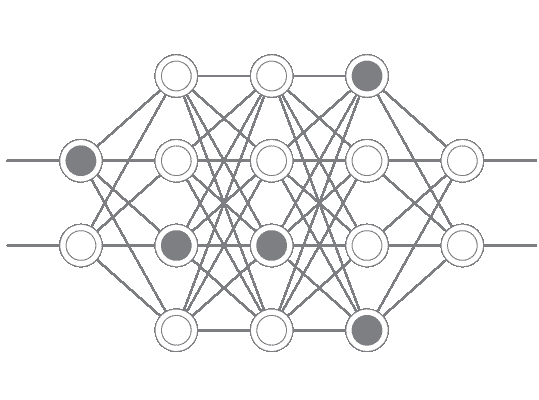

# 我们应该在多大程度上信任我们的人工智能系统？

> 原文：<https://medium.datadriveninvestor.com/how-much-should-we-trust-our-ai-systems-6d7bb0c77cac?source=collection_archive---------5----------------------->

## 我们的人工智能系统中的偏见影响了我们的决策

人工智能系统正越来越多地集成到每个涉及关键行业的系统中，如刑事司法、执法、招聘和金融贷款。

这高度重视这些新系统的决策质量。因此，一个有趣的讨论是技术中的偏差量，我们能控制它吗？它能产生多大的影响？

它是如何发生的？
更好地理解了这种偏见。人工智能系统通常是在大数据集上训练的。因此，人工智能系统的好坏取决于我们输入的数据。不良数据可能包含隐含的种族、性别或意识形态偏见。许多人工智能系统将继续使用坏数据进行训练，使这成为一个持续存在的问题。

这意味着偏见可以进入我们设计的人工智能系统，并用于为政府和企业做出决策。这就带来了一个问题:我们能在多大程度上信任技术来做出影响我们生活的关键决定。

**COMPAS 示例** 解释这一点的最佳示例是算法 COMPAS(替代制裁的矫正罪犯管理特征分析)，这是美国法院用来评估被告重新犯罪的可能性的案件管理和决策支持工具。

白人和黑人被告被给予更高的风险分数，再次犯罪的几率大致相同。但 ProPublica 的一项分析发现，当你检查系统犯下的错误类型时，黑人被告被贴上错误标签的可能性几乎是再次犯罪的两倍——因此可能会受到刑事司法系统更严厉的对待。另一方面，在 COMPAS 评估后的两年内犯下新罪行的白人被告被误标为低风险的可能性是黑人被告的两倍

一个更棘手的问题是，输入这些系统的数据是否会反映并加剧社会不平等。例如，批评者认为，至少像 COMPAS 这样的系统使用的一些数据从根本上受到刑事司法系统中种族不平等的污染。

> 我最担心的不是公司开始种族歧视。我更担心的是那些没有批判性思考的公司，他们可能会通过使用的数据来源来强化偏见。”

除此之外，当斯坦福大学宣布成立一个新的人工智能研究所时，该大学表示“人工智能的设计者必须广泛代表人类”，并公布了 120 名教师和技术领导者在该倡议中的合作伙伴。

一些人很快注意到，这个“代表”群体中没有一个人是黑人。反弹很快，引发了对人工智能领域严重缺乏多样性的讨论。

主要的科技公司已经推出了人工智能“道德”委员会，不仅缺乏多样性，有时还包括一些利益与道德使命不一致的有权有势的人。结果是一些人认为的认真对待人工智能伦理问题的系统性失败，尽管有广泛的证据表明算法、面部识别、机器学习和其他自动化系统复制并放大了偏见和歧视性做法。

缓解偏见
那么我们能做些什么呢？
利用人工智能和计算认知建模的最新进展，如伦理学的契约方法，来描述人们在决策中使用的原则，并确定人类思维如何应用这些原则。目标是建造在决策中应用某些人类价值观和原则的机器。

识别和减轻人工智能系统中的偏见对于在人类和学习机器之间建立信任至关重要。当人工智能系统发现、理解并指出人类在决策中的不一致时，它们也可以揭示我们不公正、狭隘和认知偏见的方式，从而引导我们采取更公正或平等的观点。在识别我们的偏见并向机器传授我们的共同价值观的过程中，我们可能会比人工智能提高更多。我们可以提高自己。

**结论** 总之，偏见无处不在，难以消除，因为它们往往是我们意识不到的潜意识想法。因此，在科技行业使用经过特殊培训的员工时，一定程度的谨慎有助于建立更好的理解，以消除我们系统中的任何偏见。

感谢我用来研究这篇文章的资料来源，因为它们帮助我更好地理解了这个概念。

 [## 爱德华·穆尔德鲁

### 爱德华·马尔德鲁的最新推文(@EdwardMuldrew)。程序员，视频制作，技术和平面设计…

twitter.com](https://twitter.com/EdwardMuldrew) 

**所用来源:** [https://www . Ericsson . com/en/blog/2019/3/how-can-we-stop-technology-from-inheritage-our-bias](https://www.ericsson.com/en/blog/2019/3/how-can-we-stop-technology-from-inheriting-our-bias?source=post_page---------------------------)
[https://www . the guardian . com/technology/2019/mar/28/big-tech-ai-ethics-boards-prediction](https://www.theguardian.com/technology/2019/mar/28/big-tech-ai-ethics-boards-prejudice?source=post_page---------------------------)
[https://fivethirtyeight . com/features/technology-is-bias-too-how-do](https://fivethirtyeight.com/features/technology-is-biased-too-how-do-we-fix-it/?source=post_page---------------------------)