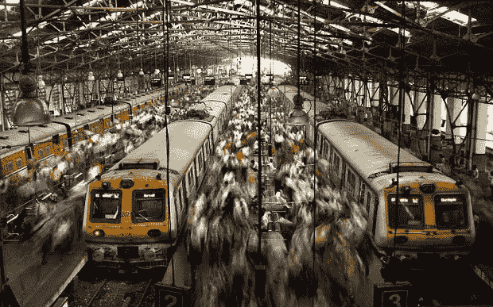

# 我是如何拿到现实生活中的 MBA 学位的？

> 原文：<https://medium.datadriveninvestor.com/how-mumbai-trained-me-in-life-skills-3933154a9ffa?source=collection_archive---------10----------------------->

600 万！这是每天从一个地方到达另一个地方的孟买次城区的人数，也称为孟买本地人。因此，孟买本地铁路被称为世界上最密集的铁路也就不足为奇了。

以下是我的旅程:

在德国呆了几年后，我的工作把我带到了印度的孟买——一座不夜城。作为一名顾问，你永远不知道下一个任务会把你带到哪里。这一次带我去了离家 30 公里的孟买老城区。现在，30 公里在任何地方都不是什么大事，但在孟买，考虑到交通状况，这很可能意味着 2 小时的车程。合乎逻辑的做法是坐火车，就像当地人一样。因此，在一个晴朗的早晨，我第一次踏上了孟买当地人的土地，这真是一次学习的经历！

我将告诉你我在孟买当地的六个月的日常通勤中所学到的三个重要的生活经验。

 [## 面向 Noobs |数据驱动型投资者的数字身份

### 聪明人如何在增强现实中创造身份价值？我最近刚满 40 岁。作为一个生物…

www.datadriveninvestor.com](https://www.datadriveninvestor.com/2019/02/28/digital-identity-for-noobs/) 

**战略思维**

现在，当你成功登上孟买当地火车时，你知道你已经成功了。登上火车是一种策略，需要一些仔细的计划和战略思考。当你第一次踏上这个车站的时候，它看起来让人无法抗拒。火车站挤满了成千上万的人——上班族、小贩、商人、卖菜的人等。别忘了酷热的天气。男的，女的，老的，年轻的——这个国家的普遍法则是——推，或者被推！

诀窍是，从缩小变量开始。一旦你弄清楚了站台和火车接近你的方向，分析一下你的同路人，他们正盯着火车的同一扇门。接下来，将你自己放置在远离车门的 45 度角，这样当火车到达时，你可以毫不费力地被推向车门。这就对了，战略思维！(我现在说起来很轻松，但我第一次上火车确实花了至少三次努力)。

**谈判**

登上火车感觉像是一个巨大的成就，但记住车厢里的人几乎和站台上的人一样多。就像生活中任何合乎逻辑的进展一样，旅程的下一步是找到一个站立或坐下的地方(如果你知道如何谈判的话)。所以，一旦你上了火车，你就必须环顾四周，调查你的观众，找到一个最佳的位置坐下。

接下来，你开始与座位持有者进行非语言的谈判。这可能包括一些手势，一些眼球运动和点头。然而，要知道可能会有很多谈判者同时这样做——记住永远不要失去眼神交流，有坚定的决心，你就会得到那个座位——这就是谈判！

**在任何情况下都找到最好的**

40 度的高温和拥挤的火车会对感官造成极大的冲击。你可以抄袭并继续下去，或者如果你知道如何充分利用这种情况，它可以是一个令人愉快的。

在旅途中，你真的不需要智能手机来娱乐自己。有成千上万的事情会让你忙个不停。你可以听刚刚登上火车的音乐家的音乐，或者从女卖家那里购买小饰品。你也可以从看到许多人*从各个可能的方向阅读同一份报纸中找到乐趣。或者在看一群老朋友在尴尬的环境中打牌时找到乐趣。*

最后，有人正确地说，除非你去孟买当地旅游，否则你没有真正体验过孟买。回想起来，我很高兴我尝试过吗？是的，当然——这是一生的经历，教会了我在任何情况下都可以应用的东西。它给了我一个现实生活中的 MBA。

感谢您的阅读。