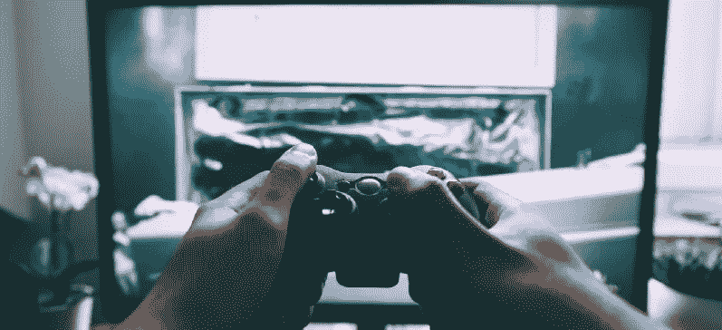
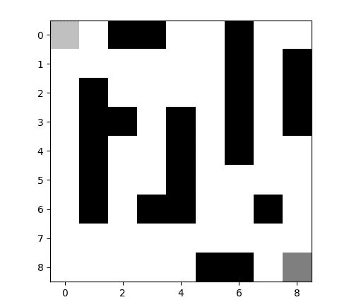
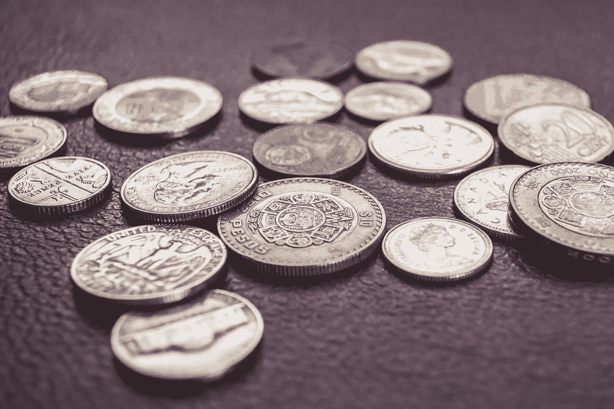
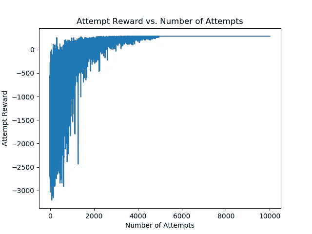
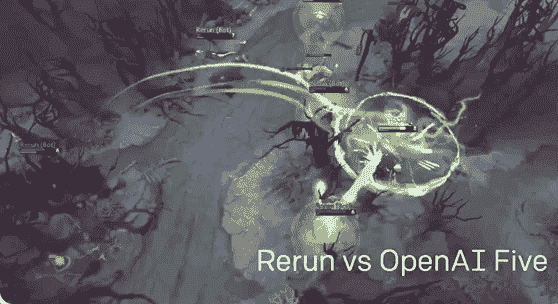

# 我的电脑如何自学穿越迷宫

> 原文：<https://medium.datadriveninvestor.com/how-my-computer-taught-itself-to-navigate-through-a-maze-12123f47e1f1?source=collection_archive---------5----------------------->

几乎每个人都喜欢玩游戏，就我个人而言，我喜欢电子游戏。哪种游戏并不重要，但我会选择任何可靠的策略游戏。我选择的平台是个人电脑，几周前我对自己说，*“我的个人电脑总是让我玩游戏，但是如果我让它为我玩游戏呢？”*

这启发我开始研究**强化学习**，它可以用来教会计算机如何自己做事情，而无需任何明确的指令。为了涵盖强化学习或 RL 的概念，它是一种机器学习，通过**在一系列步骤**中最大化回报来工作；“好”的行为导致奖励，“坏”的行为导致惩罚。

对于 RL 的概述，有一个代理(播放器)，它在一个环境中采取行动。然后，代理接收其新位置和该动作的报酬。**随着时间的推移，系统会变得更好，直到它优化到最高的回报。**

如果你想知道更多关于 RL 的一般知识，我写了一篇关于它的文章******，它应该涵盖了基础知识，并提供了一些关于该领域的更多见解。******

## ********营造环境********

************

******It’s just a maze, it can’t possible be that hard, right?******

******让强化学习代理通过系统的第一步是……创造系统(环境)。为了这个项目的目的，我选择了各种各样的**迷宫** **，以保持相对简单。我的代理应该不会花太长时间，而且应该能很快学会。********

****我去了一个九乘九的格子，有些地方是陷阱。我不想让代理无法进入“坑”，所以我不鼓励他们移动。****

**** [## 挑战你对人工智能和社会看法的 4 本书|数据驱动的投资者

### 深度学习、像人类一样思考的机器人、人工智能、神经网络——这些技术引发了…

www.datadriveninvestor.com](https://www.datadriveninvestor.com/2019/02/28/4-books-on-ai/) 

下面是它的样子:

The agent is in the top left, with the goal location at the bottom right. The pitfalls are in black.

这里要考虑的另一个因素是，代理有多条路径可以到达最终目标，唯一的区别是到达最终目标所需的时间。我这样做是为了试验*代理是否能找出可能的最快路径*，我可以根据它获得的累积奖励来检查。

## **奖励系统**

Points or money, there needs to be some kind of incentive for doing work, or else it won’t get done.

老实说，没有报酬，人们是不会工作的，计算机也一样。我决定**罚代理人 1 点**在空白区域移动，**罚掉 25 点**掉进其中一个坑，我**给它 300 点**到达终点目标。我曾想过在离最终目的地更近的地方给分，但后来决定不这么做。

至于我为什么选择每个数字，在很大程度上，这是随机的。我唯一主要考虑的是确保掉进坑里的惩罚足够大，让**代理避免尝试使用它作为潜在的捷径。**

## **Q-学习算法**

环境…检查！奖励系统…检查！现在剩下的就是一种方法，将所有的事情整合在一起，让代理人真正能够改进和学习如何在迷宫中导航。一种方法是使用一种 Q 学习算法。

> ****

1.  我们首先创建一个 Q 表，其中**存储了状态(位置)和动作(上、左、右或下)**的每种可能组合的值。每个条目的值从 0 开始。
2.  在此之后，选择一个ε，这是一个确定代理应该有多随机的度量。**ε值越高，它采取随机行动而不是使用 Q 表的概率就越高。**随着时间的推移，我们将减少该值，以便代理更加依赖表格而不是随机操作。
3.  我们可以设置一个学习率，这是一个系数，它决定了在特定的状态和动作对下，Q 表会根据奖励改变多少。
4.  我们可以设定一个折现率，它是一个系数**控制未来和过去的行动对桌面**的影响。
5.  基于状态和动作对的当前奖励、预期未来奖励和当前 Q 表值或 Q 值，用各种值更新该 **Q 表。**
6.  然后，该过程重复进行指定次数的迭代。

Just a casual simulation of an agent learning how to walk and jump in a 3D environment, completely on its own.

这就对了，在代理遵循这个过程几千集之后，它可以学习如何在迷宫中导航，玩复杂的视频游戏，**甚至走路，就像谷歌 DeepMind** 的模拟一样。虽然我的例子不一定像谷歌那样是复杂的 3D 模拟，但我的代理最终学会了如何在迷宫中导航，而且做得相当好。

## 真的有多好？—让我们从看这个图表开始。

Graph which shows the reward obtained from each attempt vs. how many attempts the agent had

我给我的代理人 **300 步直到自动失败**，我让它**尝试迷宫一万次**。这看起来似乎很多，但我的电脑设法在大约 30 秒内完成了它，这接近于我认为普通人找到最快路径所需的时间。

代理显示出几乎不断的改进，尽管它开始时几乎有一半的移动都掉进了坑里。通过大约**尝试****5500 次，这是完美的**，每次都能找到*最快的*可能解决方案**。我甚至尝试改变环境，放置更多的陷阱，有时改变它们的位置，但通过尝试 6000 次，几乎总是得到一个**完美的解决方案。****

现在我明白了，人类最多只需要尝试 3 次就能找到最容易的路径，但是计算机没有上下文或先验知识的优势。事实上，我的电脑能够自学如何在迷宫中导航是疯狂的，更疯狂的是，我的项目仅仅触及了强化学习的表面。如今它正被用来玩[星际争霸 2](https://deepmind.com/blog/article/AlphaStar-Grandmaster-level-in-StarCraft-II-using-multi-agent-reinforcement-learning)、 [Dota 2](https://www.theverge.com/2019/4/13/18309459/openai-five-dota-2-finals-ai-bot-competition-og-e-sports-the-international-champion) 以及成吨的其他游戏，它甚至可以扩展到其他领域。

Reinforcement Learning being used to absolutely crush people in Dota 2

很难预测强化学习会把我们带到哪里，但可以肯定地说，我们绝对应该对目的地保持警惕。谁知道呢，也许我们的电脑也会在现实世界中击败我们**** 

**谢谢你看我的文章！如果你有任何反馈，建议，评论，或更正，我很乐意听到他们。请随时通过下面的任何社交媒体与我联系，我也提供了项目代码，以防你想更好地了解事情是如何工作的。**

****项目 GitHub:** [迷宫 RL](https://github.com/vedaant-varshney/maze-rl) **邮箱:**vedaant.varshney@gmail.com **LinkedIn:**[veda ant Varshney](http://www.linkedin.com/in/vedaant-varshney)**