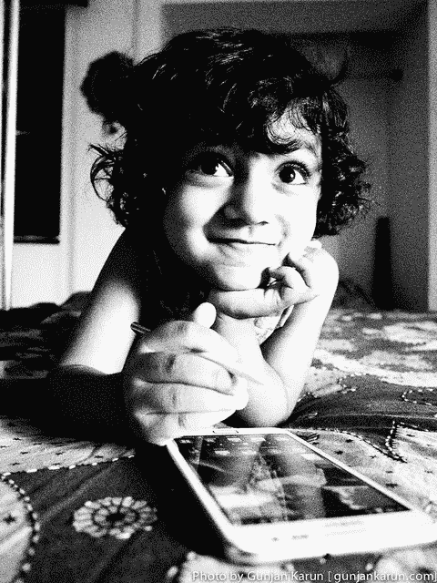

# 我的智能手机如何改变我的大脑——五年过去了

> 原文：<https://medium.datadriveninvestor.com/how-my-smartphone-changed-my-brain-five-years-on-768ab49ccd15?source=collection_archive---------11----------------------->

五年前，我第一次买了一部智能手机。光滑，黑色，在白色的聚苯乙烯巢里看起来像处女。价格昂贵。在我人生的那个阶段，这是我买过的最昂贵的东西。

Image: Gunjan Karun, [**NoDerivs 2.0**](https://creativecommons.org/licenses/by-nd/2.0/legalcode)

不像几乎所有的同龄人，我对把互联网放在口袋里的想法感到退缩，而不是蜂拥而至。我记得当我的同事无法通过电子邮件联系我时，他们哭着说“拿一部该死的智能手机来”，我记得我的兄弟拒绝在他的谷歌地图上给我指路，因为我没有。当我意识到我的勒德倾向没有任何原创性或趣味性，实际上它们是我周围人的负担时，我屈服了，买了一个。

我甚至写了一篇关于我用它的第一个早晨的博文: [**如何控制不被你的智能手机控制**](https://redchair21.wordpress.com/2013/10/21/smartphones-not-so-smart/) **。太天真了，我都要哭了。我不是在开玩笑。我不像有些人那样对电话上瘾，但即使是我也无法遵循我当时随口说出的一点点建议。为什么会让我想哭？因为我觉得我的大脑已经不一样了。五年后，换了四部智能手机，我想我知道该怪什么了。**

**下不了 Whatsapp**

2013 年，我建议“卸载 Whatsapp ”,因为我周日早上花了三个小时在这上面。“我写下了我感觉到的实时回复信息的义务，以及返回和回到事情上的冲动。五年过去了，我每天都会花三个小时在“这件事”上。一些在 2013 年感觉如此错误、如此不健康的事情，现在感觉很正常。但事实并非如此。内心深处还是觉得不对。但感觉很正常。至于卸载 Whatsapp 失败？2013 年，我写道‘你不需要它。我错了。你确实需要它。如今，从我自己的家庭交流到与我的团队合作，一切都在 Whatsapp 上完成。我可以放弃这一切，去某个地方住在小屋里。但是我不想。我想在这个社会中找到一种健康的互动方式。

**我沉迷于发现事物**

五年过去了，我的大脑现在想找出事情的真相。一直都是。把互联网放在口袋里已经造成了这种上瘾，这里有一个昨天的例子来说明它的样子:*一座四层楼的建筑有多少米？有人更新 Instagram 了吗？智利科恰莫今天的天气怎么样？有人更新 Instagram 了吗？北瓦尔沙姆在哪里(我一直想知道！)有人给我发消息吗？谢丽尔·斯特兰德的声音听起来像什么？有人更新 Instagram 了吗？快餐有什么好处吗？古拉汉姆·格林最受欢迎的好读物是什么？一英里航空里程真的是一英里航空里程吗？*这些问题在昨天的五分钟内闪过我的脑海，我唯一能做的就是不在我的智能手机上查找每一个问题。事实上，如果我没有做这个练习，我会把每一个都找出来。但这不正常！这些信息都不重要！也许除了北沃尔舍姆。此外，在这些不断的问题中思考是不正常的，沉迷于寻找答案的微小多巴胺冲击也是不对的。对了，没人更新 Instagram。

**我用我的手机作为对话道具**

五年前，我发誓要进行完整的对话，而不去用图片或视频来说明——因为否则，我可能会忘记如何描述事情。今天，我已经失去了描述事物的能力。当被要求描述一家我去过的酒店时，我只是想得到一张照片并展示给你，如果我谈论的是我读过的一篇文章，我会把电话和文章一起给你，而不是总结文章中的内容。我真的忘记了吗？是也不是。它确实影响我看待事物的方式。在过去，我可能会在这家酒店走来走去，把细节和观察结果储存起来与人分享。*我不再有这些想法了。我不会以同样的方式互动和观察，也不会储存。*相反，我拍照。如果我对我读过的一篇文章感到兴奋，我会转发它，已经忘记了它是关于什么的。如果我以后回忆起来，我会说，“哦，我读到了关于英国退出欧盟的伟大的事情……”然后我说它为什么伟大或它在说什么的部分就消失了，所以我会说“等等，让我给你看看……”

**我用手机作为社交道具**

我在 2013 年写过“电话和朋友不要混在一起。”我重申这个建议。没有什么比在一群人中间生产一部手机更能让你感到生命的一点点逝去了。它玻璃般的黑色屏幕象征性地吸走了房间里所有的联系和焦点。五年过去了，当我和另一个人在一起时，我仍然会尽量避免使用手机——但实际上，我在这方面有多成功呢？在同事的陪伴下，拿出手机“检查”东西是完全可以接受的。开会时，每个人都坐在自己的手机上，我也拿出手机，漫不经心地浏览邮件，按下刷新键。和朋友在一起的时候，别人这么做我就把手机拿出来。如果我发现自己独处了一会儿，我也会把它拿出来。然而，让我们说，我真的很自律，我从来没有把手机拿出来。其他人呢？我控制不了他们。我爸爸根本无法集中注意力听我说话，因为他一直在看手机。我的朋友现在是一位母亲，她注意到她担心她的儿子会一直看到她拿着手机，并认为她比他更关心手机。这是一个明智的观察，也是我们都在努力解决的问题。但是即使你约束自己不去做，你也不能阻止其他人，你也不能阻止他们给你的感觉。

**一种娱乐形式已经不够了**

2013 年，我写过手机和电视不要混用。我很惊讶我错过了一整集《国土安全》,因为我一半在看它，一半在看我的手机。这在 2013 年对我来说很不愉快，但现在对我来说很正常。我也是边听播客边玩手机。我不是唯一一个。我读到过伦敦西区的演员脱离角色，向一名观众吼叫“把电话拿开”。人们现在在剧院里使用手机。只专注于一种娱乐形式似乎需要令人不安的注意力水平。它也不止于此。当我吹干头发的时候，我的手机就在我面前，当我洗澡的时候，它就在我手中。现在，作为一个孩子，我总是习惯在任何地方看书。然而，我没有在手机上做任何特别的事情，我只是在刷新订阅，寻找新的。我究竟是怎么来到这样一个世界的，在这个世界上，看电视的坏习惯实际上被认为是我应该关注的事情，因为它的替代品甚至更糟糕？

**那现在怎么办？**

那我们该怎么办？我的回应是，我真的不知道。我下定决心要严格控制我的手机，但是习惯已经随着时间悄悄潜入，改变了我的思维方式。我仍然意识到离开手机的重要性，我已经安装了一个应用程序来限制我的屏幕时间。到目前为止，一切顺利。然而，即使我对自己的手机完全自律，我也无法控制别人如何使用他们的手机，当有人更喜欢用他们的手机而不是和我说话时，有时会让我感到多么孤立。

我担心青少年感到悲伤——不是因为他们感到压力，要满足社交媒体创造的不切实际的期望——而是因为在社交媒体之外的世界里，他们的朋友和父母都在打电话。我经常看到他们，在公共汽车上，成群结队，眼睛向下，手里拿着电话。他们会通过把手机递给另一个人或者发表评论来进行互动。有一会儿，每个人都会抬起头，连接，然后不久，他们中的一个会回到电话旁，其他人也会跟着。对我们所有人来说，拒绝是一种巨大的恐惧，如果我担心我的朋友会忽视我，我十几岁的自己就不会试图开始交谈，我怀疑他们每个人都是这样的感觉。不同的是，我能记起这件事发生之前的一个世界，并且我对为什么我会有这种感觉有一些意识。他们可能无法确定他们不安的来源。

然而，还是有一线希望。我的姐夫比我小十岁，他提到他的朋友们正在发展一种新的使用电话的礼仪。他称之为“三人出局”意思是，如果小组中有三个人拿出了手机，那么你也拿出手机也是可以接受的。如果少于三个，拿出手机是不能接受的。如果有人试图拿出手机，而拿出手机的人数少于三人，这种礼仪被称为“三下”。

这让我感到安慰。越来越多的研究表明手机对我们的大脑有什么影响。然而，上个世纪有越来越多的研究表明吸烟或酒后驾车会造成伤害。然而，医学研究只能到此为止。人类是非理性的动物，只有当我们作为一个社会让习惯变得不被社会接受时，习惯才会真正改变。研究只是第一步。在我们最年轻的人群中，越来越多的，尽管规模不大，关于电话使用的礼仪，将比世界上所有的发现更有助于限制电话的使用。所以五年后，我可能会写一篇关于手机在我生活中的角色的不同的文章。我确实希望如此。