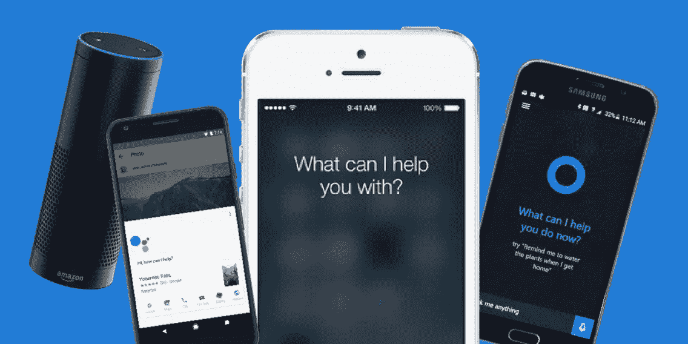

# 自然语言处理如何帮助我编写新助手的代码

> 原文：<https://medium.datadriveninvestor.com/how-natural-language-processing-helped-me-code-my-new-sidekick-ae4c14b39452?source=collection_archive---------2----------------------->

## 如何使用 Python 创建虚拟助手

承认吧…每个人都有。你很懒。你的闹钟在早上响起，你打了个盹。你可以开车去上班，但是，你要找人开车送你。你可以在家做饭，但是你可以叫外卖。你可以让 Siri 给某人打电话，而不是拨打他们的号码。等等。是懒惰，还是**在利用 21 世纪**？

老实说，我很矛盾。一方面，我看到了有一个随时待命的虚拟助理的好处。在紧急情况下，您无需解锁手机就可以轻松通话。另一方面，你不需要记忆数字，这可能会导致你的思维变弱，你可能会变得如此依赖你的虚拟助理，如果没有它，你可能会对你的手机一无所知(布局，速度，类型等)。).

像每一个**好的特性一样，它有它的优点和缺点**，但是，尽管如此，我决定创建一个这样的东西来做同样的工作。



Different companies’ virtual assistants. From left to right: Amazon Alexa, Google Assistant, Apple’s Siri, and Samsung’s Bixby.

使用机器学习和自然语言处理(NLP)，你可以很容易地做出类似的东西。你想在开始编码之前得到正确的环境，因为当你运行你的程序时，它会在第一次尝试时工作。要简单地设置环境，您真正需要做的就是**从您的 web 浏览器或 pip 命令安装 Anaconda，Anaconda** 使它变得非常容易，因为所有的东西都已经安装在它上面了。

# 自然语言处理

## 什么是 NLP？

自然语言处理(NLP)是人工智能**的一种形式**，它专注于**分析人类语言以获得洞察力、制作广告、帮助你发短信**等等。

NLP 是一项新兴技术，它驱动了许多人未曾接触过的人工智能形式。NLP 有许多不同的应用，可以让这个星球上的几乎每一个人受益。这就是为什么我使用 NLP 的基本形式来构建这个令人惊叹的虚拟助手。

每天，人类说数百万个单词，每个人都能够很容易地理解我们在说什么。从根本上来说，这是一个简单的单词接力，但单词跑得更远，因为我们从任何人说的任何话中得到了不同的上下文。他们可以通过肢体语言或提及某事的频率来暗示某事。虽然自然语言处理并不关注声音的变化，但它确实借鉴了语境模式。

## NLP 如何工作

NLP 最难的**部分**是**理解**或**给计算机接收到的自然语言**提供 **含义。**

首先，**计算机必须接受自然语言(人类说英语)并将其转换成人工语言。**这就是语音识别或语音转文本的功能。这叫做**自然语言理解(NLU)。**一旦信息以文本形式出现，**就可以试着**理解文本的意思**。**

## **自然语言理解(NLU)**

**今天大多数语音识别系统都是基于**隐马尔可夫模型(HMMs)** 。这些是**统计模型，通过使用**数学计算出**你说了什么，将你的讲话转化为文本**。**

****HMMs 通过听你说话来做到这一点，**将其分解为**个小单元(通常为 10-20 毫秒)**，然后将其与我们从进口库中预先录制的语音进行比较。然后，它会查看一系列的**音素**(有特色的词类，如 *pat* 中的 *p* )和**统计确定你正在说的最可能的单词**和句子。它**以** **文本**的**形式输出**该**信息**。**

****NLU 的下一个也是最难的**步骤**是实际理解部分**。同样，不同的 NLP 系统使用不同的技术。然而，过程大体上是相似的。首先，**电脑必须理解**每个单词是什么。它试图**理解**是一个**名词**还是一个**动词**，无论是过去时还是现在时以及其他语法时态。这被称为**词性标注(POS)。****

## **自然语言生成(NLG)**

****NLG** 比**更简单**到**完成**。它**将计算机的人工语言翻译成文本**。它还可以翻译文本到语音，这就是这个虚拟助手所做的。**

**首先，NLP 系统确定将什么信息翻译成文本。如果你问你的电脑一个关于天气的**问题**，它**很可能会在网上搜索找到你的答案**。从那时起，它决定温度、风和湿度是应该大声读给你听的部分。**

**然后，它**以**的方式组织**它会说** **它**。这类似于 NLU，除了，NLU 理解说什么，NLG 产生它。使用英语词典和一套语法规则， **NLG 系统可以组成完整的句子。****

**最后，如果你想大声朗读文本，文本到语音转换会接管。文本到语音引擎(在这种情况下，它是谷歌的文本到语音模块)使用**韵律** **模型**分析文本，该模型确定**停顿、持续时间和音高**。然后，使用语音数据库(来自配音演员的录音)，引擎**将所有记录的音素放在一起，形成一种可理解的语音形式。****

# **导入库**

**每个 python 程序都需要导入库，以便利用计算机识别的信息。例如，当我写这段代码时，我需要一个库，它能让我访问我的计算机麦克风，并能将消息传递给我。那是我使用谷歌文本到语音库的时候。要导入库，您只需键入`from gtts import gTTS`。**

**接下来，计算机需要能够识别你的语音。这就是自然语言处理在 T21 的用武之地。这是一种不太复杂的自然语言处理形式。基本上，NLP 是人工智能的一种形式，让计算机接受和存储信息。然后，分析这些信息并传达它被编程要做的事情。要利用这个库，只需要输入`import speech_recognition as sr`。**

**接下来的五个库是支持库，它们帮助创建环境并帮助前两个库履行它们的职责。操作系统库允许您与电脑上的任何操作系统(可能是 Windows、Mac 或 Linux)进行交互。要使用此模块类型`import os`。RE 库只是利用了英语。本质上，它允许你用英语和它说话，并允许它理解你说的话。要导入它，只需输入`import re`。webbrowser 库让您可以访问互联网。你可以设置你想要访问的网络浏览器，无论是谷歌浏览器、Safari 浏览器、Firefox 浏览器、Internet Explorer 浏览器还是微软 Edge 浏览器。使用`import webbrowser`将其编码。smtplib 库定义了一个 SMTP 客户端会话对象，可用于向任何 Internet 机器发送邮件。请求库被放在那里，以确保所有请求都被计算机接收，并且计算机能够向用户输出相关信息。要访问这个库，请键入`import requests`。**

# **代码中的不同功能**

**为了编写一个成功的代码，你需要能够定义你自己的函数，以使你正在构建的任何东西都能工作。对于这个虚拟助手，**我写了(并定义了)三个函数，我在整个代码中使用了这些函数，以便用更少的代码行使代码更容易理解。****

```
def talkToMe(audio):
    "speaks audio passed as argument"print(audio)
    for line in audio.splitlines():
        os.system("say " + audio)
```

**这个函数，本质上，**让我们与计算机**对话。通过自然语言处理，它把我们刚刚说的话输入到屏幕上。这是文本到语音通信的一个例子。**

```
def myCommand():
    "listens for commands"r = sr.Recognizer()with sr.Microphone() as source:
        print('Ready...')
        r.pause_threshold = 1
        r.adjust_for_ambient_noise(source, duration=1)
        audio = r.listen(source)try:
        command = r.recognize_google(audio).lower()
        print('You said: ' + command + '\n')#loop back to continue to listen for commands if unrecognizable speech is received

    except sr.UnknownValueError:
        print('Your last command couldn\'t be heard')
        command = myCommand();return command
```

**这个功能让我们**可以访问电脑中的麦克风**，并使用 NLP、NLU 和 NLG 来识别我们的语音。然后，如果它**不理解我们的讲话**，它能够告诉我们它不理解我们说的话，并给我们**纠正自己的机会。****

```
def assistant(command):
    "if statements for executing commands"
```

**尽管这个函数很短，但它是我们能够命令我们的计算机做任何事情的全部原因。例如，如果我们想让电脑**打开一个网站，我们输入一个“else if”命令(** `elif` **)** ，就可以口头告诉电脑打开某个网站。**

```
elif 'open personal website' in command:
        reg_ex = re.search('open website (.+)', command)
        if reg_ex:
            domain = reg_ex.group(1)
            url = '[https://armaanmerchant.com/'](https://armaanmerchant.com/') + domain
            webbrowser.open(url)
            print('Done!')
        else:
            pass
```

**如果我想让我的虚拟助理打开我的个人网站，我只需要输入程序。我用网络浏览器库访问互联网，并命令我的电脑打开 http://armaanmerchant.com/(我的个人网站)。然后它简单地打印“完成！”就在它打开之前！**

```
while True:
    assistant(myCommand())
```

**最后，这个**命令循环整个代码**,所以我们可以继续使用虚拟助手，而不需要终止会话并重新启动它。**

**本质上，NLP 是计算机的翻译器。就像在国外你依靠谷歌翻译来帮助你说另一种语言一样，计算机依靠 NLP 作为它们的翻译器，因为人类语言对它们来说是陌生的。**

**NLP、NLU、NLG、ML、AI 这些概念单独使用真的很神奇，当它们一起工作的时候，**可以完成这么多！****

# **关键要点**

*   **使用机器学习和自然语言处理(NLP)，你可以很容易地制作一个简单的虚拟助理。**
*   **自然语言处理(NLP)是一种人工智能形式，专注于分析语言并提供建议输出。**
*   **计算机必须将自然语言(人类说英语)转换成人工语言。这被称为自然语言理解(NLU)。**
*   **今天，大多数语音识别系统都是基于隐马尔可夫模型(hmm)的。hmm 通过听你说话，将其分解成小单元(通常 10-20 毫秒)，然后将其与我们从导入的库中预先录制的语音进行比较。**
*   **将计算机的人工语言翻译成文本更容易。它只是将人工语言输出到文本中，然后读出文本。这被称为自然语言生成(NLG)。**
*   **每种计算机功能都做一些其他功能做不到的事情。当各个功能协同工作时，可以完成很多事情！**

****感谢你阅读我的文章，请继续关注并给我一些掌声！！谢谢！****

**查看我的其他文章[这里](https://medium.com/me/stories/public)！还有，可以在 LinkedIn 上随意加我，[arman Merchant](https://www.linkedin.com/in/armaan-merchant-b3bba89a/)。**