# 神经网络如何处理您的输入(经过训练的神经网络)

> 原文：<https://medium.datadriveninvestor.com/how-neural-network-process-your-input-trained-neural-network-fd48f1bf310?source=collection_archive---------8----------------------->

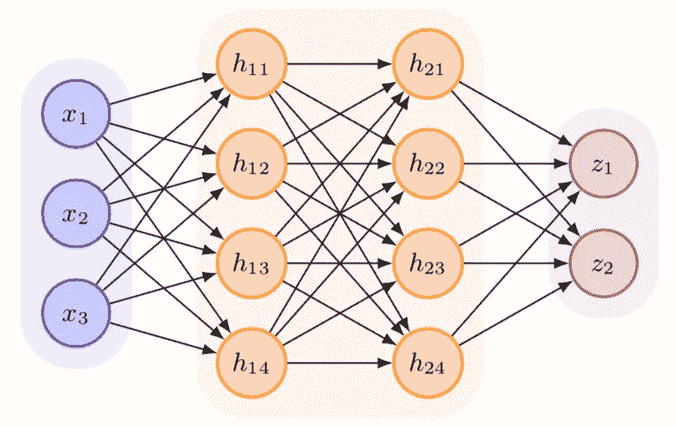

Source: [https://seas.ucla.edu/~kao/nndl/](https://seas.ucla.edu/~kao/nndl/)

你好，这是我在这个平台上的第一个故事。我将从这个神奇但不那么神奇的神经网络开始。当我谈到神经网络时，我的一些朋友和同事总是皱起眉头。他们认为它的处理非常复杂(我不知道，也许这个污名是从它听起来很复杂的名字“神经网络”发展而来的)，最后不想学了。但事实是**这不是真的**。在这篇文章中，我想摆脱这种耻辱。除了神经网络使用的学习算法(有人说这也很简单)，神经网络中的处理非常简单。在这个故事中，我们将讨论神经网络如何处理你的输入

先从它的图(这个故事的头图)来学习它的结构。神经网络中有 4 个组件，即层(一行中神经元组)、神经元(蓝色、橙色和紫色圆圈)、权重(箭头)和偏差(图中未示出)。神经元分为 3 种类型，即**输入神经元、隐藏神经元和输出神经元**。层也分为 3 种类型，即 i **输入层、隐藏层和输出层**。最左边的一排神经元是输入层，最右边的是输出层。输入层和输出层之间的所有神经元行都是隐藏层的一部分(在图中有 2 个隐藏层，从左到右称为隐藏层 1 和隐藏层 2)。除了输入神经元，所有这些神经元都有一个计算过程。

输入层仅仅是一组预测器。预测值从输入层转移到下一层(隐藏层)由该层处理。通过**线性回归运算**完成传递值。这就是为什么我们有一个重量和偏见。为了便于理解，这里有一张输入层和隐藏层 1 的交互图。

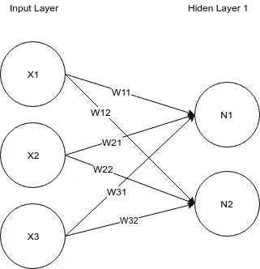

这组预测值在图像中箭头(权重)的方向上被传递给神经元。转移到 N1 的价值是

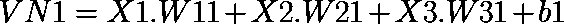

对 N2 来说

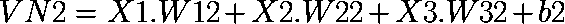

27/5000

x 是一组预测值，W 是一组权重，b 是偏差。VN 代表神经元的*值，传递给下一层神经元的值。在被神经元接收后，这些值由这些神经元使用一个称为**激活函数**的方程进行处理。一些常用的激活功能有*

1.  **乙状结肠**

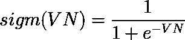

2.**谭**

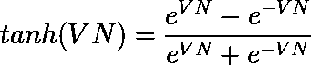

所有这些运算都可以改写成矩阵运算的形式，如下所示。

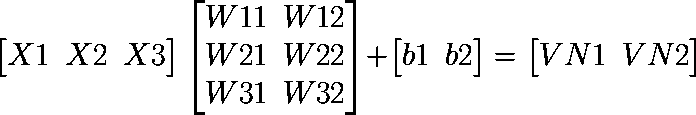

假设我们使用 sigmoid 激活函数，那么

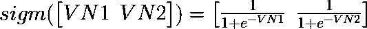

这就是输入层和隐藏层的交互方式。现在，移动到隐藏层(隐藏层 1)和输出层的相互作用。假设我们试图解决回归问题，那么输出层中的神经元只有 1 个。

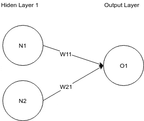

Interaction between hidden layer 1 and output layer

在输出层中，没有像在隐藏层 1 中那样发生处理。隐含层 1 通过线性回归运算将其值传递给输出层，这就是我们神经网络的最终输出。

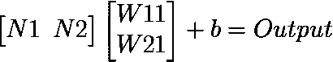

如果我们要解决分类问题，例如:预测下雨事件(下雨或不下雨)，输出层将有 2 个神经元。

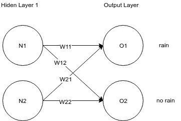

Interaction between hidden layer 1 and output layer for prediction of rain events case.

在这种情况下，如果 O1 > O2，那么神经网络的预测是 rain，相反如果 O1 < O2 then the prediction is not rain. To ge

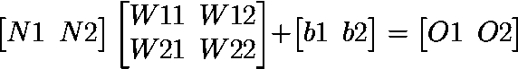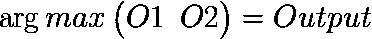

To get the **概率值**，对于分类函数，所使用的激活函数是 **softmax 函数**

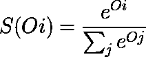

这就是神经网络处理你输入的方式。神经网络如何获得最佳权重以获得更准确的结果，这由学习算法负责，我们在这个故事中不讨论。

**我的另一个神经网络系列:**

1.  **神经网络如何处理你的输入(经过训练的神经网络)**
2.  [神经网络如何“学习”](https://medium.com/@genomexyz/how-neural-network-learn-3b56c175b5ca)
3.  [知道你的输入在神经网络中有多重要的简单方法](https://medium.com/datadriveninvestor/a-simple-way-to-know-how-important-your-input-is-in-neural-network-86cbae0d3689)