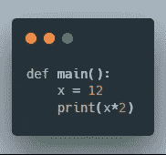
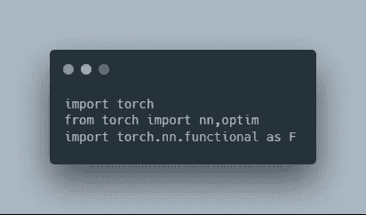
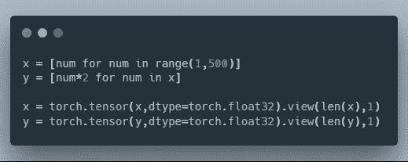
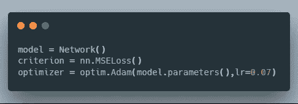
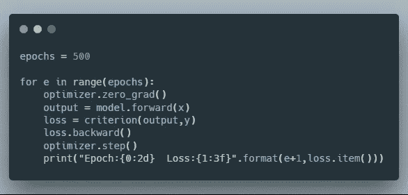
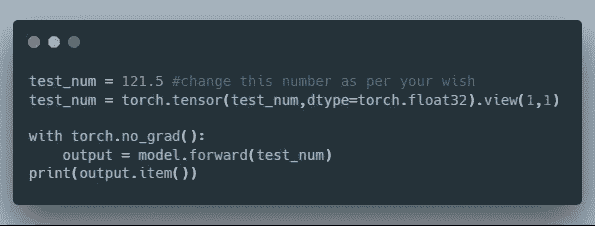

# 神经网络如何对比经典算法

> 原文：<https://medium.datadriveninvestor.com/how-neural-networks-contrast-classical-algorithms-9663381e5866?source=collection_archive---------14----------------------->

[](http://www.track.datadriveninvestor.com/1B9E)

神经网络或人工神经网络是在某种程度上模仿人脑的计算算法，旨在识别数据中的模式，并将其学习应用于一些未知数据。想象你是一个孩子，你第一次看到一只狗，有人告诉你这是一只狗，你的大脑学习它，下次你看到可爱的四条腿的小动物，你知道它是一只狗。类似地，这些算法不受一套规则的指导，不像经典算法那样只能服从已被编码到其中的固定逻辑。

为了举例说明这些网络是如何工作的，想想 Google 相册是如何根据相册中的人自动将你的照片组织到不同的相册中的。简单地说，谷歌开发的神经网络可以分析照片，识别照片中的人，或者换句话说，检测照片中的模式，并因此对它们进行分类。

这篇文章将有助于理解这些网络如何检测数据模式并从中学习，而不是遵循经典算法遵循的硬编码规则。为了理解这一点，让我们首先深入一个简单的问题，寻找一个数字的双精度，看看如何使用经典算法和神经网络来完成。

# 经典方法

*用 python 实现*



*输出:24*

# 神经网络方法

## 导入必要的库模块



## 准备我们的网络将用来学习的数据集:

*500 个数字及其对应的双精度数*



## 定义损失函数和梯度下降优化器



## 训练网络 500 个历元/次



该网络实现了接近 0 的损耗，这意味着它在计算结果时几乎 100%准确，即给定数字的两倍。

```
Epoch:499  Loss:0.007805
Epoch:500  Loss:0.007795
```

## 让我们看看它如何在看不见的数据上执行，例如 121.5



```
Output: 243.11219787597656
```

121.5 的两倍是 243，我们的网络计算得相当准确。是不是很神奇？？

显然，你可能会想“在神经网络中填充这么多代码来计算一个数字的双精度值有什么用，第一种方法不是更简单吗？”。考虑到这个例子的原始性，你是对的，但是想想神经网络计算结果的基本性质。它没有指示网络计算数字*2，而是从提供的数据中学习并自动完成。现在在现实世界的问题上追踪这个想法，给定一些细胞的图像，你想检测它是恶性的还是正常的。

编写一个简单的逻辑来将它们分类为单个图像是不太可能的，因为它包含需要考虑的数百万个特征，这里神经网络来救援，并且可以非常准确地检测细胞是正常的还是恶性的，因为它学习从数据(图像)中学习并理解它。因此，神经网络模仿人脑，并有能力解决自计算机出现以来不可能完成的许多任务。

如果你觉得这篇文章有趣或有帮助，考虑留下一个或多个掌声。