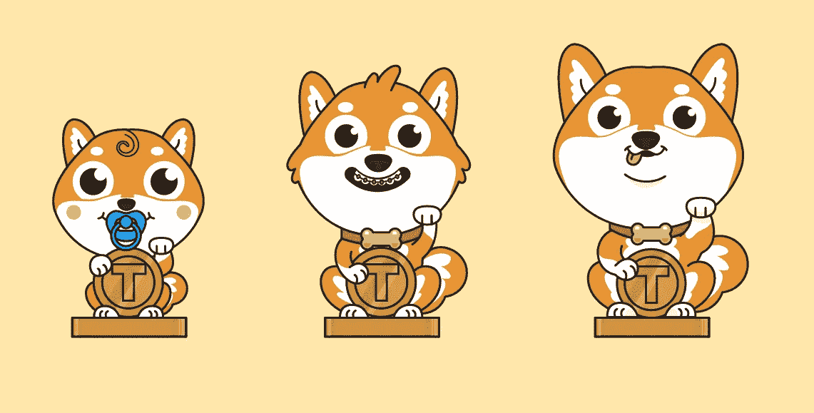

# NFT 如何激励慈善捐赠

> 原文：<https://medium.datadriveninvestor.com/how-nfts-can-incentivize-charitable-giving-b7db9c6007c6?source=collection_archive---------5----------------------->

Sneak peek of upcoming Spring donation collectibles

每个非营利组织都想增加他们收到的捐款数额——而且理由充分。非营利组织正在帮助解决一些世界上最具挑战性和最紧迫的问题，从[拯救雨林](https://www.rainforesttrust.org/)到[为最需要的人提供教育资源](https://learningequality.org/)到[捍卫互联网自由](https://www.fightforthefuture.org/)，还有许多更重要的原因，我们没有时间在此一一列举。但是，他们如何说服人们拿出他们的血汗钱来支持这些事业呢？最近的行为科学研究已经产生了一些见解。

## **行为科学如何看待给予**

**品牌和身份**

在最近的一次非营利会议上，希望工程的 Jann Schultz 和捐助之声的 Kiki Koutmeridou 展示了他们的[发现](http://dc.nonprofitfederation.org/wp-content/uploads/sites/3/2014/09/Behavioral-Science-Turning-Insight-into-Action-reduced.pdf)捐助者会被与自己价值观相似的慈善机构所吸引并保持忠诚。他们将慈善机构比作品牌，并建议他们利用自己的品牌来强化捐赠者围绕捐赠建立的身份。他们还建议慈善机构调整他们的信息，以针对特定的捐赠者身份。

**社交存在和认可**

德克萨斯 A&M 大学经济系的教授们最近进行了一项研究，他们向邀请他们在脸书的朋友捐款的人提供 1 美元或 5 美元。他们发现，当人们认识到他们的朋友也捐款时，他们更愿意鼓励他们的朋友捐款。他们得出结论，人们可以在社会压力下向慈善机构捐款，只要他们这样做得到认可。

**杠杆互惠**

[互惠](https://en.wikipedia.org/wiki/Reciprocity_(social_psychology))指的是以更多的积极行动来回应一个积极行动的社会规范。例如，如果有人帮了你一个忙，你更倾向于在他生日时送他一份精美的礼物。世界银行[的行为科学家发现](http://blogs.worldbank.org/developmenttalk/what-motivates-charitable-giving)互惠可以促使人们捐赠更多，参考了一项分发糖果增加捐赠额的研究。在美国本土，互惠是像 NPR 这样的组织向他们的捐赠者分发手提袋和其他物品的原因。每次捐赠者看到手提袋，他们都会做出积极的反应，更有可能再次捐赠。

**给予和接受——NFTs**

不可替换令牌或 NFT 是一种特殊类型的数字令牌，它是唯一的且不可互换的(“不可替换”)。它们被用来创造具有可验证的数字稀缺性的可收集资产，例如在线游戏 [CryptoKitties](https://www.cryptokitties.co/) 中独特的虚拟猫。

NFTs 能帮助说服人们向慈善机构捐赠更多吗？比方说，人们收到不可替代的“影响力代币”，以表彰他们对慈善机构的捐赠。影响力标志将是慈善机构品牌**的延伸**，加强捐赠者身份**和慈善机构价值观**之间的联系。影响力标志也可以成为捐赠者社交媒体身份的一部分，增加捐赠者的**社交存在**和**认知度**。最后，影响力象征物将作为奖励给捐赠者的额外礼物，让捐赠者将捐赠行为视为一种积极的行为，并使他或她更有可能以未来的捐赠来回报。

**很明显，非捐赠基金可以利用行为科学来激励人们捐赠更多的钱**，这是一个很好的例子，说明区块链可以被用来做好事！

***在*** [**了解更多**](https://spring.wetrust.io/)