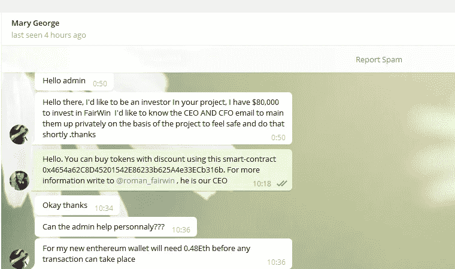
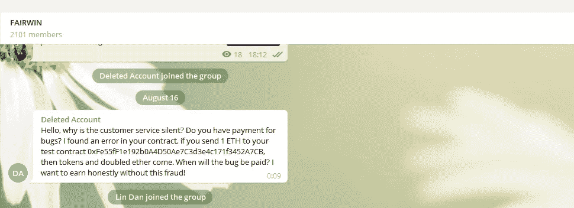

# 如何在代币销售中不落入骗子之手

> 原文：<https://medium.datadriveninvestor.com/how-not-to-fall-into-the-hands-of-scammers-during-a-token-sale-524f6d5a00f0?source=collection_archive---------4----------------------->

众所周知，大量骗局都与 ico 和加密货币有关。甚至那些对区块链漠不关心的人也知道这件事。但是仍然有人设法成为骗局的受害者。因此，我决定告诉大家过去几个月来, [FairWin](http://fairwin.io/) 团队所面临的诈骗案例。

7 月 7 日，我们开始了[代币销售的第一阶段](https://medium.com/p/only-5-days-left-until-the-end-of-the-first-stage-of-the-fwin-token-sale-6af3f5b9eab0)，8 月初我们公布了购买代币的智能合同，并在区块链推出了我们的[游戏平台的 alpha 版本。如果说以前骗子试图在其他人的 YouTube 频道上向我们出售广告，那么现在我们收到的原创广告要多得多。](https://medium.com/@alexstargame/the-fairwin-game-platform-alpha-has-been-launched-c1626ff001ab)

几天前，一个叫玛丽·乔治的人给我们的电报管理员写信，声称她准备在费尔温投资 80 000 美元(听起来太棒了！)，但是她的钱包上没有乙醚来执行交易。起初,“投资者”要求我们的管理员将 0,48 ETH 发送到她的帐户，以便她可以进行交易并投资于该项目，然后变得更加坚持要求多达 2 ETH。你可能已经猜到，我们与这样一个投资者的关系是短暂的。

另一个有趣的角色在我们的智能契约中“发现”了一个 bug，并希望获得相应的令牌。他在我们的电报聊天中写了这件事。当然，没有错误。正如我们在 Etherscan 上发现的那样，这不是此人第一次部署这种方案。

> 所以，请保持警惕，以防你收到这样的信息！

一般来说，一旦你开始代币销售，收到的信息内容就会发生巨大的变化。广告报价越来越少，来自顾问、密码爱好者的信息越来越多，更多的报价与投资者的吸引力有关，当然还有来自投资者的信息。

许多骗子开始谈话时会说，他们希望给这个项目带来一笔可观的资金。如果对话进展顺利，他们会要求单独会面或电话交谈。在谈话的过程中，你的谈话者顺利地改变了话题，并建议购买一些东西。

通常，这样的办公室看起来相当体面。他们中的许多人都有一页纸，上面模糊地描述着公司的活动。我不认为这种活动是彻头彻尾的骗局。更有可能这只是一种销售方式。然而，遇到这种情况已经够令人不愉快的了:你会浪费很多时间只是为了看这个人把一些东西强加给你。

> 要小心，不要落入骗子的手中。

# 关于该主题的更多文章:

*   [**如何推出一个 ICO 而不被骗子忽悠**](https://cryptocurrencyhub.io/how-to-launch-an-ico-and-not-to-be-fooled-by-swindlers-4336a287fb1a)
*   [**如何不花一毛钱推出一个 ICO**](https://medium.com/@alexstargame/how-to-launch-an-ico-without-spending-a-dime-36202ed7052c)
*   [**不良 ICO 广告**](https://medium.com/@alexstargame/bad-ico-advertising-9e426935cf3c)
*   [**你的 ICO 在社交媒体需要高活跃度吗？**](https://medium.com/@alexstargame/does-your-ico-need-high-activity-in-social-media-dc792e3b9a13)

# 关注我们:

推特:[https://twitter.com/FairwinGambling](https://twitter.com/FairwinGambling)脸书:[https://www.facebook.com/fairwin.gambling/](https://www.facebook.com/fairwin.gambling/)insta gram:[https://www.instagram.com/fairwin_team/](https://www.instagram.com/fairwin_team/)

# 与我们聊天:

不和:[https://discord.gg/Hbardp2](https://discord.gg/Hbardp2)Reddit:[https://www.reddit.com/user/fair-win](https://www.reddit.com/user/fair-win)电报:[https://t.me/fair_win](https://t.me/fair_win)