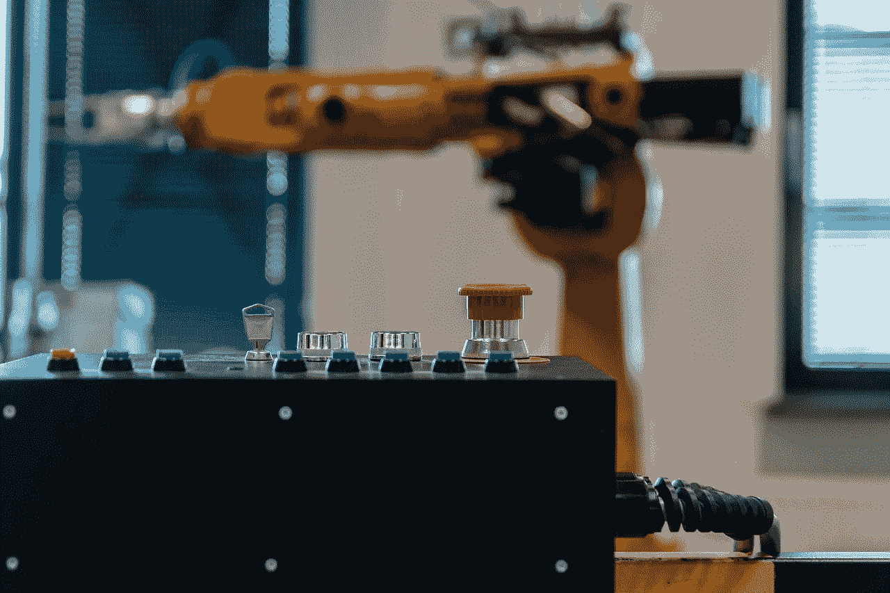
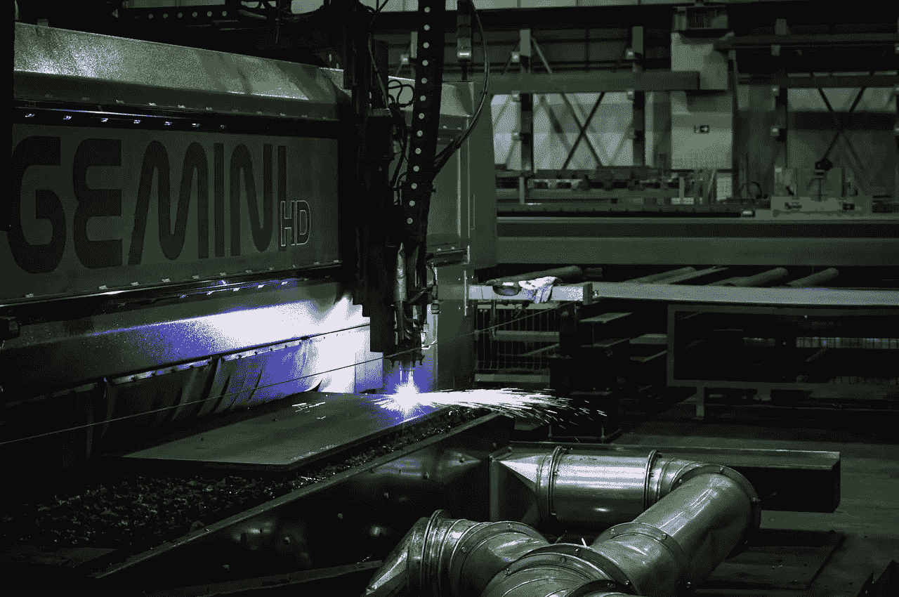

# 组织如何为智能自动化做准备

> 原文：<https://medium.datadriveninvestor.com/how-organizations-are-preparing-for-intelligent-automation-a7dc43b5e8b0?source=collection_archive---------7----------------------->

传统的劳动力正在发生巨大的转变，人工智能和自动化与此有很大关系。这种转变已经持续了几十年，但现在正以极快的速度向前推进。随着自动化和人工智能的发展，这些技术将对我们所知的工作产生重大影响。找出公司正在做什么来为改变做准备。

## **数据怎么说**

自动化和人工智能几乎触及了每个行业——从餐馆到制造业——所以雇主的任务是与这项技术合作，而不是反对它。根据世界经济论坛报告“2018 年就业的未来”，人工智能将取代 7500 万个工作岗位，但创造 1.33 亿个新工作岗位，净增加 5800 万个新工作岗位。虽然制造业和农业等行业已经使用自动化和人工智能有一段时间了，但未来十年还会有更多行业受到影响。

很明显，虽然一些工作会被人工智能或自动化淘汰，但其他工作会被创造出来。由人工智能驱动的技术仍然需要人类输入才能发挥作用，人工智能仍然远远落后于人脑的大多数功能。需要高度创造力、同理心和人际关系的工作可能永远不会被人工智能取代。例如，治疗师、社会工作者和教师可能永远都是人类的工作。此外，人们可能不希望某些工作由机器来完成，即使技术可以处理这些工作。最后，机器很难匹配人类的灵活性。例如，一些公司试图制造理发机器人，但效果不佳。

 [## 不管准备好了没有，革命就在我们面前|数据驱动的投资者

### “对于技术如何影响我们的生活和重塑经济，我们必须形成全面的全球共识……

www.datadriveninvestor.com](https://www.datadriveninvestor.com/2019/02/12/ready-or-not-the-revolution-is-upon-us/) 

我们不应该担心人工智能和自动化会消除工作岗位，而是应该问自己这些技术如何帮助工人，以及人和组织如何才能最好地为人类和机器协同工作的世界做好准备。

## **如何让员工为智能自动化做好准备**

自动化和人工智能有望提高人类劳动力的效率。根据来自德勤的[数据，在接受调查的 523 名高管中，超过 90%的人完全期待人工智能能够提高他们员工的能力。具体来说，他们预计在未来三年内，后台办公能力将增长 25%以上，运营能力将增长 17%。](https://www2.deloitte.com/us/en/insights/focus/technology-and-the-future-of-work/intelligent-automation-technologies-strategies.html)

尽管这些数据描绘了一幅商业领袖对人工智能信念的积极画面，但许多公司还没有开始确定如何在他们的组织中实施人工智能或自动化。德勤的报告显示，44%的组织尚未考虑人工智能将如何改变他们的劳动力和运营程序。此外，大约三分之二的组织还没有缩小哪些员工需要更新技能的范围

再培训和鼓励新技能的发展(“再技能”)是在工作中拥抱人工智能和自动化的关键方面。公司必须开始审核员工的角色，以了解人类目前如何与机器互动，以及新技术将如何直接影响未来的工作流程。为了充分获得人工智能和自动化的好处，评估流程和更新角色描述至关重要。然而，德勤报告称，38%的组织甚至还没有开始对角色已经改变的员工进行再培训。

除了评估角色和工作流程，公司还需要帮助员工将智能自动化视为帮助而不是障碍。利益相关者的支持对人工智能和自动化的成功采用极其重要。幸运的是，德勤的调查表明，近 75%的组织表示，他们的利益相关者(包括员工)支持他们将智能自动化集成到运营中的努力。对于剩余的百分比，向员工展示人工智能和自动化如何为他们工作至关重要。这也包括为那些工作变化最大的人制定再培训计划。

## **成功因素**

德勤的报告指出了成功将智能自动化大规模集成到员工队伍中的组织的六个特征。这些特征包括:

-智能自动化的企业级战略，可在收入、成本降低和劳动力能力方面产生更高的回报

-结合 RPA(机器人流程自动化)和 AI

-技术、基础设施和网络安全到位

-成熟、充分发展的过程定义、标准和程序

-清楚了解如何获取价值

-由降低成本的需求驱动的彻底简化

## **转变心态和工作理念**

鉴于智能自动化带来的可能性和机遇，德勤的报告还确定了组织必须重新定义工作概念的方式。为了充分实现这些好处，组织可能需要对工作的性质和目的进行重大的思维转变。根据德勤的说法，未来的工作应该由以下因素来定义:

-劳动力能够解决的问题及其生产性产出，而不是完成的任务。

-员工建立和维护的团队和关系，而不是他们管理的人。

-自动化工作和增加劳动力的技术，以提高客户的生产力和价值。

-将学习、职业发展和新经验融入日常工作。

这些想法中有许多代表了重大变化，但人工智能和自动化是如此具有根本性的颠覆性和有价值的技术，这种重新定义是有道理的。