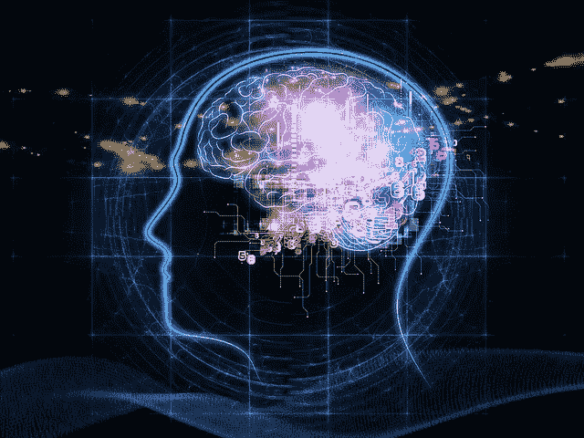
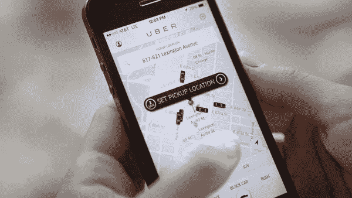

# 我们的潜意识如何影响我们的交易决策

> 原文：<https://medium.datadriveninvestor.com/how-our-subconscious-impacts-our-trading-decisions-7036d33c1619?source=collection_archive---------2----------------------->

> 有意识的头脑可以比作一个在阳光下嬉戏的喷泉，它从地下巨大的潜意识水池中喷涌而出。——西格蒙德·弗洛伊德

人脑重约 3.3 磅，仅占身体重量的 2%，却占据身体消耗能量的 20%，比任何其他器官消耗的能量都多。它也单方面对你如何感知、解释和应对这个世界负责。大脑可以进一步划分为两个区域，一个区域专注于由你的五官驱动的意识活动，这是你如何理解外部世界的方式，另一个区域产生你所有的潜意识思想，这基本上是“自动驾驶”的一切。

在 RAIN，我们雇佣了自己的内部定量研究人员、交易员和开发人员团队，我们痴迷于寻找以定量方式赚更多钱的方法(我们[喜欢让它下雨](https://rainfund.ai/#performance!))。作为股票市场交易者，我们知道在任何时候我们能应付的都是有限的。每天开市时，我们都会查看突发新闻，看看是什么在推动市场。当市场关闭时，我们需要平仓所有当天的头寸。我们的代码不能崩溃，如果崩溃了，我们需要在压力和胁迫下迅速做出反应。

哦，更别提我们还试图在整个过程中在[负和市场环境](https://www.ifa.com/articles/negative_negative-_game_investing/)中赚钱。

作为人类，我们倾向于花很多时间来思考我们的意识状态在做什么。毕竟，这似乎是实际可行的，因为我们的意识实际上是我们在任何时间点所意识到的东西的函数。我们甚至为了让自己进入“正确的精神状态”,通过做所有的小事，如服用维生素、去健身房、晚上有足够的睡眠，来准备我们的大脑。对于交易者来说，我们做所有这些事情是因为我们想在做投资和交易决定时保持良好的心态。

但是，首先是什么真正推动了这些决定呢？

# ***回车:万能的潜意识***

Our sub-conscience is responsible for more than 90% of brain activity

当我们深入探究我们是如何做出日常决定的，尤其是重要的决定时，显而易见的是，潜意识比表面上看起来更重要。哈佛大学和麻省理工学院的研究人员得出结论大脑不仅分为两个不同的区域——一个驱动意识思维，另一个驱动潜意识思维——而且大脑的潜意识部分负责我们做出的所有决定的 90%以上，这个数字[可能接近 95%](http://www.simplifyinginterfaces.com/2008/08/01/95-percent-of-brain-activity-is-beyond-our-conscious-awareness/) 。

重要的是要清楚地了解你的潜意识是什么，以便理解它对你的交易心理的潜在意义。

在畅销书[思考快与慢](https://www.amazon.com/Thinking-Fast-Slow-Daniel-Kahneman/dp/0374533555)中，丹尼尔·卡内曼根据情况的类型将大脑的决策过程分为“快速思考”和“慢速思考”场景。当情况没有给你带来任何惊喜时，你的大脑处于快速思考模式，并自动/半自动地做出决定。

快速思考的大脑是你的潜意识在工作，它也与直觉有关。当你开车时，你不会真的去想你要开到哪里，或者你要怎么开——你只是在开车。类似地，当你阅读财经报纸时，你并没有真的停下来思考你正在阅读的内容。你只是*在读*。

从表面上看，这似乎不错。悠闲地开着车看着报纸有什么不好？当然，什么也没有——这些活动本身显然非常好。但这并不能忽视这样一个事实，例如，早上经历路怒会导致更高水平的压力。昆士兰大学临床心理学家兼副教授 Stan Steindl 认为，这种压力水平的增加反过来又会导致我们更加冒险，更加冲动，因此更有可能出现误判和事故。

当你以此为生时，这听起来对做出更好的交易和投资决策没有太大帮助。也许你应该开始每天带着优步去上班？

# 底线

认知偏见是真实存在的，它以各种方式影响着我们的生活。旧学派的主流观点是，金融领域不存在认知偏差。其基本思想是，人类在默认情况下是完全理性的，所有信息都被定价，这导致了“完美环境”定价理论的流行，如[有效市场假说](https://en.wikipedia.org/wiki/Efficient-market_hypothesis) (EMH)和资本资产定价模型(CAPM)。但是现代行为金融专家对 EMH 和 CAPM 的有效性提出了质疑，包括像[沃伦·巴菲特](https://en.wikipedia.org/wiki/Warren_Buffett)这样的人，巴菲特成功地从经验和理论上质疑了 EMH。根据卡尼曼(前面提到的)，股票市场的不完美是由认知偏差造成的，如过度自信、过度反应和其他类型的偏差。由于我们在不同情况下无法正确评估风险，认知思维中的这些错误导致我们避免某些情况(如购买价值股)。

所以底线很简单:不要高估自己，按照这种思路，不要高估任何人*。就像你和我一样，所有的全球金融市场都充满了非理性的人，每个人都认为他或她可以完全控制自己的情绪、感觉、想法和行动，而实际上，没有人真正知道他或她在做什么。*