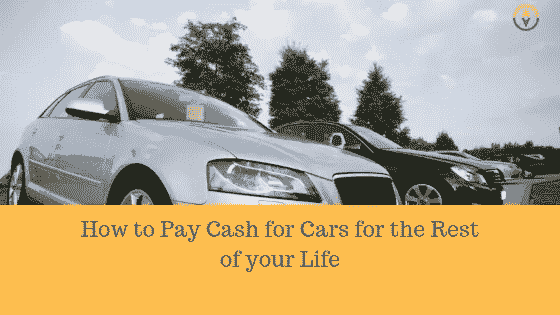

# 如何为汽车支付现金生活！

> 原文：<https://medium.datadriveninvestor.com/how-pay-cash-for-cars-for-life-f22c0997fbff?source=collection_archive---------27----------------------->

我们加拿大人爱惜我们的汽车。我们绝对喜欢他们！你还能在哪里找到这样一对夫妇，他们开着两辆新车，过着一张接一张的生活？

**心态**问题是我们的心态。我们已经习惯于相信我们总是会有汽车付款。因此，当你的汽车开始有点磨损时，加拿大人又申请了 34000 美元的汽车贷款。
汽车付款只是一种生活方式，对吗？

那是正常的思维方式。正常思维方式的问题是它在破坏你成功的机会！

最近的统计数据显示，加拿大人平均为一辆新车支付 34，000 美元，在 72 个月内平均每月支付 570 美元，最新趋势是 84 个月和 96 个月
，但在这种情况下，让我们坚持 72 个月。

你的汽车销售员没有告诉你的是，你漂亮的新车在第一年将会贬值 25%,到第五年会贬值 63%。你还有一年的还款期。
这意味着 6 年后，你只为价值 34，000 美元的汽车支付了大约 40，000 美元。现在大概值 11000 美元。

这时，正常人又回到另一个汽车付款期，持续 6 年，继续这个循环。但是，如果我们决定改变我们对汽车付款的看法呢？如果我们决定保留我们的钱，而不是以付款的形式交给银行，会怎么样？如果我们变得激进，设计一个计划让我们的钱为我们服务，而不是为银行服务，会怎么样？

**但是如果呢？…**
在我们的例子中，平均每月汽车付款为 570 美元。
假设你想买一辆新车，每月支付 570 美元，而你现在开的车价值 1000 美元。

如果你把这 570 美元拿去支付给自己，而不是支付给银行，那么仅仅十个月你就会有 5700 美元。再加上你 1000 美元的车，你可以用现金买一辆 6700 美元的二手车。
短短 10 个月还不错。

**留在这里陪我**。如果你再存 570 美元 10 个月，你会再存 5700 美元。一年后，你可能会以大约买价卖掉 6700 美元的车，然后在两年内升级到 12400 美元的车。现在，让我们疯狂一会儿，做一会儿梦。你在未来不到两年的时间里，你一直在为自己支付汽车贷款，而你一毛钱都不属于银行！

二十个月前，你准备以 570 美元的付款购买一辆新车。
只是为了好玩，让我们在接下来的 52 个月里，每个月用一只增长良好的股票共同基金来支付你自己的汽车付款，这样就可以玩够 6 年了。

现在你已经进入未来六年了，是时候买辆新车了。通常情况下，你会准备签署一份新的贷款，并马上回到汽车付款。但是我们的新计划怎么办？ ***你现在已经有了汽车基金。***
你在一只增长良好的股票共同基金中已经存了 52 个月，每月 570 美元。如果股市平均回报率为 10%，你知道你会有多少钱吗？略高于 35000 美元

你 52 个月前花 12，400 美元买的那辆车已经到了该买新车的时候了。这太好了，因为你现在有现金支付一辆好车！

**看看这个！**
如果你用现金花 15，000 美元买了一辆新车，你的汽车基金会剩下 20，000 美元，收益约为 10%……
你知道这意味着什么吗？如果你不在你的汽车基金里再投入一毛钱，你可以每六年买一辆 15000 美元的新车。
那是免费汽车人！这就是当你的钱开始为你工作时会发生的事情！

***关于麦克***

金融蔻驰，演讲者和个人金融博客。Mike 的目标是帮助尽可能多的人，教授帮助他和他的妻子 Steph 制定财务游戏计划的财务原则，永远战胜债务，让他们今天过上最好的财务生活。

Mike 是北美年轻家庭和企业的个人理财教练，最近推出了他的第一门课程，教授他在一对一辅导课程中使用的原则和策略。你在寻找一个计划，战胜债务，积累财富吗？访问:[www.MoneyCoachMike.com](http://www.moneycoachmike.com)获取免费资源，帮助你今天过上最好的理财生活！