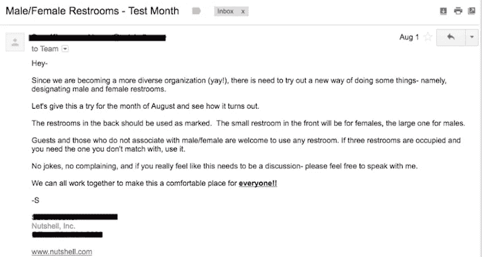
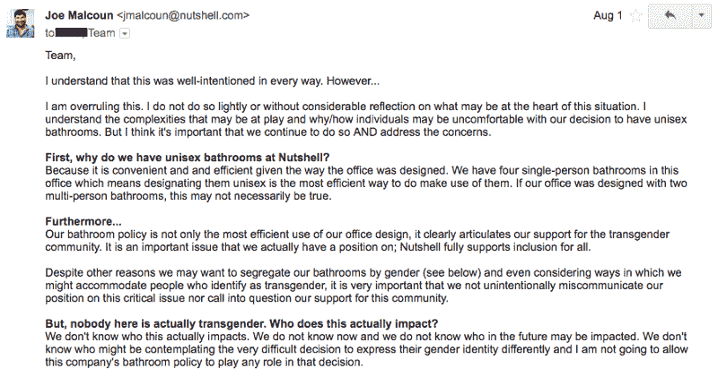
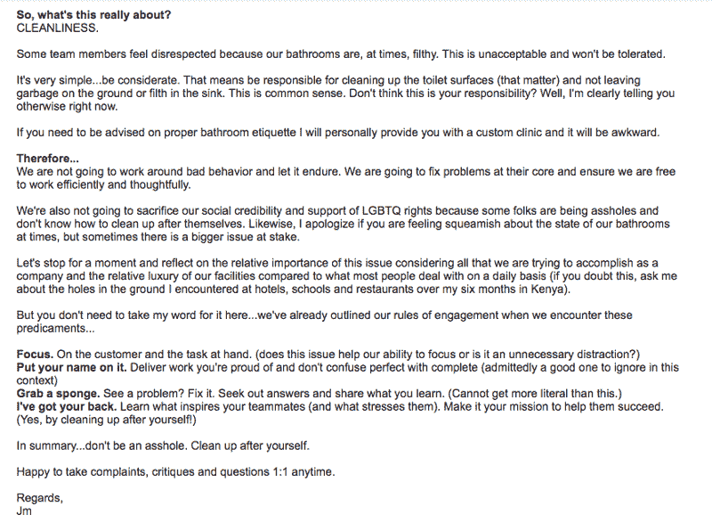

# 在马桶座上撒尿如何让我们谈论多样性挑战

> 原文：<https://medium.datadriveninvestor.com/how-pee-on-our-toilet-seats-made-us-talk-about-diversity-challenges-ab7c84ada4b6?source=collection_archive---------1----------------------->

***读者注意…*** *作为一个社会，我们很不愿意谈论多样性，尤其不适合探究自己的缺点和瑕疵。这是一件困难的事情，我希望那些选择参与这一对话的人将怀着同样的愿望这样做，以找到我在坚果壳承诺的积极成果。这篇文章和* [*附带的幻灯片*](https://docs.google.com/presentation/d/1zCasoBPfXF9wChYOE-pm05wPFRsjK6Bci87X9QU9q3M/edit?usp=sharing) *，意在开启这样的对话。*

**这一切是如何开始的…**

它是足够无辜的。有足够的幽默来开玩笑地软化边缘。这条信息基本上说的是“**嘿，伙计们，让我们给浴室分配性别。让我们试用一个月**。

我对这封邮件感到非常惊讶。这是我第一次听到有人提到它。我知道我们的团队有多包容，我们都相信支持团队成员、客人和顾客是多么真诚和严格，无论他们的性别身份如何。鉴于浴室已经成为 LGBTQ 权利的不幸战场，果壳一直明确支持我们的同性恋和变性朋友/同事/家庭成员。

到底发生了什么事？我没花多长时间就明白了字里行间的意思:

浴室很脏。更具体地说，办公室里的一些男人会在马桶座上留下尿迹，并且在处理完事情后不会总是把它们放下来。我们的女同事已经厌倦了漫不经心地要求更周到的浴室礼仪，她们现在强调要让别人知道她们对改变的渴望。

我最初的反应没有经过深思熟虑。我本可以更谨慎地回应，以免暗示我对所表达的担忧不屑一顾。但是，我强调了我们公司的立场，即我们必须非常明确地承诺包容。

具体来说，我说我不知道谁可能正在努力公开过自己的变性人生活。我也不知道将来谁会有同样的挣扎。但是我肯定不会让我们的办公室卫生间政策在他们做出决定的过程中发挥任何作用。

因此，以包容的名义，我呼吁这个问题是什么:

办公室里的一些男人把我们的浴室弄得很脏，结果女人们觉得完全不受尊重。他们应该这样做。事实上，当人们不爱护我们的环境时，我们都应该感到不被尊重。

**一切都水落石出……**

所有这一切发生的时机简直不可思议。第二天早上，我们的自动化员工调查开始进行，得到的反馈与我们收到的任何反馈都不一样。这些评论直截了当、残酷无情，令人非常不安。没有哪个领导会想象自己的公司对女性同事不友好或不尊重，但根据我们收到的评论，这正是我们团队中一些女性的感受。这既尴尬又令人沮丧。

看了匿名评论后，我立即取消了当天的日程安排。我在当地的一家咖啡店做了准备，并和团队中的每一位女性成员安排了一对一的会面。他们一个接一个地和我坐在一起，讲述他们被谈论、嘲笑、人身攻击和其他消极的性别歧视行为的故事。他们都同意他们不认为我们的团队“有意这样做”,但我对这件事的忽视程度说明了一切。这些事情是持久的，并且将存在于任何组织中，除非你从一开始就有意识地解决它们。

在接下来的几周里，我综合了每次谈话的笔记，对某些人进行了跟进，并与我的伙伴安迪和盖伊保持一致。令人鼓舞的是，我们很快就同意这是一个重要的优先事项，而且当地的思想领袖非常渴望帮助我们。然而，我们被我们想象的改变女性同事的经历所需的巨大变化所淹没。

没过多久，我们就意识到现状是不可持续的，也不符合我们的价值观。起初，很难不被卷入根除和监管攻击性行为。**幻想解雇性别歧视的人感觉很好。**很难做出比这更有说服力的陈述了。

但是我们很快意识到:1)我们的团队成员*没有一个人想让*成为性别歧视者；2)无论我们如何努力地监控事情，我们都无法阻止冒犯性的言论或行为。根据定义，冒犯行为的定义是被冒犯的个人，而不是做出冒犯行为的人。也就是说，我们绝对不会*容忍*这种不尊重或冒犯的行为。

> **我们的目标:为整个团队创造一个支持和尊重的环境。**

但是我们如何实现这一点呢？我们决定专注于五件事:

1.  阐明人力资源部在果壳公司的工作方式。
2.  更新并重新引入*果壳行为准则*。
3.  承认我们的缺点。
4.  庆祝并分享我们已经做得很好的事情。
5.  我们所做的一切都要更加深思熟虑和体贴。

**简单阐明人力资源……**

通过一对一会谈，我意识到，由于我们没有正式的人力资源人员，团队不知道该找谁解决问题，这一空白在没有任何领导协调的情况下被填补。我还听说团队成员觉得有些问题不值得我关注(“我不想每次马桶座上有尿的时候都打扰你。”)

因此，我非常明确地表示，需要向我提出问题，车队的安全和舒适是我的第一要务。无论出于何种原因，如果他们不愿意直接与我交谈，他们应该尽快找一位同事来帮助我。我们还找到了公司外部的人，包括一名女性投资者，他们可以充当幕后渠道。

***果壳行为准则……***

这实际上是一份写得非常好的文件，我已经一年多没看过了。当一个新的团队成员提到它有多好时，我很尴尬，我几乎不能回忆起它的内容。我们有一个政策，这很棒，但是如果我们不承认它并实践它，结果会怎样呢？

> **我们的*行为准则*是所有坚果剥壳机之间的协议。它描述了我们做出的承诺，以及我们的行为和对待他人的方式。**

我觉得我们的 [*行为准则*](https://docs.google.com/document/d/1a58nJKqNZRV7G9j53Blen2z1Pq_kJArQ2rCuo2kjj70/edit?usp=sharing) 特别不可思议的地方在于，它不只是简单地列出明显的违规行为，而是进一步帮助个人自己解决违规行为。

理想情况下，当某人被同事冒犯或感觉不被尊重时，他们应该坦然地把那个人拉到一边，告诉他们为什么被冒犯。他们被鼓励要求道歉，并感到被倾听和理解。同样，违规者应该听取反馈，不要自我防卫，从错误中吸取教训，真诚地道歉。

> **我们可能永远无法完全杜绝冒犯行为，但果壳绝对不会容忍。**

但是我们需要做的不仅仅是依靠球队来控制进攻局面。除了明确向我直接上报问题之外，我们还承诺每个季度重新审视我们的*行为准则*。我们将作为一个团队进行审查，并根据需要进行更新。我们还将为员工提供资源，帮助他们更好地理解隐性偏见和构建包容性文化的框架。(我真的很喜欢鲍康如的[项目中的资源，包括](http://projectinclude.org/) 。)

事实是，如果我们真的很好地实践了果壳的价值观，那么我们应该能够期待一个更具包容性的社区。**我们需要根据他们来招聘、解雇和提升员工。**我们还需要做得更好，定期奖励那些展示了坚果壳价值观的人。

**拥有它…真的…**

但当然，澄清我们的人力资源结构，确保团队知道彼此之间以及与我之间的良好沟通是不够的。我们必须通过行动和承担失败的责任来展示我们对更具包容性的文化的承诺。因此，我们觉得承认我们的缺点，努力明确了解我们需要改进的地方，这很重要。

像我们行业中的许多公司一样，我们很难在我们的产品开发团队中雇佣多样化的候选人。不是因为缺乏欲望。而是因为我们还没有尽可能地优化它。

例如，我们最近了解到，我们的一些帖子包含“兄弟”语言(例如，“啤酒和乒乓球”)。完全是无意的，但当它最终被指出给我们时，我们不可能忽视它。我们没有强调公司对女性更有吸引力的地方。我们也没有考虑到我们的面试过程对女性候选人来说可能不太理想。为了解决这一问题，我们将使用面试脚本，更好地确保所有候选人都被一致地问到问题。

正如我们不是第一个跨越这种“启蒙”的人一样，我们也不是第一个思考解决方法的人。我们已经从[我们的朋友们在原子物体](https://atomicobject.com/diversity)上所做的出色工作中吸取了经验(加油，原子们！).

正如我们在产品团队中努力实现多元化一样，我们的领导团队几乎总是由白人组成(比如我)。很难忽略这在内部向我们的团队成员和外部向我们的社区传达了什么。我们可以随心所欲地将它合理化(这是有间接原因的)，但它仍然是我们的现实，我们必须接受它，直到我们能够改变它。

我们还意识到，我们有机会帮助有抱负的女性团队成员成为软件工程师。在一个例子中，我们资助了一名女性坚果剥壳机的在线编码课程，高级工程团队成员提供了指导和辅导。但她最终还是在我们给她想要的机会之前离开了。那是失败的。在另一个例子中，一名女性离开了果壳公司的营销岗位，去了一所编码学校，后来没有申请为我们编码。很能说明问题。

我们将继续找出我们可以做得更好的具体事例，并报告出来。我们认为真正重要的是，拥有它意味着公开我们的失败和意图。

**但也不全是坏事……**

我们做了一些正确的事情。也许并不完美，但肯定有良好的意图和积极的结果。

目前，女性约占所有坚果脱壳机的 30%。这并不理想，但以行业标准来看已经算是不错的了。尽管我们渴望达到 50%，但最近几周的事件强调，招聘并不是创造包容性环境的关键结果。但它肯定是一种重要的成分。

我们还为新妈妈提供带薪产假，我们尽量不把所有工作安排在下班后。我们中的许多人都有年轻的家庭，我们非常支持工作/个人生活的平衡。花时间和我们的孩子在一起是一种非常有益的体验(即使感觉像在地狱里！)并帮助我们的团队成员更加专注地开展工作。

像许多与多元化斗争的公司一样，我们试图为解决这一问题的前线组织提供支持。例如，我们在经济上支持并捐赠我们的时间(作为导师)和办公场所给*女孩发展* 的[安阿伯分会。](https://www.girldevelopit.com/chapters/ann-arbor)

最后，在人们何时何地工作的问题上，我们尽量保持灵活性。可以理解的是，父母在工作之外有很多责任，我们不希望我们的团队成员觉得他们必须做出不必要的艰难决定，仅仅是为了照顾他们的孩子和配偶。

**向前进……**

我们还有很长的路要走。但是迈出最初的几步是令人振奋的。就在几天前的一个晚上，我在加速器里向一群年轻的企业家即兴描述了我们最近几个月在处理的事情。谈论这个问题感觉很舒服。坦率地解释我们和许多人一样，在多样性中挣扎，这是一种解放。

我希望更多科技行业的同事和同行会效仿，这样我们就可以为下一代降低这个问题的敏感度。但这只有在我们公司内部开始真诚对话的情况下才会发生。

***附言…*** *我没有任何理由相信我比任何人都更了解如何最好地解决这个关键问题。有很多东西可以批评，但这样做不会推动我们前进。请借此机会为解决方案和积极势头做出贡献。成功需要整个社区的广泛参与，我们需要投入大量时间和资源来改变现状。*