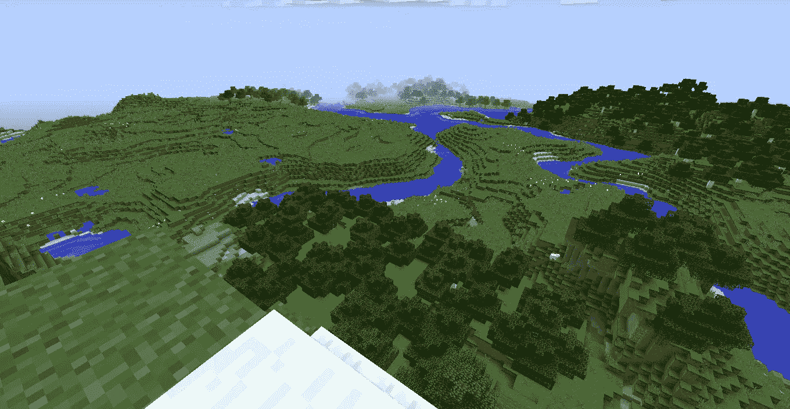

# 每天玩《我的世界》是如何让我搬出去开始我的职业生涯的

> 原文：<https://medium.datadriveninvestor.com/how-playing-minecraft-every-day-allowed-me-to-move-out-and-start-my-career-746d2e813aac?source=collection_archive---------17----------------------->

我从小就讨厌学习。

不是获取新技能和知识的行为，这一直让我兴奋。但是拿起一本教科书，坐上几个小时，吸收信息，把我这个孩子吓坏了。所以我做了许多孩子做的事情来缓解无聊，试图逃避学习；我玩了很多电子游戏。

从一开始，我在这些游戏中最喜欢做的事情就是创造一些东西。像《《我的世界》》这样的游戏，玩家的主要目标是塑造世界，按照他们想要的方式玩，对我来说这是一款完美的游戏。

我会花几个小时制作地图；您可以与其他人分享的数字世界，并将其上传到网站和论坛。最终，我的一张地图引起了注意。

我野营回来，发现我的收件箱里有大量关于我制作的地图的信息。结果是几个拥有超过一百万订阅者的 YouTubers 用户播放了这个视频并上传了视频。不久后，他们中的一个人找到我，提出委托我专门为他们的一个视频制作另一幅地图。我激动地说好。在那之后，他们雇我制作另一张更大的地图。我也同意了。

此时，我已经为许多人做过小额佣金工作，并开始积累大量经验。这很有趣，我的报酬也很少，但从长远来看，我并不期望做更多的自由职业者的工作。然后我找到了《我的世界》市场，这是一个社区驱动的数字商店，创作者可以在这里向数百万玩家应用和销售内容。我立刻产生了兴趣。

申请的先决条件是有一个以前创作的内容组合，对游戏的热情，以及有限责任公司。我有三分之二，所以我很快学会了如何注册第三个。2017 年 8 月下旬，我的公司铸铁厂诞生了。

我没有直接与市场合作，而是决定与一家有丰富内容发布经验的工作室合作。联系他们不到一个月后，我上传了一条内容到市场上。不久后，我计划搬出父母的房子，与我的兄弟签订一份公寓租约。今年毕业后，当我的大多数同龄人都在收拾行李准备上大学的时候，我正在发展自己的事业。

作为自己公司的老板，回报与我最初的预期不同。很有挑战性。我每天都被迫变得适应性强、有动力、有创造力。老实说，这对我来说是最好的部分。这不简单也不容易，但是我可以为我做的东西感到骄傲。有了铸铁厂，我从不做让我厌烦的工作，我不断鞭策自己变得更好。

尽管创办一家公司的想法一直很吸引我，但我没想到自己能够运用多年来扮演《我的世界》时不可避免地积累起来的那套技能。我知道对我来说，铸铁厂不是最终目标，而是朝着我想去的方向迈出的一步，建立我自己的方式。

就像游戏本身一样，我创造的技能超过了它们各部分的总和。多种计算机语言，了解我自己的创作过程，设定现实的截止日期，并与他人合作，使我们对项目的共同愿景成为现实。但是到目前为止，我学到的最有价值的事情是，我不需要等待别人来追求我想要的东西。我要走自己的路，这让我很兴奋。如果我不得不学习如何注册一个有限责任公司，如何建立一个专业网站，或者熟练掌握一个新程序，那就这样吧。

我仍然讨厌学习，但我热爱创作。铸铁厂教会了我如何创造迄今为止最有价值的东西，我的事业。