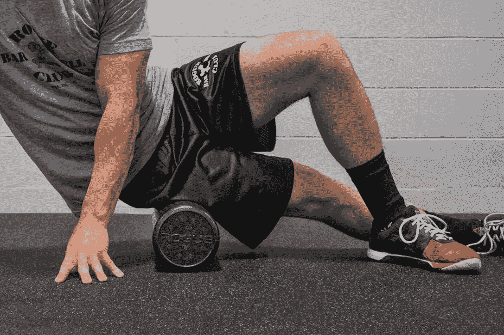
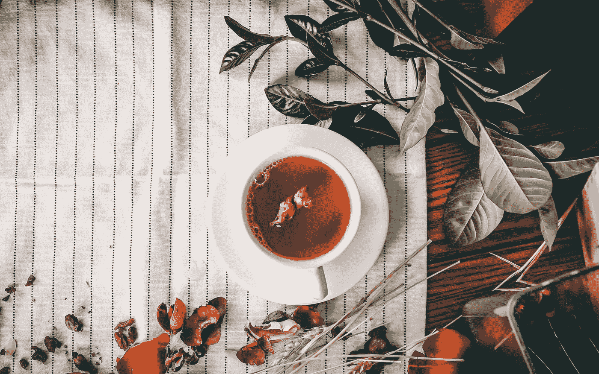

# 番茄多好吃🍅能救你一命(在职)

> 原文：<https://medium.datadriveninvestor.com/how-pomodoro-can-save-your-life-in-office-283b45e3bd50?source=collection_archive---------5----------------------->

Not the POMODORI we are looking for ([Unsplash](https://unsplash.com/photos/nM6qrtnVKn8))

作为现代的工人，我们做了很多事情，朝九晚五地坐着。但是我们没有做的是关心我们的幸福。

我们坐着参加冗长的会议，注意力不集中，眼睛盯着显示器。所以在一天结束后，我们的背会酸痛，眼睛会像第九层地狱一样灼热，而且每天的计划并没有全部完成。

如果我告诉你，有一种方法可以让你度过这一天，而不会以头痛结束这一天，会怎么样？**耗尽了** **的能量**？不想再做任何事，只想躺在床上。

 [## 跑步摆脱疯狂:锻炼如何提高你的生产力——数据驱动型投资者

### 没有比锻炼更好的方式来开始一天的工作了。我试着一周至少做四天，在…

www.datadriveninvestor.com](https://www.datadriveninvestor.com/2018/10/23/running-to-get-rid-of-the-crazy-how-working-out-increases-your-productivity/) 

所以让我先介绍一下**和**。对于任何不知道什么是**番茄**的人来说，它不仅是一种美味的蔬菜(或者水果，如果你想这样吃的话)，而且是一种非常棒的**技术**，它可以提高你的**健康**、**注意力**和总体**幸福感**。你准备好深入挖掘了吗？

我不会用这种技术是如何产生的整个历史来烦你，但是如果你感兴趣的话，这是弗朗切斯科·西里洛在 1980 年末提出的。所以生在意大利，自然就起了这个名字， **POMODORO** 。

> 这项技术几乎不存在于**厨房**的**定时器中。**

是的，就是你用来做饭的那个。

将这个计时器设置为 25 分钟，这将是你的**PRIME**TIME，你闪耀的时刻。你把所有的注意力都集中在任务上，只做一件事，不要偏离你的想法。

完成工作后，你会有 5 分钟的休息时间，让你的大脑放松，不要过度劳累。这将是一个番茄循环。

循环结束后，新的循环开始，一次又一次，直到你到达一个点时停止。当然，你的一天由多个**更大的** **休息**组成，比如午餐、咖啡或茶，或者其他任何事情。但是要点仍然保持不变。

我知道，每个人都想集中注意力，对吗？但之后我们戴上**智能手表**，口袋里有**手机**开着**震动**，还有**提醒**和外部噪音源或其他视听**压力**。
这样做的目的是，在你获得**动力**后，它会打断我们的注意力，所以我们每次都需要从头开始。想象一下你正试图推动一辆汽车。开始时你需要用更大的力量，但是一旦它开始移动，你慢慢地推动得越来越少？嗯，这和我们学习的方式完全一样，在我们大脑的**迷宫** **中到达准确的点**，或者更确切地说，通过所有准确的相同点。这需要很多时间。你想在你的大脑中加强这种联系。你试图获得的所有连续信息，最重要的是**记住**和**尽可能利用**。

> 因为只有当这些联系得到加强并且完全即时时，你才开始精通这个领域，你正在努力掌握。

简单地说，**知识**在**瞬间**就可供你使用。所以你不需要专注于它，去得到它，这样你就可以把时间花在更深入的问题上。

> 只要记住运动的物体，倾向于保持运动

所以，既然我们生活在现代，你就不需要在你的办公室里使用厨房计时器，坦率地说，也许这是一件好事，因为你也可以打扰别人。但是你可以在你的工作机器上运行工具，或者只是在你的手机上运行一个简单的定时器来跟踪 **25/5 比率**。

因此，让我试着分解一下我将如何使用**番茄工作法**以及我如何对它进行一点调整，实际上还有其他好处，不仅仅是工作道德和目标导向的方法。

所以在**番茄**第一次运行之前，我有一个**准备**阶段**阶段**。

> 接下来的 25 分钟我要做什么？

设立一些目标，让我可以依靠。比方说，我需要为即将到来的会议制定一个计划。让我想想我需要为会议做些什么准备。我将**写下任务**和笔记，例如，谁是我的听众，他们在会议上的背景是什么，我需要在演示中提出什么要点？

> 然后，当我觉得准备好了，在大约**5-10 分钟**后，我**关闭**所有**干扰**，让手机离线，断开干扰声音，播放专注音乐，或环境声音(我其实真的很喜欢 Spotify 上的**瑜伽** **和** **冥想** **播放列表**，因为它不会用我可以或愿意(甚至在精神上)唱歌的歌曲来干扰我)，戴上耳机，开始 25 分钟的

**随着时间的推移，我将检查列表 **FIFO(先进先出)**，并清理列表，如果有任何可能的问题，或可能需要发生的额外任务，我将它们放在列表中，作为**子任务**或下一个**任务**，我继续我的工作。**

> **计时器发出哔哔声后，我会做一个简短的**回顾**，已经做了什么，我还需要做什么，接下来可能会做什么(可能需要一些洗牌)。**

**在此之后，下一次会议的**计划**就可以开始了，但这不应该超过 1-2 分钟。**

**在**结束** **仪式**过去后，我做我的 5 分钟，或者在某些情况下 10 分钟**休息**，在那里我需要放松，让我的头休息片刻。因此，你可以也应该在休息时间做多种活动，这将增强你的健康和幸福。**

**所以让我从最便宜的能帮到你的方法开始。**

# **喝吧。**

**课程结束后，再倒满一杯水，至少喝半杯。所以，在你的系统中至少摄入 0.2%的水。这将意味着在工作日本身，你将获得大约 2-3 升水，当然这取决于你的 **POMODORI** (时段的数量)，但请记住**2-3 升**足够你一整天，所以你可能想在一天结束时省略水，这取决于你的消耗量。**

# **拉伸。**

**你可以做一些基本的事情来释放你的**筋膜**和**肌肉**中的紧张，简单到做无重量的硬拉运动，在保持背部挺直的同时伸出你的脚趾，或者任何其他的**瑜伽**练习，将**酸痛**从你的身体中拉伸出来。**

****

**Roll out the sore muscles ([hiconsumption](https://hiconsumption.com/2019/01/how-to-use-a-foam-roller/))**

**你可以通过得到一个**泡沫滚筒**来改善这一点。它们的价格大约为 10-30 美元，或者只是一个**高尔夫球**或其他**硬球**，在你的身体上推出一些斑点。这有助于身体放松，释放你积聚的大量内心紧张。**

# **动起来。**

**试着让血液在你体内流动。在工作中做与你其他时间相反的事情。**

> **办公椅是人类的无声杀手。**

**随着我们花更多的时间坐着，我们限制了我们体内的血液流动，我们过度使用一些肌肉，同时完全降低了其他肌肉的质量，如果我们进入任何替代教学，你就限制了你的能量流动。**

**所以你可以从绕着你的地板走几步开始。但我喜欢每隔几分钟就起身爬几层楼。**

> **如果我每天至少爬 30 层楼，那对我来说就是好日子。**

**当然，这不是我每天都可以做的事情，有些日子我只爬 10，有些日子我爬 50，这也取决于工作安排。但这让我也能达到我为自己设定的一些健康目标。因此，通过在这些楼层行走，我增强了我的肌肉，也使它们变得结实，过一段时间你就会开始看到这一点。**

**所以过一段时间后会发生什么，也许会失去**的动力**但是现在这可能会被你的手机、小玩意或者其他东西挑战。我的 iPhone 总是追踪我的脚步和爬过的楼层。但如果你想要更深入的分析，你可以得到一个智能带，像 miBand，价格为 40 美元，也将满足你的小工具饥饿。🤖🤖**

# **补充能量**

****

**Just a dash of butter makes it even better ([Unsplash](https://unsplash.com/photos/DFtvglCPWjY))**

**我需要让我的大脑保持在边缘状态，这样它就能经受住强烈的聚焦**番茄大战**，所以我努力保持食物的平衡，这可能有助于我的大脑**T21 制造新细胞，并为一整天的工作提供足够的能量。我试着吃蓝莓、坚果，尤其是黄油。由于黄油为我提供脂肪，为我的大脑功能提供必要的能量，我开始把它放在我的饮料中。在**咖啡**中，在**茶**中，令我惊讶的是，它添加了相当好的味道，因为它有点像奶油。我唯一不喜欢的是我咖啡杯里的油脂，除此之外我没什么可抱怨的。🙃****

****

**([Unsplash](https://unsplash.com/photos/YxqLwUeS0Bs))**

**所以你怎么说，你会尝试这种方法吗？也许一开始不是一整天，但是从 1 或 2 个番茄开始，看看你喜欢它，如果你感觉更好，完成更多。**

**如果你喜欢这篇文章，并希望在我发表新文章时收到通知，请继续关注。**

**你也可以加入 facebook 上的 [DevUp](https://www.facebook.com/Devup-2313243115571718) 社区来获取最新消息。感谢您的关注，我希望这篇文章对您有所影响。下次见🤵**