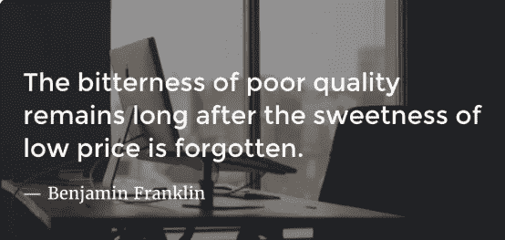
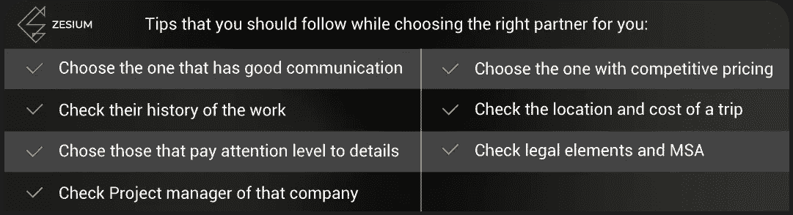

# 发展的代价如何让你的企业摆脱困境

> 原文：<https://medium.datadriveninvestor.com/how-price-of-development-can-keep-your-business-out-of-trouble-54ba26be3a51?source=collection_archive---------25----------------------->

> “软件架构是一组设计决策，如果决策不正确，可能会导致项目被取消。”―约恩森林

软件开发对每个公司来说都是一笔很大的投资，不管他们是创业公司还是大企业。公司通常试图通过雇佣低成本的开发公司来降低这些成本。如果你从你的短期资产负债表来看，这是一个伟大的举动-你的费用很低，你得到了你工作的主要工具。但是长期来看是这样的吗？

软件开发不仅仅是开发成本——它是你今天业务的主要工具，你必须知道低成本可以决定你是继续做生意还是失去所有投资并被挤出市场。下面我会试着向你解释错误选择开发的后果。

**为什么低成本不是一个好主意？**

试图省钱的公司通常选择最低的软件开发选项。正如低成本的[定律所说——在缺乏额外信息和对软件开发经济学缺乏理解的情况下，软件开发商的选择将仅仅基于成本。不幸的是，这通常要付出很高的代价。](http://www.agile-doctor.com/2015/10/06/high-cost-of-low-cost-software-developemt/)

那些只着眼于短期目标并希望降低运营成本的经理们过快地投入外包。他们很快选择了一个供应商(通常是错误的)，然后匆忙投入生产，期望马上得到一个好产品。在匆忙中，他们会跳过仔细评估哪家公司适合他们，并提供高质量的产品，而不是廉价的。如果你是一名负责寻找合适合作伙伴的经理，请检查你是否遵循了[这些建议。](https://medium.com/@batic.marija/how-to-protect-yourself-from-being-a-victim-of-a-cheap-software-development-outsourcing-9d535e4b04e5)

如果你雇佣一家低成本公司，你必须意识到你将拥有的隐性成本。其中之一就是[技术债](https://hackernoon.com/there-are-3-main-types-of-technical-debt-heres-how-to-manage-them-4a3328a4c50c)。如果你不熟悉这个术语——它是开发过程中短期决策和捷径的真实成本。当你雇佣低成本的开发公司时，这些成本通常是无意中产生的——他们急于快速交付解决方案。

由于大部分成本涉及维护，您不应该急于开发。它必须经过良好的规划、测试和高质量。如果你使用低成本的开发人员，你也可以预期随之增加技术债务和维护成本。

雇佣低成本开发人员的人忽略的另一个隐藏成本是延迟成本。一般来说，低成本开发人员的生产率较低，因此他们需要更长的时间来生产和部署软件。由于这些公司有很多廉价的开发人员，他们试图在一个项目上投入更多的人。然而，加倍人并不能解决问题。认为人增加一倍生产力就会增加一倍的想法导致了另一个问题——边际成本。它增加了成本，但生产率要么保持不变，要么只是略有上升。低成本开发周期更长，延迟成本更高。

**和大型 IT 公司合作的代价是什么？**

现在你在想‘好吧，我不会买便宜的，但会买最贵的，因为它们质量最好’。这可能是真的，但是如果你在一家知名的 IT 公司工作，你必须意识到你必须支付一些与软件开发无关的费用。以下是您还需要支付的费用:

*   **高毛利。**公司越大，费用越高，维护成本越高。
*   **营销和销售。如果公司正在寻找新的商机，它会付钱给销售和市场代表来推销他们的服务。这是额外添加到价格，你将支付的发展。**
*   **员工超龄。**大公司人员多，流程长。而为这些工资和时间买单的是你。

这些成本与你的发展无关，但大公司必须支付他们的运营成本，所以这些都包含在他们的价格中。你不想为与你无关的东西付钱，你为什么要付钱呢？

另一个事实是，他们通常有大量的开发人员，而你的项目只是他们的千分之一，所以不要太专注于它。他们可能会给你提供一个好的产品，但是维护成本呢？一旦他们向你交付了产品，软件开发并没有结束，这只是一个步骤。你必须确保你信任的公司不会因为你为他们所做的工作付钱而忘记你，而是会在将来和你在一起。

**不选便宜的，不选大牌的。选择竞争性。**

这么贵是个坏主意，便宜的更糟——现在的问题是选择什么？通常，答案在中间——选择有竞争力的。选择一家重视质量的公司——这是你必须关注的主要问题。开发领域的竞争非常激烈，唯一能让公司与众不同的是他们提供的产品质量。虽然口碑在决策中仍然很重要，但网上评论慢慢开始定义一家公司的商业信誉。在雇用公司发展之前，检查他们的声誉[在线](https://clutch.co/profile/zesium)。

一个好的开发团队会把重点放在代码质量上，而不是其他任何事情上。他们将用结构化的、组织良好的代码来编写他们的软件，这些代码既易于管理又易于维护。完成这项工作应该很简单，并且在前进的道路上产生更少的问题。

开发过程并没有随着代码的构建而结束——软件使用后，错误可能会突然出现。为了最小化这些成本，一个好的开发公司会有一个强大的质量保证，并且会在开发的每个阶段测试他们的产品。在早期发现漏洞可以节省很多钱- [越早发现，花费越少](http://blog.celerity.com/the-true-cost-of-a-software-bug)。

你已经知道维护的重要性——每个产品都需要维护。开发你的软件的公司必须为你做这件事，这意味着一旦他们把产品交付给你，你们的关系并没有结束。为了确保你的产品质量好，符合你的业务需求，你需要在这个过程中做一些小的调整。因为这将是一个长期的合作伙伴关系，明智地选择，始终把质量放在第一位。

这里有一个清单，你应该遵循它来找到最适合你的公司。

# 质量差的实际成本的例子

公司不太愿意给出他们的错误决定和糟糕的产品质量给他们带来了多少损失的确切数据，所以很难得到一个完整的画面。公司将质量差的产品交给其他供应商修理的情况并不少见，这些错误会增加开发成本。一些公司会奖励那些在他们的产品中发现严重安全漏洞的研究人员。许多公司目前都提供这样的奖励——苹果，如美国电话电报公司、脸书、谷歌、微软、特斯拉汽车和雅虎。

根据 Tricentis 年的报告, 606 个有记录的软件失败影响了世界一半的人口(37 亿人)、1.7 万亿美元的资产和 314 家公司。如果你把时间算进去，那就是 268 年 8 个月 2 周 3 天 8 小时 46 分钟。

以下是其中的一些:

*   英国航空公司遭受的打击最大，2017 年内有 6 次停机，其中 3 次发生在 1 个月内。2017 年 5 月的一次停电在两周内引发了全球混乱，造成了 2.1 亿美元的总损失，股价下跌了 4%，使公司价值蒸发了数亿美元。
*   2017 年发现的苹果自动更正 bug，损失巨大。iOS 11 的发布揭示了一个打字错误，会将单词“I”自动更正为“A”。这听起来是一件小事，但事实并非如此。首先，目前全球有超过 7 亿部 iPhones 在使用。其次，每天有 60 亿条短信被发送出去——而这仅仅是在美国！全球估计为每年 8.6 万亿条消息。有人估计这花了他们 115000 美元。
*   SolarCity 顾问 Lazard 在 2016 年与特斯拉的一笔交易中犯了一个错误，当时他们的计算系统对这家太阳能公司的价格进行了折扣，导致价格降低了 4 亿美元。这个错误是在交易签署两周后发现的。
*   Niantic 于 2017 年在芝加哥组织了一场售罄的节日，承诺将有几只稀有的口袋妖怪可供捕捉。20，000 名 Pokemon Go 玩家涌入节日场地，却发现游戏和蜂窝服务网络在负载下不断崩溃。Niantic 退还了门票费用，向与会者提供了价值 100 美元的游戏内硬币，然后后来同意了 157.5 万美元的集体诉讼和解，以报销差旅费。

在这里你可以得到[一个计算器](https://goleansixsigma.com/cost-of-poor-quality-copq/)，它可以帮助你计算低质量开发的成本。

这些成本不仅与物质损失有关，而且有些还造成了严重的安全问题。一些例子是 2017 年发生在科罗拉多州丹佛市的四个火车软件错误。去年发生的最大一次事故是软件安全机制失灵，导致株馆站的两列地铁列车相撞。38 人受伤，为修复漏洞而进行的定期维护使列车运行中断了 6 个多月。

一些错误导致了意想不到的结果。其中一个案例是一个法国人适合优步，因为它发现他的妻子在欺骗她——优步向他和他妻子的手机发送了一个通知。另一个例子是建筑工人贴了一张他自己被推土机推着的照片，标题是用阿拉伯语写的“早上好”。脸书把这条信息翻译成希伯来语的“攻击他们”，英语的“伤害他们”。这名男子被(可能)不会说阿拉伯语的警察逮捕，并在错误被发现前被当作可能的恐怖分子关押。

**结论**

选择一家合适的开发公司对你未来的生意非常重要，所以明智地选择你的合作伙伴。不幸的是，许多做软件开发资源财务决策的人不了解软件开发的本质和它的总成本。如果他们这样做了，他们会做出截然不同的决定。

为了避免一路上的所有陷阱-做你的研究，提前计划并专注于质量。一旦你找到了适合你需求的公司，相信你的合作伙伴，并在发展的每个阶段都进行沟通。这是带领你的公司走向成功的唯一途径。