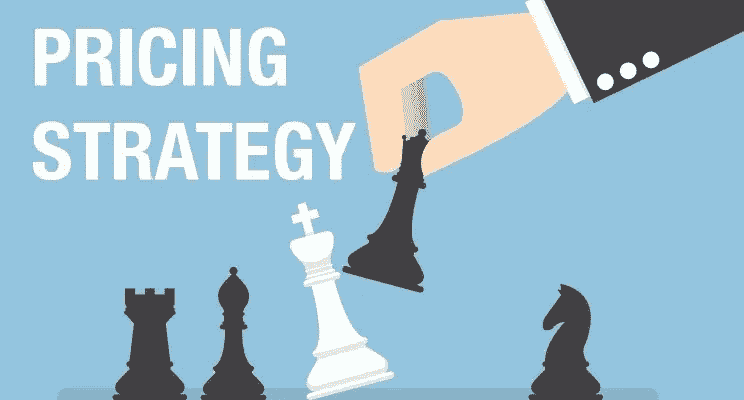

# 私募股权公司如何通过定价从其投资组合公司中获取巨大价值

> 原文：<https://medium.datadriveninvestor.com/how-private-equity-firms-can-extract-significant-value-from-their-portfolio-companies-through-5127914d19ba?source=collection_archive---------1----------------------->

增加私募股权公司的投资价值可能是一项复杂的工作。可以利用多种杠杆，如融资、产品/服务匹配、人力资本、运营转型、技术等。

然而，高 EBITDA 杠杆率的一个领域一直被私人股本管理公司忽视，那就是定价。

# 定价:隐藏的 10 倍 EBITDA 乘数

鉴于 EBITDA 是公司估值的主要驱动因素，关注对 EBITDA 影响最大的驱动因素以实现投资回报最大化是有意义的。

对数以千计的私募股权投资的分析表明，价格改善的 EBITDA 杠杆通常会影响 EBITDA 10-12 倍。相比之下，平均私募股权投资的固定或可变成本的减少对 EBITDA 有 2-5X 杠杆作用。

当我们在没有销量下降的情况下实现 2%的有效价格增长时，这通常会产生 25%的 EBITDA 增长。顶线价格优化带来的 10-12 倍 EBITDA 杠杆远高于降低成本带来的 2-5X EBITDA 效应。

鉴于定价的高估值影响，为什么私募股权公司不专注于对其投资组合公司的定价优化？

# 世界级定价的五个层次

私募股权公司通常会在一家公司多年表现不佳后投资该公司，这给该公司带来了许多挑战(和机遇)。定价通常被视为速赢，但这些速赢背后是混乱的定价策略和价值主张。

大多数管理团队都不是定价专家，因此不知道如何系统地捕捉完整的定价机会。相反，该公司的定价策略通常基于成本加成传统和销售团队的扭曲指导。这是最基本的。

有效的定价策略可以分为五个层次:

# 一级:消防

很大一部分公司的定价永远处于救火模式。定价策略不存在，他们的销售力量失控。价格、成交量和客户价值之间的关系是随机分散的。复杂的采购部门推动价格谈判过程。销售团队不断被推向季度截止日期，并被迫打折以完成销售。最好的谈判者得到最好的价格。由于低定价、隐性成本和疯狂打折，该公司在大量账目上亏损。

# 第二级:警务

下一个层次是警务。私人股本公司通常会安排一个强有力的财务人员来扮演警察。私人股本投资者只要控制住定价过程，就能从中获取大量价值。为了获得控制权，实施了结构化定价流程，财务部门直接参与并管理定价。定价手册可能已经准备好，销售人员将获得一些关于批量折扣的指导。定价可能仍然基于成本加成模型。一些 Excel 电子表格甚至定价软件被用来控制这个过程。这是第一阶段的巨大飞跃，但该公司的定价是基于成本和目标利润率，这仍然是次优和不科学的。

# 第三级:合作

很少有公司能独自达到这一水平。与第二阶段相比，这是一个巨大的范式转变，涉及到根据对买家的价值来定价。大多数私人股本公司希望其投资组合的公司达到第三级，但没有推动实现这一目标所需变革的流程和工具。投资组合公司可能会投资价值销售或挑战销售计划，让他们的销售团队采取“价值合作伙伴”的立场，努力支持更高的价格，但这不足以达到第 3 级。通常，必须使用微细分、客户意见调查、销售人员培训和 KPI 来重新设计定价策略，以确保成功转型到第 3 级。达到这一水平对 EBITDA 有重大且可重复的长期好处。

一家私募股权公司将投资组合中的公司全部纳入三级定价，预计息税折旧及摊销前利润(EBITDA)将达到 10-12 倍。通过优化过程，我们通常会看到收入增加 2%，EBITDA 增加 25%。

# 第 4 级:优化

在人工智能和机器学习的时代，四级将变得越来越普遍，成为竞争的必需品。在拥有丰富数据源的行业中尤其如此，这些数据源可以被定价科学家利用。餐馆、零售、在线都是四级竞争势在必行的行业，达到四级将获得丰厚的回报。

# 第五级:精通

当公司根据价值和硬数据优化了每个产品/服务和客户的定价时，就达到了这个阶段。获得定价控制权的公司有效地释放了其市场中的所有可用价值，并产生了比竞争对手大得多的 EBITDA 和估值数字。

# 优先考虑价格的积极影响

我称价格为组织的“冰山”,因为它在表面上看起来并不重要，但当你深入了解时，你会意识到它对企业盈利能力的巨大影响。投资者不仅从 10-12 倍的 EBITDA 杠杆中受益，而且股东也保持了价值，每笔交易都会带来更高的 EBITDA 和长期公司价值。

这种“冰山效应”到底有多阴险？考虑一下:我们通常会看到从标价/报价到发票价格的大约 20–25%的折扣。但这还不是全部。由于大量的隐性折扣、数量让步、不必要的及时交付计划、最后一分钟的变更单等，我们还看到从发票价格到“在我们口袋里”价格的额外 20-25%的折扣。这些成本的可见性接近于零，并扼杀了利润。

通过投资于有效的定价计划，您可以突出这些隐藏的成本，并通过使用以利润为导向的 KPI 降低成本，同时增加总收入。最终结果是 EBITDA 和公司价值显著提高。

经理们通常会引用“市场力量”来解释为什么一家公司的定价结构是这样的。这是一种纯粹的反应模式，不能解决导致定价策略不佳的潜在动机和缺乏复杂性的问题。销售团队已经适应了强大的采购团队，并期望在每个季度末给予折扣和许多其他隐藏的(和昂贵的)让步。

通过关注其投资组合公司的定价策略，私人股本投资者可以创造出数倍的附加价值。