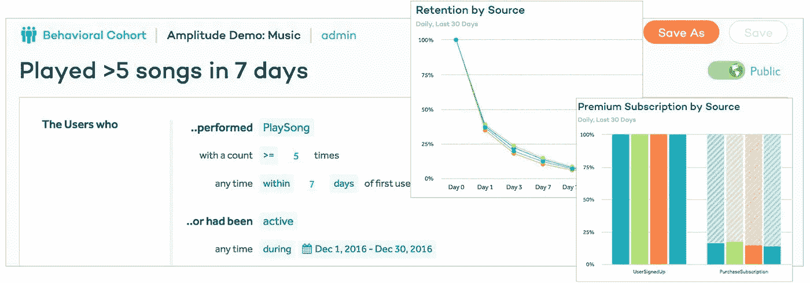
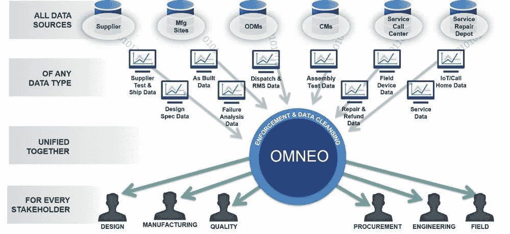
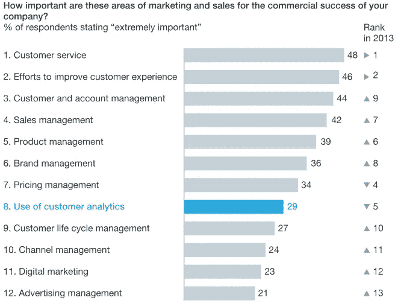

# 产品分析如何让电子商务公司受益

> 原文：<https://medium.datadriveninvestor.com/how-product-analytics-benefits-ecommerce-companies-10969f8bb982?source=collection_archive---------3----------------------->

数据分析工具对于电子商务公司等数字商业企业的价值可以从其采用率的增加以及整体收益(如更好的决策、成本降低和收入增长)来评估。电子商务公司对分析的资本投资只有在能够推动改善决策时才算数。

电子商务企业面临的挑战主要围绕如何以更低的成本获得新客户，以及如何留住他们以最大限度地提高产品销量。这通常会推动以下关键决策:

哪些营销渠道带来了最好的客户？

我们的客户中有百分之多少报名参加最终产品销售？

每天或每月有多少用户回到我们的在线零售网站？

我们产品的最佳[客户特征](http://blog.close.io/ideal-customer-profile)是什么？

**什么是产品分析？**

简单来说，**产品分析**向产品管理[展示他们的用户是谁，他们需要什么，以及如何留住他们](https://amplitude.com/behavioral-analytics-platform?ref=nav)。产品分析通过收集和解释所有产品相关数据，推动更好的客户洞察和基于数据的决策。

简而言之，产品分析提供了一种自动化的方法来分析用户，并为他们提供更好的客户体验。产品分析简化了对用户的跟踪，从他们对你的品牌感兴趣到他们购买你的产品。

**公司为什么使用产品分析？**

电子商务公司需要了解他们的用户和客户如何使用他们的零售产品或服务。产品分析使他们能够跟踪用户使用其产品的数字足迹，以查看和收集他们喜欢(或不喜欢)的信息，以及他们参与或返回的产品线。

产品分析通过将各种数据源集成到一个有组织的窗口中，为决策者将非结构化业务数据转化为有价值的见解。

**为什么产品分析对公司如此重要**

[根据麦肯锡的一份报告](https://www.mckinsey.com/business-functions/marketing-and-sales/our-insights/why-customer-analytics-matter)，部署客户(或产品)分析的公司比任何不使用这些技术的竞争对手公司赚取两倍的利润。随着这个信息时代产生大量的业务数据，只有那些能够从这些产生的数据(使用分析工具)中获得商业价值和洞察力的公司才能从数据驱动的产品管理中获益。

除了影响产品决策，产品分析还可用于:

了解用户和顾客的购买行为。

衡量任何产品线的进展。

证明任何产品创意的可行性。

激发创新的产品想法。

**如何使用产品分析**

产品分析工具主要围绕以下两个功能设计，即:

**数据跟踪**，分析用户访问和用户行为。

**数据分析**，通过用户仪表盘或生成的报告分析和可视化数据。

此外，为了使产品分析能够成功地为企业决策提供信息并推动企业决策，产品分析团队必须与产品管理部门和其他部门紧密合作，以便:

创建高效的流程，建立对产品分析及其见解的信任。

开发一个反馈回路，帮助团队相互协作和指导，以获得更好的质量和产出。

与产品团队发展密切的合作关系。

在团队中开发一种通用语言，可以促进核心指标(例如，产品使命、客户行为)的共享。

利用数据洞察，教育您的公司人员做出更明智的决策。

**产品分析的共同特征**

大多数产品分析工具提供以下功能:

**用户追踪**功能:追踪网站或应用内的用户活动。

**用户描述和细分**:了解来访用户或顾客的描述，并根据年龄、使用的设备、地点和行为模式对他们进行分类。

**创建和分析营销漏斗**:直观地衡量任何客户如何浏览一系列事件(例如，产品注册、个人资料完成和入职)。

[**群组分析**](https://www.cleverism.com/lexicon/cohort-analysis/) :分析客户行为如何随着时间的推移而变化或演变。

**数据可视化仪表盘**

**衡量用户参与度。**

**总结**

生成的数据在现代产品管理中的至关重要性提升了产品分析为全球在线零售商提供的独特优势。分析简化了从大量非结构化业务数据中获取业务洞察力的想法，并转变了产品管理方法的效率。